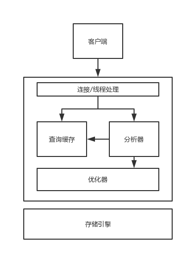

1. Java 基础
2. JVM 知识
3. 开源框架知识
4. 操作系统
5. 多线程
6. TCP 与 HTTP
7. 架构设计与分布式
8. 数据库知识
9. 消息队列
10. 缓存

## 一：Java基础

1. JAVA 中的⼏种基本数据类型是什么，各自占用多少字节

2. String 类能被继承吗，为什么

3. String， Stringbuffer， StringBuilder 的区别
答：String 是 final 类，⽆法继承，也⽆法被修改，每次修改都会创建新的 String 对象。
Stringbuffer 和 StringBuilder 则能正常被修改，两者的区别是 StringBuffer 每个方法都加了锁，是线程安全的。

4. ArrayList 和 LinkedList 有什么区别

5. 讲讲类的实例化顺序，⽐如⽗类静态数据，构造函数，字段，子类静态数据，构造函数，字段，当 new 的时候，他们的执行顺序

6. ⽤过哪些 Map 类，都有什么区别， HashMap 是线程安全的吗,并发下使用的 Map 是什么，他们内部原理理分别是什么，比如存储⽅方式， hashcode，扩容，默认容量

7. JAVA8 的 ConcurrentHashMap 为什么放弃了了分段锁，有什么问题吗，如果你来设计，你如何设计
答：在 1.8 之前， ConcurrentHashMap 通过一个大⼩为 16 的 Segment 数组，这 16 个Segement 继承自 ReenterLock，类似 16 把锁均匀的维护着所有的桶。每次写操作将会锁住 1 个 segment 下所有的桶，锁力度较大，会降低支持的并发数。所以 1.8 进行了优化，采用了更细力度的锁， hash 后，如果没有相关的桶，不加锁，直接通过 Unsafe 的类似 CAS 操作将值放入，如果有桶，则对这个桶加锁，其他桶的节点依然可以正常操作

8. 有没有顺序的 Map 实现类，如果有，他们是怎么保证有序的

9. 抽象类和接⼝的区别，类可以继承多个类么，接口可以继承多个接口么,类可以实现多个接口么

10. 继承和聚合的区别在哪
答：继承主要描述的是‘A is B’的关系，而聚合描述的是‘A has B’的关系，一般情况下，优先使用聚合，因为继承可能会继承父类中一些不必要的属性和方法。但是，如果需要向上转型，就需要用继承。

11. IO 模型有哪些，讲讲你理理解的 nio ，他和 bio， aio 的区别是啥，谈谈 reactor 模型

12. Java nio 3 个重要组件是哪⼏几个？buffer 怎么从写模式切换到读模式？两种模式下的position, limit, capacity 有区别吗

13. 反射的原理，反射创建类实例例的三种⽅式是什么
答：当⼀个类加载完成后，会生成一个 Class 对象， Class 对象可以获取类的所有属性，⽅法等数据。
⽅式一：对象调用 getClass()方法
⽅式二：类名.class
⽅式三：Class.forName(全路径名称)
创建 class 对象后，直接调用 class 对象的 newInstance()方法即可创建实例

14. 反射中， Class.forName 和 ClassLoader 区别

15. 描述动态代理理的⼏种实现⽅方式，分别说出相应的优缺点

16. 动态代理理与 cglib 实现的区别

17. 为什么 CGlib ⽅式可以对接口实现代理

18. final 的⽤用途

19. 写出三种单例模式实现

20. 如何在父类中为子类⾃动完成所有的 hashcode 和 equals 实现？这么做有何优劣

21. 请结合 OO 设计理理念，谈谈访问修饰符 public、 private、 protected、 default 在应用设计中的作用

22. 深拷贝和浅拷⻉区别

23. 数组和链表数据结构描述，各自的时间复杂度

24. error 和 exception 的区别， CheckedException， RuntimeException 的区别

25. 请列出 5 个运行时异常

27. 说一说你对 java.lang.Object 对象中 hashCode 和 equals ⽅法的理理解。在什么场景下需要重新实现这两个方法

28. 在 jdk1.5 中，引⼊了泛型，泛型的存在是用来解决什么问题

29. 什么是泛型擦除？擦除是不是意味着运行期就无法获得泛型信息了

30. 这样的 a.hashcode() 有什么用，与 a.equals(b)有什么关系

31. 有没有可能 2 个不相等的对象有相同的 hashcode

32. Java 中的 HashSet 内部是如何⼯工作的

33. 什么是序列化，怎么序列列化，为什么序列化，反序列化会遇到什么问题，如何解决

34. java8 的新特性

35. 枚举类可以继承其他类吗？为什么

36. 为什么枚举类可以用来实现单例模式？通过序列化反序列化可以破坏枚举的单例例模式吗？怎么可以破坏

37. 了解强引用，软引用，虚引用和幽灵引用吗？谈谈它们的⼀个使⽤场景

## 二：JVM知识

1. Jvm 包括那⼏大部分
答：主要包含 4 个部分：类加载器，字节码执行引擎，内存模型，本地方法调⽤。

2. 什么情况下会发生栈内存溢出
答：一般在递归调用的时候容易发生。
虚拟机栈描述的是 Java 方法执行的内存模型，每个⽅法的执行都会创建一个栈帧，用于保存局部变量表， 操作数栈，动态链接，方法出口等信息。
如果请求的栈深度大于虚拟机所允许的最大深度，将抛出 StackOverFlowError,如果无法申请所需的内存，则会抛出 OutOfMemoryError。

3. JVM 的内存结构， Eden 和 Survivor ⽐例

4. JVM 内存为什么要分成新生代，⽼年代，持久代。新⽣代中为什么要分为 Eden 和Survivor
答：分为新生代，⽼年年代和持久代是为了不同的区域根据特点采用不同的 GC 策略，例如新生代对象⼀般是朝⽣夕死，一般采⽤复制算法，区分进一步分为一个 Eden 和两个Survivor 区域。而老年代和持久带则一般采⽤标记清除算法。

5. JVM 中一次完整的 GC 流程是怎样的，对象如何晋升到⽼年代

6. Jvm 什么情况下会回收⽅法区

7. 你知道哪几种垃圾收集器，各⾃的优缺点，包括原理，流程，优缺点

8. 详细介绍下 CMS 垃圾回收器
答：CMS 是⽼年代垃圾回收器，⽬标是最短的停顿时间。它的⼯作主要包括 4 个阶段：
(1)初始化标记，主要是标记老年年代中被 GCroots 和新生代引用的对象，需要 STW
(2)并发标记：从第一步对象开始，并发的完成标记
(3)重新标记：因为第二步是并发完成的，过程中对象引用可能发生变化，这一步主要是保证实际清理前标记是正确的，需要 STW
(4)并发清除：对标记对象并发进行清除
第一步和第三部虽然依然需要 STW，但完成的工作较简单，较少，时间较短；最耗时的完成标记过程和清除过程都是并发进行的，所以 CMS 能控制较短的停顿时间。

9. 垃圾回收算法的实现原理

10. 分析问题时，⽤用过哪些 jdk 自带的命令行

11. 简单介绍下 class ⽂件的结构

12. 有通过 Java 字节码分析问题吗？怎么通过 jdk ⾃带命令查看字节码？说几个常⻅的指令？

13. 当出现了内存溢出，你怎么排错

14. JVM 内存模型的相关知识了解多少，⽐如重排序，内存屏障， happen-before，主内存，工作内存等

15. 简单说说你了解的类加载器，可以打破双亲委派么，怎么打破

16. 线程有哪些实现方式？Java 的线程是怎么实现的

17. 线程有哪些调度方式？Java 是怎么调度的？设置优先级靠谱吗

18. 类加载包括哪些流程，每个流程都主要进行哪些工作？

19. 运行时栈帧结构时怎么样的？

20. 虚拟机⽅法调用的是在什么阶段确定调用⽅法的版本的？重载(overload)和重写(override)分别是在什么阶段实现的？

21. Java 是基于栈还是基于寄存器的？两者有什么区别？

22. 你们线上应用的 JVM 参数有哪些

23. g1 和 cms 区别,吞吐量优先和响应优先的垃圾收集器器选择

24. 怎么打出线程栈信息

25. 请解释如下 jvm 参数的含义：

26. -server -Xms512m -Xmx512m -Xss1024K

27. -XX:PermSize=256m -XX:MaxPermSize=512m

28.XX:MaxTenuringThreshold=20 XX:CMSInitiatingOccupancyFraction=80

29. XX:+UseCMSInitiatingOccupancyOnly。

30. 当 new ⼀一个对象时，会发生哪些操作？

31. 同时起两个线程，⼀个线程 OOM 挂了，另一个线程会受到影响吗？

## 三：开源框架知识

1. 讲讲 Spring 加载流程
答：资源的定位(Resource) -> bean 的解析(BeanDefinition) -> bean 的注册
(conncurrentHashMap)

2. Spring AOP 的实现原理理？解释⼏个 AOP 相关的专业名词？
答：原理：通过 IOC 和动态代理， aop 本质上是对被代理 bean 的增强，在 getBean()获取 bean的时候，初始化 bean 完成后会有一些后处理流程， aop 就是在这里实现的，如果发现bean 有相关联的 advisior 或者 Interceptor，就会通过动态代理对其进行增强。
专业术语：通知(Advice):切面的工作，切面是什么时使用， before,after,after-returning,afterthrowing,around；连接点(JoinPoint)：应用中能插入切面的一个点；切点(PointCut)：一个或多个连接点

3. 讲讲 Spring 事务的传播属性。
答：spring 事务传播属性主要作用是处理事务⽅法被另一个事务方法调用的时候， spring如何处理这些事务的行为。例如默认的传播属性 PROPAGATION_REQUIRED，就是如果当前有事务，则加⼊入当前事务，如果没有则新建一个事务。Spring 在 TransactionDefinition 中定义了事务的 7 种传播属性和 5 种隔离级别

4. Spring 如何管理理事务的。

5. Spring 怎么配置事务（具体说出一些关键的 xml 元素）

7. Spring 为什么把 bean 设计成默认单例例的？这样设计有什么好处和坏处
答：(1)避免频繁的创建实例，减少开销，提升性能；(2) 避免频繁创建对象导致 OOM 或者频繁的 GC； (3)可以充分利⽤缓存，加快获取速度
它的劣势也比较明显，因为⼤家共⽤一个 bean，所以多线程环境下可能出现线程安全问题

8. 什么是 mybatis？它有什么优缺点？

9. `#{}` 和 `${}` 区别

10. 实体类和表中的属性名字不一致时，怎么处理理？like 查询怎么处理？

11. Mybatis 中，怎么定位具体的 sql 的？Mapper 接⼝里面的方法，能重载吗？

12. Mybatis 怎么做分⻚页

13. Mybatis 除了增删改查的标签，还⽤过哪些标签？

## 四：操作系统

1. Linux 下 IO 模型有⼏几种，各自的含义是什么。
答：5 中 IO 模型：阻塞 IO 模型，⾮阻塞 IO 模型， IO 复用模型，信号驱动 IO，异步 IO
阻塞 IO：进程一直阻塞，直到数据拷贝完成。
⾮阻塞 IO：通过反复调用，内核如果数据没准备好，会立即返回失败，上游决定继续重试，直到准备好。数据拷贝过程依然是阻塞的。
IO 复用模型：使用 select， poll 或者 epoll，依然会阻塞，但是可以同时监听多个 IO 端口，哪一路路准备好了，就优先处理哪个。
信号驱动 IO：⽴即返回，当数据准备好了，向调用进程发送一个信号。
异步 IO：数据准备好后，内核完成后通过回调函数通知用户进程

2. epoll 和 poll 有什么区别

3. 平时⽤到哪些 Linux 命令
答：cd, mkdir ,touch, cp, vi, cat, netstat, kil， top
浏览⽂文件：cat more less
看⽇志：tail -n100 -f cantina.log
wc -l(看文件行数) -c(看文件的字节数)
top 看负载， cpu
df du 看磁盘使用率。df -h du -d1 -h /user
iostat -d -k 看磁盘 IO
free -m 看内存使⽤用情况

4. ⽤一行命令查看文件的最后五行

5. ⽤一行命令输出正在运行的 java 进程。

6. 介绍下你理理解的操作系统中线程切换过程。
答：进程切换一般发⽣于中断，异常或者系统调用的时候。此时，
(1) 被中断的进程 A 保存当前的上下⽂信息，然后挂起，修改线程状态，进入
相关进程队列。
(2) 恢复 B 进程的上下文信息，分配 cpu 时间片进行处理

7. 进程和线程的区别
答：进程操作系统资源分配的基本单位，线程是任务调度执行的最小单位。一般一个进程会包含多个线程，线程是轻量级的进程。
开销：进程有⾃己独立的代码和内存空间，切换开销较大，⽽多个线程共用进程的代码和数据空间，每个线程有⾃己独立的线程栈和程序计数器。

8. top 命令之后有哪些内容，有什么作用

9. 线上 CPU 爆高，请问你如何找到问题所在

## 五：多线程

1. 多线程的⼏种实现⽅方式，什么是线程安全
答：通过继承 Thread， 或者实现 Runnable 接⼝
也可以通过线程池的⽅式，实现 Callable 接⼝
当多个线程访问某个类时，不需要采取额外的同步措施，这个类依然能表现出正确的行为，这个类就是线程安全的。

2. volatile 的原理，作用，能代替锁么
答：volatile 修饰的变量在写数据的时候， JVM 会自动向处理器加一个 lock 指令，处理器收到 lock 指令后会将新修改的值立即回写到主内存，同时导致此变量在其他工作内存的值失效。
可以用作轻量级的同步方式，它能保证数据在各个线程的可⻅性，也能避免指令重排序。但是 volitaleb 并不能代替锁， volatile 虽然能保证可见性，如果对 volatile 变量的操作不依赖当前值，那就没问题，但如果依赖，那就是多步操作，例如 i++，依然需要加锁。

3. 画一个线程的⽣生命周期状态图

4. sleep 和 wait 的区别
答：sleep 是 Thread 类中的静态方法，⽽ wait 是 Object 中定义的普通方法。两个方法都会释放 cpu 资源并使线程进入 waiting 状态，但是 sleep 不会释放锁， ⽽ wait会释放锁。

5. sleep 和 sleep(0)的区别

6. Lock 与 Synchronized 的区别
答：第一，实现⽅式不一样。synchronized 是通过字节码层⾯面进行⽀持的，⽽ lock 底层是通过 AbstractQueuedSynchronizer 实现。 lock 加锁的⽅方式，以 UnfairLock 为例例，就是尝试去 setState,如果成功就给 state 加 1，如果失败，就排队到队尾，等待锁持有者的唤醒。 释放锁就是给 state 减 1。
第二， Lock 相⽐比较于 synchronized 功能更加的丰富。例如 trylock 尝试去加锁，带过期时间的加锁，公平锁和非公平锁等。

7. synchronized 的原理是什么，一般用在什么地方(⽐如加在静态方法和非静态方法的区别，静态⽅法和非静态方法同时执行的时候会有影响吗

8. 解释以下名词：重排序，⾃旋锁，偏向锁，轻量级锁，可重入锁，公平锁，非公平锁，乐观锁，悲观锁

9. 用过哪些原子类，他们的原理是什么

10. JUC 下研究过哪些并发工具，讲讲原理

11. ⽤过线程池吗，如果用过，请说明原理，并说说 newCache 和 newFixed 有什么区别，构造函数的各个参数的含义是什么，⽐如 coreSize， maxsize 等

12. 线程池的关闭⽅式有几种，各自的区别是什么。

13. 假如有一个第三方接口，有很多个线程去调用获取数据，现在规定每秒钟最多有 10 个线程同时调用它，如何做到

15. ⽤三个线程按顺序循环打印 abc 三个字母，比如 abcabcabc

16. ThreadLocal 用过么，⽤途是什么，原理是什么，⽤的时候要注意什么

17. ThreadLocalMap 怎么计算 hash 的

18. 如果让你实现一个并发安全的链表，你会怎么做

19. 有哪些无锁数据结构，他们实现的原理是什么

20. 讲讲 java 同步机制的 wait 和 notify

21. CAS 机制是什么，如何解决 ABA 问题

22. 多线程如果线程挂住了怎么办

23. countdowlatch 和 cyclicbarrier 的内部原理和用法，以及相互之间的差别(比如countdownlatch 的 await 方法是怎么实现的)

24. 对 AbstractQueuedSynchronizer 了解多少，讲讲加锁和解锁的流程，独占锁和公平所加锁有什么不同

25. 使⽤ synchronized 修饰静态方法和非静态⽅法有什么区别

26. 简述 ConcurrentLinkedQueue 和 LinkedBlockingQueue 的不同之处

27. 导致线程死锁的原因？怎么解除线程死锁

28. ⾮常多个线程（可能是不同机器器），相互之间需要等待协调，才能完成某种工作，问怎么设计这种协调⽅方案

29. ⽤过读写锁吗，原理是什么，⼀般在什么场景下⽤

30. 开启多个线程，如果保证顺序执行，有哪几种实现方式，或者如何保证多个线程都执行完再拿到结果。

31. 延迟队列的实现⽅方式， delayQueue 和时间轮算法的异同

32. PriorityQueue 是怎么做到每次 poll()数值都是当前最小值

## 六：TCP 与 HTTP

1. http1.0 和 http1.1 有什么区别
答：(1)http1.1 ⽀持长链接，通过请求头的 keep-alive,1.0 则是短链接的，每次请求都会建⽴ tcp 连接。
(2)增加 host 字段，之前认为每台服务器都有一个唯一的 ip,但随着虚拟技术的发展，一个服务器上可以存在多个虚拟主机，它们共享一个 ip 地址。
(3)新增状态码 100，客户端先发一个不带内容的请求头，如果服务器接受就返回 100，然后客户端在继续其他请求，⽤于试探服务器端是否接收请求，还节省带宽。
(4) 引⼊了了 Chunked transfer-coding 来解决上面这个问题，发送方将消息分割成若干个任意⼤小的数据块，每个数据块在发送时都会附上块的长度，最后用一个零长度的块作为消息结束的标志。这种方法允许发送方只缓冲消息的一个⽚片段，避免缓冲整个消息带来的过载。
(5) 在 1.0 的基础上加⼊入了一些 cache 的新特性，当缓存对象的 Age 超过 Expire 时变为stale 对象， cache 不需要直接抛弃 stale 对象，⽽是与源服务器进行重新激活

2. TCP 三次握手和四次挥手的流程，为什什么断开连接要 4 次

握手需要 3 次，是因为 tcp 是双向通信协议， 2 次握⼿手只允许一方建立连接，而另一方则承认它， 这意味着只有一方可以发送数据。所以需要 3 次握手达到双方互相确认可以发和接收数据。
建立连接的 3 次握手的第二次信号，同时发送了 ack 和 syn，所以相对于断开连接少 1 次发送流程。当客服端向服务端发送断开 FIN 请求时，表示客户端不会再向服务端发送数据了，但是客户端可能还有数据没接收完，服务端还需要继续向客户端发送剩余的数据，当服务端也没数据发送给客户端时，服务端在发送断开请求，客户端进行确认即可，所以是4 次握⼿手。

3. TIME_WAIT 和 CLOSE_WAIT 的区别

4. 说说你知道的几种 HTTP 响应码，比如 200, 302, 404
答：2**一般指请求成功， 例如 200 成功。
3**指重定向， 301 永久移动， 302 临时移动。
4**指请求错误， 404 未找到， 403 禁止。
5**指服务器异常， 500 服务器内部错误， 503 服务不可⽤。

5. 当你用浏览器打开一个链接（如：javastack.cn）的时候，计算机做了哪些工作步骤

6. TCP/IP 如何保证可靠性，说说 TCP 头的结构

7. 如何避免浏览器缓存

8. 如何理解 HTTP 协议的无状态性。

9. 简述 Http 请求 get 和 post 的区别

10. HTTP 有哪些 method

11. 简述 HTTP 请求的报⽂格式

12. HTTP 的⻓连接是什么意思

13. HTTPS 的加密方式是什么，讲讲整个加密解密流程

14. Http 和 https 的三次握手有什么区别。

15. 什么是分块传送

16. Session 和 cookie 的区别，还有其他更好的方式吗？

## 七：架构设计与分布式

1. ⽤ java ⾃己实现一个 LRU

2. 分布式集群下如何做到唯一序列号
答：uuid -> segment 获取号段方案 -> segment+双 cache -> snowflake。详细的说明可以查看美团技术公众号对应文章

3. 设计一个秒杀系统， 30 分钟没付款就⾃动关闭交易

4. 如何使用 redis 和 zookeeper 实现分布式锁？有什么区别优缺点，会有什么问题，分别适⽤什么场景。（延伸：如果知道 redlock，讲讲他的算法实现，争议在哪里）
答：简单的 redis 分布式锁可以通过 setnx 命名，对同一个 key 去 setnx 1,因为只有一个会成功，所以就达到了加锁的目的，但是这会有个问题，就是因为 value 都是 1，所有就有可能锁会被其他客户端释放，所以一般采取的措施就是 value 是随机数或者时间戳。但这个仅是和单机的 redis，如果 redis 是集群，主的数据还没来得及同步到从，主挂了，那么锁就失效了，其他客户端就能再次获取锁了。
所以 redis 作者提出了 redlock,客户端向多个节点申请锁，每个节点设置远小于锁过期时间的等待时间，当成功的节点个数⼤于一半，则获取成功。但这和上面单节点一样会有问题，有节点发生崩溃或者有节点阻塞导致过期等都同样会有问题

5. 如果有人恶意创建⾮法连接，怎么解决

6. 分布式事务的原理，优缺点，如何使用分布式事务， 2pc 3pc 的区别，解决了哪些问题，还有哪些问题没解决，如何解决，你⾃己项⽬里涉及到分布式事务是怎么处理的

7. 什么是一致性 hash

8. 什么是 restful，讲讲你理理解的 restful

9. REST 和 RPC 异同？
答：(1) ⾯向的对象不同：REST 是⾯向资源的，而 RPC 是⾯向服务，⾯向方法的
(2) 所属类别不不同：REST 主要是用在 http 中，而 RPC 主要是远程调⽤

10. 如何设计一个良好的 API。

12. 解释什么是 MESI 协议(缓存一致性)

13. 说说你知道的几种 HASH 算法，简单的也可以

14. 什么是 paxos 算法， 什么是 zab 协议

15. 一个在线⽂文档系统，文档可以被编辑，如何防止多人同时对同一份⽂档进行编辑更新

16. 线上系统突然变得异常缓慢，你如何查找问题

17. 说说你平时用到的设计模式

19. 一次 RPC 请求的流程是什么

20. ⾃己实现过 rpc 么，原理可以简单讲讲。Rpc 要解决什么问题

21. Rpc 通过哪些措施来做到更加⾼效的

22. 异步模式的用途和意义

23. 编程中⾃己都怎么考虑一些设计原则的，⽐如开闭原则，以及在⼯作中的应⽤

25. MVC 模式指什么

27. 应⽤服务器器怎么监控性能，各种方式的区别

29. 如何实现负载均衡，有哪些算法可以实现

30. Zookeeper 的用途，选举的原理是什么

31. Zk 内部通信使用的协议是http 吗

32. Zookeeper watch 机制原理

33. 介绍几个 zk 的典型应⽤场景，分布式锁，负载均衡，发布订阅等等

34. Zk 怎么保证多客户端同时创建节点，只有一个创建成功
答：通过查看 zk 的源代码可以发现， createNode 的实现会先根据节点的 path 获取上级路径的父节点，并用⽗节点对后续的创建节点操作进行加锁。当父节点 getchildren 包含当前节点时，直接失败。

35. ZK 为什么建议集群的机器个数为奇数

36. Zk 服务器有哪些⻆色，它们各自的职责是什么

37. Zk 内存结构是什么样的？有采取什么持久化措施吗？集群机器启动时，怎么初始化数据？

38. 简单介绍下 Zk 客户端创建会话的过程？

39. 简单介绍下 zk 服务器器的启动过程？

40. Zk 会话有哪些状态？怎么⽣存 sessionId 的？怎么高效的管理会话的？

41. 请思考一个⽅方案，实现分布式环境下的 countDownLatch

42. 后台系统怎么防止请求重复提交

## 八：数据库知识

1. 简单介绍下 Mysql 的架构

简单版本：

mysql服务器主要有两个部分组成：

1）sql层

2）存储引擎层

  

  

  复杂版本：

  对于MySQL来说，虽然经历了多个版本迭代（MySQL5.5,MySQL 5.6,MySQL 5.7,MySQL 8）,但每次的迭代，都是基于MySQL基架的，MySQL基架大致包括如下几大模块组件：
  （1）MySQL向外提供的交互接口（Connectors）
  （2）管理服务组件和工具组件(Management Service & Utilities)
  （3）连接池组件(Connection Pool)
  （4）SQL接口组件(SQL Interface)
  （5）查询分析器组件(Parser)
  （6）优化器组件（Optimizer）
  （7）缓存主件（Caches & Buffers）
  （8）插件式存储引擎（Pluggable Storage Engines）
  （9）物理文件（File System）
  

2. Mysql MyIsam 和 InnoDB 引擎索引结构有什么区别
  
  
3. 数据库隔离级别有哪些，各⾃的含义是什什么， MYSQL 默认的隔离级别是是什么
  答：隔离级别有 4 种
  未提交读：最低级别，只保证不读取物理损坏的数据
  提交读：可以避免脏读
  可重复读：默认级别，能够避免脏读和不可重复读
  可序列化：最⾼级别，可以避免脏读，不可重复读和幻读。
  
4. 什么是幻读
  答：一个事务按照相同条件读取以前读取过的数据，发现其他事务插入了满足条件的数据。避免幻读一般采取的措施是采用间隙锁。 不可重复读关注的是数据被其他事务修改，而幻读关注的是其他事务插入了新的符合条件的数据。
  
5. MYSQL 有哪些存储引擎，各自优缺点
6. ⾼并发下，如何做到安全的修改同一行数据
7. 乐观锁和悲观锁是什什么， INNODB 的标准行级锁有哪 2 种，解释其含义
8. SQL 优化的⼀一般步骤是什什么，怎么看执行计划，如何理解其中各个字段的含义
9. 数据库会死锁吗，举一个死锁的例例⼦子， mysql 怎么解决死锁
10. Mysql 的索引原理理，索引的类型有哪些，如何创建合理理的索引，索引如何优化
  答：索引使用 B+树对数据进行快速的检索。
  B+树索引， hash 索引，前缀索引，全文索引等等。
  创建合理理的索引：(1)首先你得清楚你业务中的使用场景，哪些字段会被经常用做检索条件，然后考虑字段的离散程度
  (2) 根据需要适当的建立索引，不要过度，索引不是越多越好
  (3) ⻓字段可以考虑前缀索引，多字段可以考虑建立联合索引
  (4) InnoDB 还可以充分利用聚集索引
  索引的优化我认为主要是优化有索引但没用上的情况：
  or 的每个条件都必须有索引，不然不会⽤索引；
  是否是复合索引的前列；
  Like 模糊查询模糊匹配%放在最前面；
  字符串没加引号导致的隐式类型转换
11. 有哪些常用的 sql 优化⽅方式
12. 聚集索引和非聚集索引的区别。
13. select for update 是什么含义， 会锁表还是锁行或是其他
14. 为什么要⽤用 Btree 实现，它是怎么分裂的，什么时候分裂，为什么是平衡的
15. 数据库的 ACID 是什么
16. 某个表有近千万数据， CRUD 比较慢，如何优化
17. Mysql 怎么优化 table scan 的
18. 如何写 sql 能够有效的使用到复合索引
19. mysql 中 in 和 exists 区别
20. 数据库⾃自增主键可能的问题
21. MVCC 的含义，如何实现的
22. 你做过的项⽬里遇到分库分表了吗，怎么做的，有用到中间件么，⽐如 sharding jdbc 等,他们的原理知道么
23. MYSQL 的主从延迟怎么解决
24. 谈谈 explain 结果中⽐较关键的指标，以及指标的含义
25. 了解 mysql 的 redo 和 undo 日志吗
26. 数据库从单机扩展到分布式会遇到什么问题，怎么解决

## 九：消息队列

1. 消息队列的使用场景
答：消息队列一般用于系统间的解耦， 例如订单组发生订单相关的各类 mq 消息，关心订单操作的系统自行申请相关的 mq 即可。
异步处理， 相比较于 rpc 的同步调⽤，需要等待结果返回， mq 是异步处理的，例如库存的扣减主流程仅仅依赖 redis，而扣减 DB 可以通过 mq 实现最终一致性。
瞬时流量的平滑削峰处理，对于瞬时的大流量，可以将其放⼊ mq 中，消费端不断拉取任务进⾏处理，做到平滑削峰。

2. 消息的重发，补充策略
答：消费端消费成功后都会给予消息中间件确认消息，中间件即可将相关的消息删除。但是由于网络的不可靠或者其他因素，消息中间件为了保证消息的一定送达，一般会采取各种重发措施，一般常见的措施有超时重传，消息确认机制等。

3. 如何保证消息的有序性

4. ⽤过哪些 MQ，和其他 mq 比较有什什么优缺点， MQ 的连接是线程安全的吗，你们公司的MQ 服务架构怎样的

5. MQ 系统的数据如何保证不不丢失
答：各大消息中间件采取的措施其实⼤同小异，互相借鉴，以 Kafka 为例。
发送端一般是通过 ACK 应答机制，当 kafka 接收到消息后，就会发生应答消息，可以配置是不需要应答，还是 leader 应答， 还是所有的 follower 都完成再应答。
消息队列一般是通过持久化到文件系统，节点的主从机制，已经主节点的选举等机制。消费端则一般是通过应答机制，以及超时重传来保证消息的可靠性的。 Kafka 通过位点来控制数据的不丢失

6. rabbitmq 如何实现集群高可用

7. kafka 吞吐量高的原因。

8. kafka 和其他消息队列的区别， kafka 主从同步怎么实现

9. 利用 mq 怎么实现最终一致性

10. 使⽤ kafka 有没有遇到什么问题，怎么解决的

11. MQ 有可能发生重复消费，如何避免，如何做到幂等

12. MQ 的消息延迟了怎么处理，消息可以设置过期时间么，过期了你们⼀般怎么处理

## 十：缓存

1. 常见的缓存策略有哪些，如何做到缓存(⽐如 redis)与 DB 里的数据一致性，你们项目中用到了什么缓存系统，如何设计的
  答：缓存是数据交换的缓冲区（称作：Cache），当某一硬件要读取数据时，会首先从缓存汇总查询数据，**有则直接执行，不存在时从内存中获取**。由于缓存的数据比内存快的多，所以缓存的作用就是帮助硬件更快的运行。

  缓存策略的分类：          

  1）基于访问的时间：此类算法按各缓存项被访问时间来组织缓存队列，决定替换对象。如LRU
  2）基于访问频率：此类算法用缓存项的被访问频率来组织缓存。如LFU、LRU2、2Q、LIRS。
  3）访问时间与频率兼顾：通过兼顾访问时间和频率。使得数据模式在变化时缓存策略仍有较好性能。如FBR、LRUF、ALRFU。多数此类算法具有一个可调或自适应参数，通过该参数的调节使缓存策略在基于访问时间与频率间取得一个平衡。
  4）基于访问模式：某些应用有较明确的数据访问特点，进而产生与其相适应的缓存策略。如专用的VoD系统设计的A&L缓存策略，同时适应随机、顺序两种访问模式的SARC策略。

2. 如何防止缓存击穿和雪崩
  答：(1)缓存穿透：指的是当缓存查不到的时候，去查数据库。当有人⽤大量量的不存在的key 去恶意查你的缓存时候，就会有⼤量的请求打到数据库，对数据库造成压力。一般可以采取的措施是，查询缓存前在增加一层过滤，例如通过 bitmap。
  (2)缓存击穿：指个别被高频访问的热点 sku，当这些热点 sku 过期了，大量的请求就会打到数据库。可以考虑采取加锁，或者设置更⻓的过期时间，甚⾄不过期。
  (3)缓存雪崩：指大⾯积的 key 同时过期，请求全部请求到了 DB。采取的办法可以 key 的过期时间增加一个随机数。
  其他还可以采取的措施，可以单机通过 Guava 做防刷。其实前面问题的关键都是对数据库造成压力，所以可以在数据库端做好限流或者分布式锁。

3. 缓存数据过期后的更新如何设计

4. redis 的 list 结构相关的操作。

5. Redis 的数据结构都有哪些，各⾃都适合什么样的场景
  答：String, list, hash, set, zset
  String 应用最广泛，适合各种 key-value 数据的存储，List 底层是双向链表，适合用作列表，队列等
  Hash 适合对象的存储
  Set 适合去充场景下集合的存储， set 还提供交并差集⽀支持
  Zset 是有序的 set，可以⽤来实现 PriorityQueue

6. Redis 的使⽤要注意什么，内存设置， 淘汰策略等
  答：(1)冷热数据分开存储，不同业务数据分开存储
  (2)规范 key 的命名，根据不同业务设置合适的命名空间
  (3)注意垃圾回收， key 设置合适的过期时间
  (4)⼤文本数据可以先进行压缩
  (5)hash， set 的 key 的 field 不应太多，可以根据业务多用几个 hash 和 set
  (6)设计 sharding 机制

7. redis2 和 redis3 的区别， redis3 内部通讯机制

8. 当前 redis 集群有哪些玩法，各自优缺点，场景

9. Memcache 的原理，哪些数据适合放在缓存中

10. redis 和 memcached 的区别
  答：redis 和 memcached 都能很好的适用缓存，它们使用内存进⾏行数据的存储。主要有如下⼏个区别：
  (1)⽀持的数据类型：memcached 仅支持简单的 key-value，而 redis ⽀持更丰富
  (2)线程模型：redis 是单线程的， mem ⽀持多线程，数据量大时， mem 具有一定的优势
  (3)持久化：mem 纯内存的， 断电，啥都没了了。redis ⽀支持 rdb 或者 aof 两种⽅式的持久化
  (4)内存管理理：mem 将内存划分成一块块固定⼤小的 chunk 内存块，尺⼨寸相同的块组成slab class，当存储数据时，找一个最合适的 chunk 进行存储，可能会产⽣生碎⽚片，内存利⽤率不高。 ⽽ redis 通过对 C 语⾔言的 malloc/free 进行包装，将申请的内存块的⼤小放置在内存块的头部区域，做到精准的内存申请和释放。同时，当内存不不够的时候， mem 采⽤用LRU 进⾏删除，而 redis 除了 LRU 还可以使⽤虚拟内存将部分 value 转移到磁盘中， key依然保存在内存中。
  (5)分布式：mem 本身不支持分布式，得⾃己在客户端实现。而 3.0 版本开始， redis 原⽣⽀持集群

11. Redis 的并发竞争问题如何解决，了解 Redis 事务的 CAS 操作吗

12. Redis 的选举算法和流程是怎样的

13. redis 的持久化的机制， rdb 和 aof 的区别

14. redis 的集群怎么同步的数据的

15. 知道哪些 redis 的优化操作

16. Reids 的主从复制机制原理

17. Redis 的线程模型是什么

18. 请思考一个⽅方案，设计一个可以控制缓存总体⼤小的自动适应的本地缓存

19. 如何看待缓存的使用（本地缓存，集中式缓存），简述本地缓存和集中式缓存和优缺点

20. 本地缓存在并发使用时的注意事项