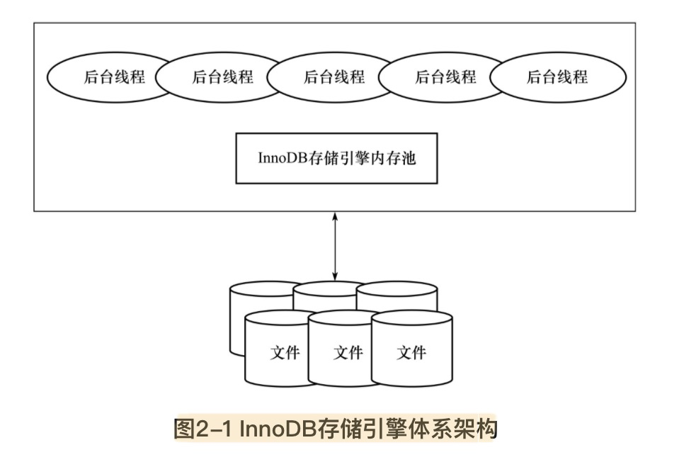
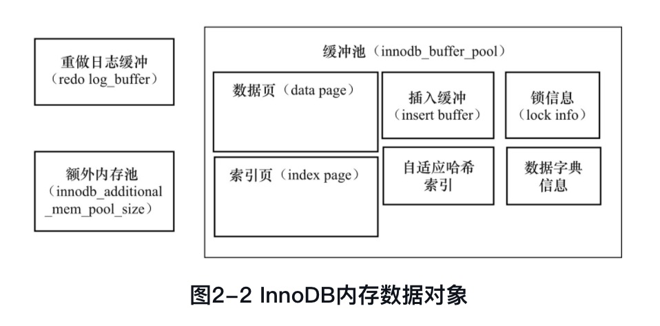
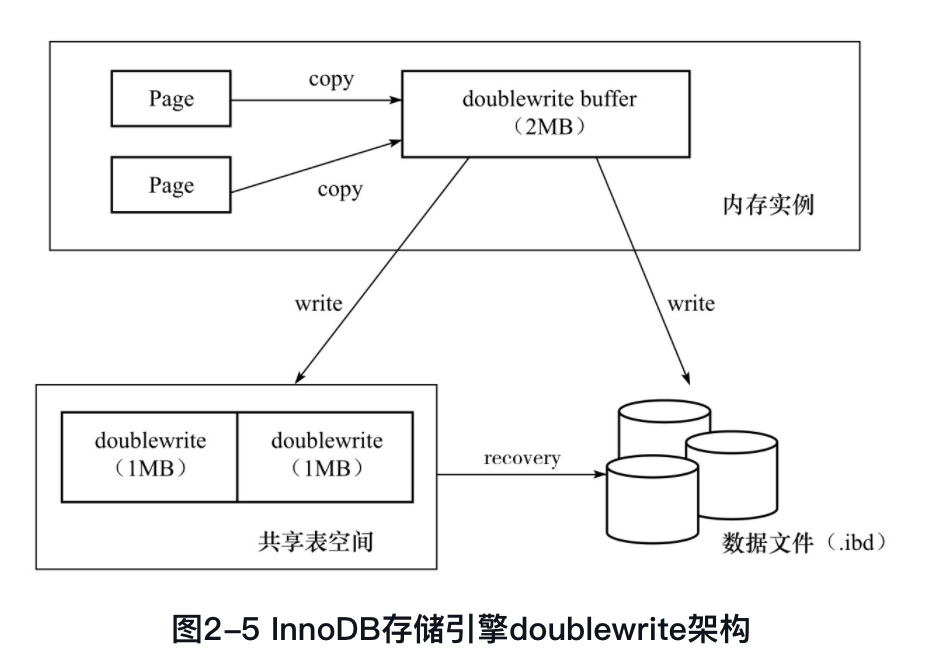
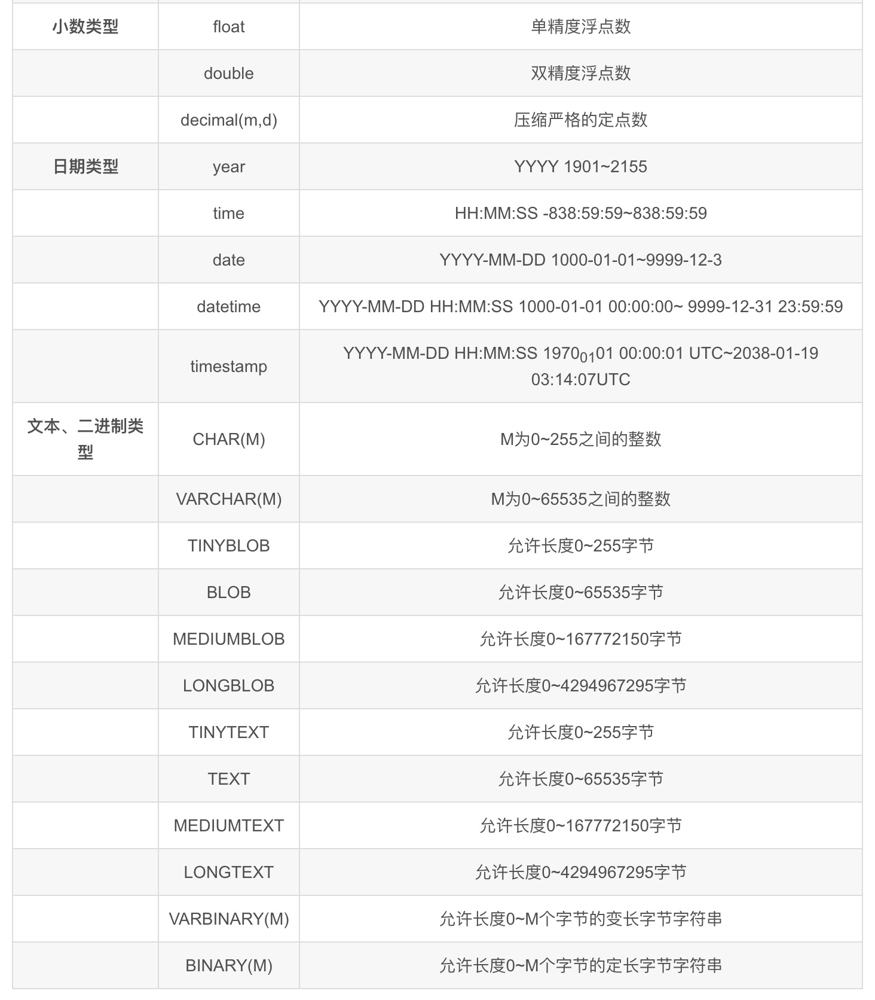

# 第2章 InnoDB存储引擎

## 2.1 概述

MySQL5.5开始默认存储引擎

特点是行锁设计、支持MVCC、支持外键、提供一致性非锁定读

## 2.2 InnoDB存储引擎的版本

最新的是InnoDB 1.2.x

## 2.3 InnoDB体系架构

文件+内存池+后台线程

### 2.3.1 后台线程

主要作用

1. 刷新内存池中的数据，保证缓存的是最近的数据
2. 将已修改数据文件刷新到磁盘文件
3. 保证在数据库发生异常的情况下，InnoDB能恢复到正常运行状态

1. Master Thread：核心后台线程

   将缓冲池中的数据异步刷新到磁盘，保证数据的一致性。包括脏页的刷新、合并插入缓冲（insert buffer）、UNDO页的回收等

2. IO Thread：负责IO请求的回调处理

   write、read、insert buffer、log io thread

   innodb使用AIO（异步io）来处理io请求

3. Purge Thread

   innodb 1.1引入，原本操作也在master Thread中

   事务被提交后，其所使用的undolog可能不再需要，因此需要Purge Thread来回收已经使用并分配的undo页

4. Page Cleaner Thread

   innodb1.2.x引入的，脏页的刷新操作

### 2.3.2 内存

1. 缓冲池

缓冲池中缓存的数据页类型有：索引页、数据页、undo页【图片里是redo log_buffer重做日志缓冲】、插入缓冲（insert buffer）、自适应哈希索引（adaptive hash index）、InnoDB存储的锁信息（lock info）、数据字典信息（data dictionary）等。

2.  LRU List、Free List和Flush List

数据库中的缓冲池是通过LRU（Latest Recent Used，最近最少使用）算法来进行管理的。即最频繁使用的页在LRU列表的前端，而最少使用的页在LRU列表的尾端。

优化：midpoint 最新读到的页，不是直接放入LRU列表的首部，而是放入列表的midpoint位置，一般在5/8处。

在InnoDB存储引擎中，把midpoint之后的列表称为old列表，之前的列表称为new列表。可以简单地理解为new列表中的页都是最为活跃的热点数据。

为什么不直接放首部？某些SQL操作会使缓冲池中的页被刷出，影响缓冲池的效率。比如索引或数据的扫描操作，需要访问表中的许多页，甚至全部的页，（而这些页可能只在本次查询需要，并不是活跃的热点数据。）会将热点数据从缓冲池中刷出，下次需要再加载，innodb需要再次访问磁盘。

3. 重做日志缓冲
4. 额外的内存池

## 2.4 Checkpoint技术

Write Ahead Log策略，即当事务提交时，先写重做日志，再修改页。

因此Checkpoint（检查点）技术的目的是解决以下几个问题：

1. 缩短数据库的恢复时间；

2. 缓冲池不够用时，将脏页刷新到磁盘；

3. 重做日志不可用时，刷新脏页。

## 2.5 MasterThread工作方式

各个版本有些微差异，比如刷新脏页的阈值有差异等，但主要工作是以下内容。

另外，刷新脏页的操作已经从master Thread分离到了单独的线程page cleaner thread. 减轻master Thread的工作，提高系统并发性。

每秒一次的操作包括： == srv_master_do_active_tasks

1. 日志缓冲刷新到磁盘，即使这个事务还没有提交（总是）
2. 合并插入缓冲（可能）
3. 至多刷新100个InnoDB的缓冲池中的脏页到磁盘（可能） -- page cleaner
4. 如果当前没有用户活动，则切换到background loop（可能）。

10秒的操作，包括如下内容： == srv_master_do_idle_tasks

1. 刷新100个脏页到磁盘（可能的情况下） -- page cleaner
2. 合并至多5个插入缓冲（总是）
3. 将日志缓冲刷新到磁盘（总是）
4. 删除无用的Undo页（总是）-- purge thread
5. 刷新100个或者10个脏页到磁盘（总是）。 -- page cleaner

## 2.6 InnoDB关键特性

InnoDB存储引擎的关键特性包括：

1. 插入缓冲（Insert Buffer）
2. 两次写（Double Write）
3. 自适应哈希索引（Adaptive Hash Index）
4. 异步IO（Async IO）
5. 刷新邻接页（Flush Neighbor Page）

网上看到的特性是 1+2+3+预读，read ahead

### 2.6.1 插入缓冲

insert buffer，和数据页一样，也是物理页的组成部分。

insert buffer的使用场景，非唯一辅助索引的插入操作。

具体实现是B+树

1.0.x引入Change Buffer，是insert buffer的升级。对DML操作——insert、delete、update都进行缓冲，分别是insert buffer、delete buffer、Purge buffer。

对一条记录进行UPDATE操作可能分为两个过程：

1. 将记录标记为已删除；

2. 真正将记录删除。

因此Delete Buffer对应UPDATE操作的第一个过程，即将记录标记为删除。PurgeBuffer对应UPDATE操作的第二个过程，即将记录真正的删除

### 2.6.2 两次写

doublewrite由两部分组成，一部分是内存中的doublewrite buffer，大小为2MB，另一部分是物理磁盘上共享表空间中连续的128个页，即2个区（extent），大小同样为2MB。

doublewrite发生在对缓冲池的脏页进行刷新的时候，不直接写磁盘，先memcpy将脏页复制到doublewrite buffer，之后doublewrite buffer每次1MB写入共享表空间的物理磁盘（马上调用fsync，避免缓冲写）（写入是顺序的）。doublewrite写完后，再将页写入各个表空间（写入是离散的）。

### 2.6.3 自适应哈希索引

对象是索引页。

根据访问频率和模式自动为某些热点页建立哈希索引。

### 2.6.4 异步IO

# 第3章 文件

## 3.1 参数文件

## 3.2日志文件

### 3.2.1 错误日志

错误日志文件对MySQL的启动、运行、关闭过程进行了记录。

慢查询日志

查询日志

二进制日志

# 问题汇总

###### 1. 三大范式？

第一范式：每个列都不可以再拆分。

第二范式：在第一范式的基础上，非主键列完全依赖于主键，而不能是依赖于主键的一部分。

第三范式：在第二范式的基础上，非主键列只依赖于主键，不依赖于其他非主键。

###### 2. 数据类型

https://dev.mysql.com/doc/refman/8.0/en/integer-types.html

整数类型。

可以指定长度，不会限制值的范围，只会影响显示字符的个数

| Type        | Storage (Bytes) | Minimum Value Signed | Minimum Value Unsigned | Maximum Value Signed | Maximum Value Unsigned |
| ----------- | --------------- | -------------------- | ---------------------- | -------------------- | ---------------------- |
| `TINYINT`   | 1               | `-128`               | `0`                    | `127`                | `255`                  |
| `SMALLINT`  | 2               | `-32768`             | `0`                    | `32767`              | `65535`                |
| `MEDIUMINT` | 3               | `-8388608`           | `0`                    | `8388607`            | `16777215`             |
| `INT`       | 4               | `-2147483648`        | `0`                    | `2147483647`         | `4294967295`           |
| `BIGINT`    | 8               | `-263`               | `0`                    | `263-1`              | `264-1`                |

https://dev.mysql.com/doc/refman/8.0/en/char.html

字符串类型，varchar有1-2位存长度，列长度小于255字节时，使用1字节表示，否则使用2字节表示。

| Value        | `CHAR(4)` | Storage Required | `VARCHAR(4)` | Storage Required |
| ------------ | --------- | ---------------- | ------------ | ---------------- |
| `''`         | `'  '`    | 4 bytes          | `''`         | 1 byte           |
| `'ab'`       | `'ab '`   | 4 bytes          | `'ab'`       | 3 bytes          |
| `'abcd'`     | `'abcd'`  | 4 bytes          | `'abcd'`     | 5 bytes          |
| `'abcdefgh'` | `'abcd'`  | 4 bytes          | `'abcd'`     | 5 bytes          |

https://dev.mysql.com/doc/refman/8.0/en/innodb-limits.html

innodb限制

1. 最大列数1017
2. innodb 加上blob text等（off-page）数据，行大小不能超过4G
3. mysql 行大小 65535bytes字节

备查

