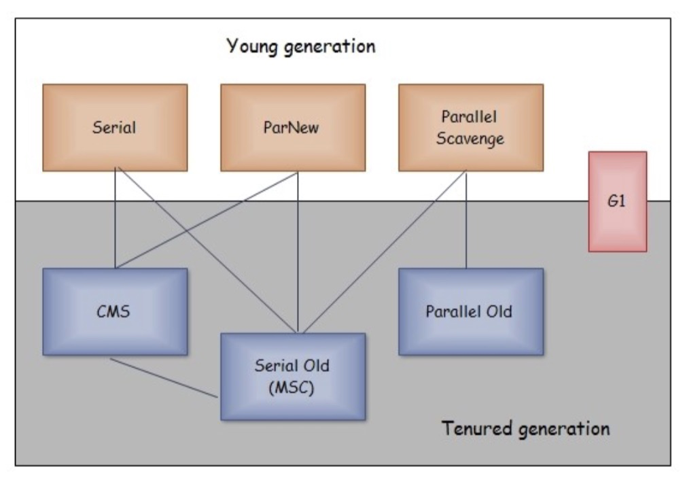

# 运行时数据区域

回答7个

线程私有：JVM虚拟机栈、本地方法栈、程序计数器

线程共享：堆、方法区、直接内存、常量池（属于方法区）

# 垃圾收集

## 对象可达

两个算法

1. 引用计数法

   当有一个地方引用了对象，对象引用计数+1，引用失效时计数-1，当计数为0时，对象可回收（为0后也不会计数再增加了，因为没有引用，就没有操作方）

2. 可达性分析

   从GC Roots出发，通过引用链可达的是存活的，不可达的是可回收的

## GC Roots有哪些

1. 虚拟机栈引用的变量
2. 本地方法栈引用的变量
3. 方法区类静态属性引用的变量
4. 方法区常量引用的变量

## 引用类型

1. 强引用：只要存在引用就不会被回收
2. 软引用：当内存不够时，会被回收不
3. 弱引用：只要gc就会被回收
4. 虚引用：（本质上不算引用，和弱引用一样都会在gc时候被回收）和ReferenceQueue引用队列配合使用可以得知对象将被回收

## 算法

1. 标记清除

   标记阶段标记出未存活的对象，清除阶段回收这些对象。

   （回收时会将回收空间合并，再加入空闲链表）

   标记和清除的效率都不太高，有内存碎片的问题

2. 标记整理

   让所有存活对象都向一端移动，清除掉边界外的对象。

   先标记，再移动。

   需要移动大量对象，效率也不高

3. 复制

   将内存划分成两块，每次用其中一个来分配对象，当一块内存用完时，将存活对象移动另一块，清理当前内存块。

   缺点是内存使用率变低了。

4. 分代收集

   将内存分成不同的几块，采用不同的收集算法。

   商业虚拟机一般分为新生代和老年代。

   新生代用复制算法。

   老年代用标记清除或标记整理。

## 收集器

| 收集器名称                       | 算法                           | 适用区间 | GC线程个数 | GC线程与用户线程的交互 | 备注                   |
| -------------------------------- | ------------------------------ | -------- | ---------- | ---------------------- | ---------------------- |
| Serial                           | 复制 Copy                      | 新生代   | 单线程     | 串行                   |                        |
| Parallel Scavenge \| PS Scavenge | parallel scavenge（复制 Copy） | 新生代   | 多线程     | 串行                   | 尽量短地暂停用户线程   |
| ParNew                           | 多线程复制 Parallel Copy       | 新生代   | 多线程     | 串行                   |                        |
| Serial Old \| MarkSweepConpact   | 标记整理 serial mark-sweep     | 老年代   | 单线程     | 串行                   |                        |
| Parallel Old \| PS MarkSweep     | 标记清除 MarkSweep             | 老年代   | 多线程     | 串行                   |                        |
| ConcurrentMarkSweep              | 标记清除                       | 老年代   | 多线程     | 并行                   |                        |
| G1 Young Generation              | 复制                           | 新生代   |            |                        | 同样分了新生代和老年代 |
| G1 Mixed Generation              |                                | 老年代   |            |                        |                        |

JVM参数与收集器组合

| 参数                                     | 收集器组合                                   | 对应到书本里的叫法                                           | 说明                                             |
| ---------------------------------------- | -------------------------------------------- | ------------------------------------------------------------ | ------------------------------------------------ |
| -XX:+UseSerialGC                         | young **Copy** old **MarkSweepConpact**      | young **Serial** old **Serial Old**                          |                                                  |
| -XX:+UseG1GC                             | young **G1 Young** and **old G1 Mixed**      |                                                              |                                                  |
| -XX:+UseParallelGC -XX:+UseParallelOldGC | young **PS Scavenge** old **PS MarkSweep**   | young **Parallel Scavenge** old ~~**Serial Old**~~**Parallel Old** | 参数只写一个效果也相同【Java9前Unix server默认】 |
| -XX:+UseParNewGC                         | young **ParNew** old **MarkSweepConpact**    | young ParNew old **Serial Old**                              | java8&9中过时及移除【不推荐】                    |
| -XX:+UseParNewGC -XX:+UseConcMarkSweepGC | young **ParNew** old **ConcurrentMarkSweep** | young ParNew old **CMS**                                     | 只设置-XX:+UseConcMarkSweepGC也行                |
| -XX:-UseParNewGC -XX:+UseConcMarkSweepGC | young **Copy** old **ConsurrentMarkSweep**   | young **Serial** old **CMS**                                 | java8&9中过时及移除【不推荐】                    |

各系统的默认参数

| 平台    | 参数                                                         |
| ------- | ------------------------------------------------------------ |
| Windows | -XX:+UseG1GC from Java 9, or before that -XX:+UseSerialGC    |
| Unix    | -XX:+UseG1GC from Java 9, or before that -XX:+UseParallelGC -XX:+UseParallelOldGC -XX:+UseAdaptiveSizePolicy |

其他参数：

-XX:SurvivorRatio=8 表示新生代的Eden占8/10，S1和S2各占1/10. 默认值是8

-XX:NewRatio=2 表示老年代是新生代的2倍，老年代占2/3，新生代1/3。默认值是2

# 内存分配与回收策略

## 内存分配

1. 对象优先在 Eden 分配

   大多数情况下，对象在新生代 Eden 上分配，当 Eden 空间不够时，发起 Minor GC。 

2. 大对象直接进入老年代

   大对象是指需要连续内存空间的对象，最典型的大对象是那种很长的字符串以及数组。

   经常出现大对象会提前触发垃圾收集以获取足够的连续空间分配给大对象。

   -XX:PretenureSizeThreshold，大于此值的对象直接在老年代分配，避免在 Eden 和 Survivor 之间的大量内存复制。

   **PretenureSizeThreshold 默认值是0**，意味着任何对象都会现在新生代分配内存。

3. 长期存活的对象进入老年代

   为对象定义年龄计数器，对象在 Eden 出生并经过 Minor GC 依然存活，将移动到 Survivor 中，年龄就增加 1 岁， 增加到一定年龄则移动到老年代中。

   -XX:MaxTenuringThreshold 用来定义年龄的阈值。

   默认值是15，为0表示每次minor gc存活的对象都会进入老年代。

4. 动态对象年龄判定

   虚拟机并不是永远要求对象的年龄必须达到 MaxTenuringThreshold 才能晋升老年代。

   survivor中对象按年龄从小开始累加，当累加到的大小占空间的一半，大于等于这个年龄的对象直接进入老年代。

5. 空间分配担保

   在发生 Minor GC 之前，虚拟机先检查老年代最大可用的连续空间是否大于新生代所有对象总空间，如果条件成立的话，那么 Minor GC 可以确认是安全的。

   如果不成立的话虚拟机会查看 HandlePromotionFailure 的值是否允许担保失败，如果允许那么就会继续检查老年代 最大可用的连续空间是否大于历次晋升到老年代对象的平均大小，如果大于，将尝试着进行一次 Minor GC;如果小 于，或者 HandlePromotionFailure 的值不允许冒险，那么就要进行一次 Full GC。

## 内存回收

Minor GC触发条件非常简单，当 Eden 空间满时，就将触发一次 Minor GC。

而 Full GC 则相对复杂，有以下条件:

1. 调用 System.gc()
   只是建议虚拟机执行 Full GC，但是虚拟机不一定真正去执行。不建议使用这种方式，而是让虚拟机管理内存。 

2. 老年代空间不足

   老年代空间不足的常见场景为前文所讲的大对象直接进入老年代、长期存活的对象进入老年代等。

   为了避免以上原因引起的 Full GC，应当尽量不要创建过大的对象以及数组。除此之外，可以通过 -Xmn 虚拟机参数 调大新生代的大小，让对象尽量在新生代被回收掉，不进入老年代。还可以通过 -XX:MaxTenuringThreshold 调大对 象进入老年代的年龄，让对象在新生代多存活一段时间。

3. 空间分配担保失败
   使用复制算法的 Minor GC 需要老年代的内存空间作担保，如果担保失败会执行一次 Full GC。

4. JDK 1.7 及以前的永久代空间不足

   在 JDK 1.7 及以前，HotSpot 虚拟机中的方法区是用永久代实现的，永久代中存放的为一些 Class 的信息、常量、静 态变量等数据。

   当系统中要加载的类、反射的类和调用的方法较多时，永久代可能会被占满，在未配置为采用 CMS GC 的情况下也 会执行 Full GC。如果经过 Full GC 仍然回收不了，那么虚拟机会抛出 java.lang.OutOfMemoryError。

   为避免以上原因引起的 Full GC，可采用的方法为增大永久代空间或转为使用 CMS GC。

5. Concurrent Mode Failure

   执行 CMS GC 的过程中同时有对象要放入老年代，而此时老年代空间不足(可能是 GC 过程中浮动垃圾过多导致暂时 性的空间不足)，便会报 Concurrent Mode Failure 错误，并触发 Full GC。

# 类加载机制

# 参考文章

http://www.fasterj.com/articles/oraclecollectors1.shtml

原文摘录

Young generation collectors

**Copy (enabled with -XX:+UseSerialGC)** -

the serial copy collector, uses one thread to copy surviving objects from Eden to Survivor spaces and between Survivor spaces until it decides they've been there long enough, at which point it copies them into the old generation.

**PS Scavenge (enabled with -XX:+UseParallelGC)** -

the parallel scavenge collector, like the **Copy** collector, but uses multiple threads in parallel and has some knowledge of how the old generation is collected (essentially written to work with the serial and PS old gen collectors).

**ParNew (enabled with -XX:+UseParNewGC)** -

the parallel copy collector, like the **Copy** collector, but uses multiple threads in parallel and has an internal 'callback' that allows an old generation collector to operate on the objects it collects (really written to work with the concurrent collector).

**G1 Young Generation (enabled with -XX:+UseG1GC)** -

the garbage first collector, uses the 'Garbage First' algorithm which splits up the heap into lots of smaller spaces, but these are still separated into Eden and Survivor spaces in the young generation for G1.

Old generation collectors

**MarkSweepCompact (enabled with -XX:+UseSerialGC)** -

the serial mark-sweep collector, the daddy of them all, uses a serial (one thread) full mark-sweep garbage collection algorithm, with optional compaction.

**PS MarkSweep (enabled with -XX:+UseParallelOldGC)** -

the parallel scavenge mark-sweep collector, parallelised version (i.e. uses multiple threads) of the **MarkSweepCompact**.

**ConcurrentMarkSweep (enabled with -XX:+UseConcMarkSweepGC)** -

the concurrent collector, a garbage collection algorithm that attempts to do most of the garbage collection work in the background without stopping application threads while it works (there are still phases where it has to stop application threads, but these phases are attempted to be kept to a minimum). Note if the concurrent collector fails to keep up with the garbage, it fails over to the serial **MarkSweepCompact** collector for (just) the next GC.

**G1 Mixed Generation (enabled with -XX:+UseG1GC)** -

the garbage first collector, uses the 'Garbage First' algorithm which splits up the heap into lots of smaller spaces.