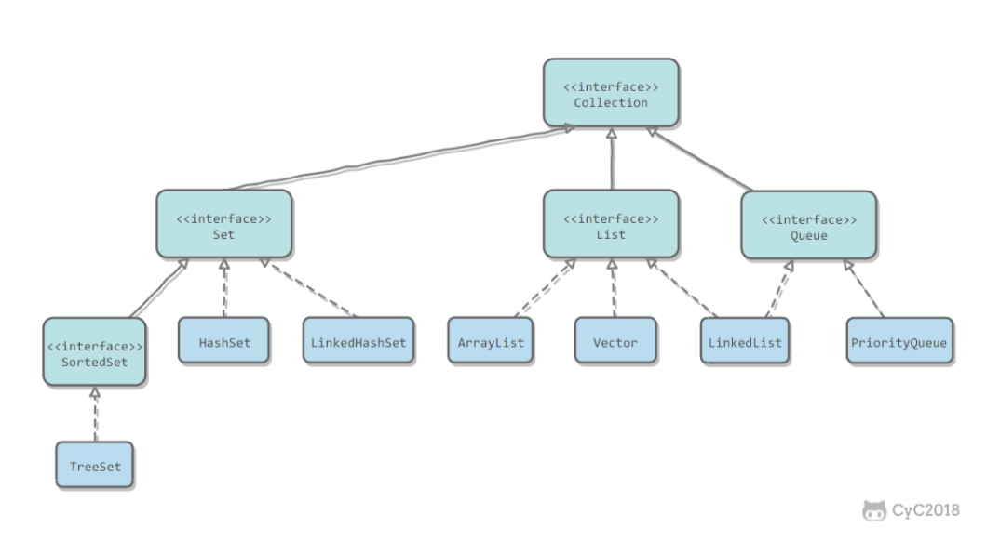
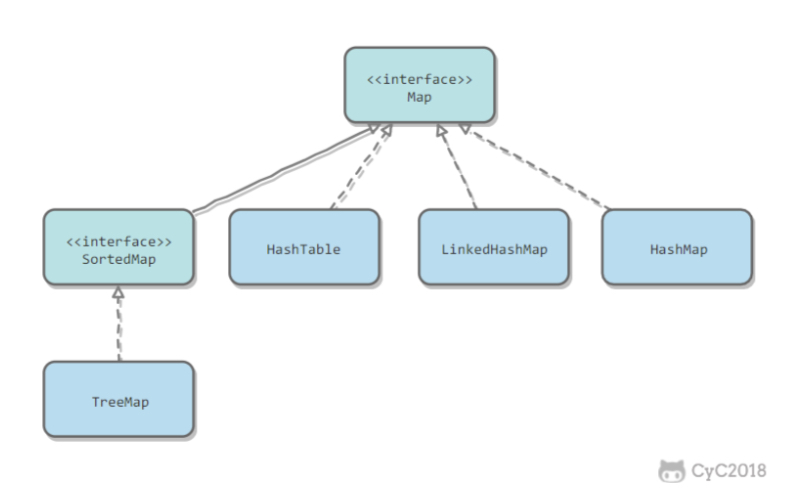
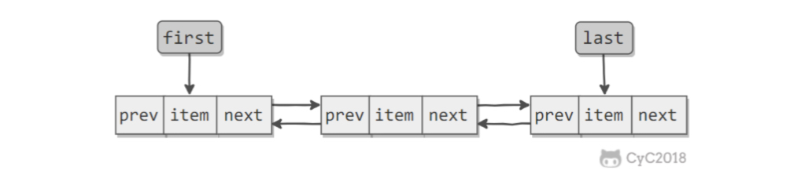
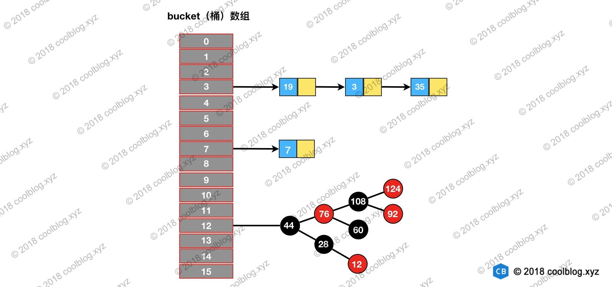
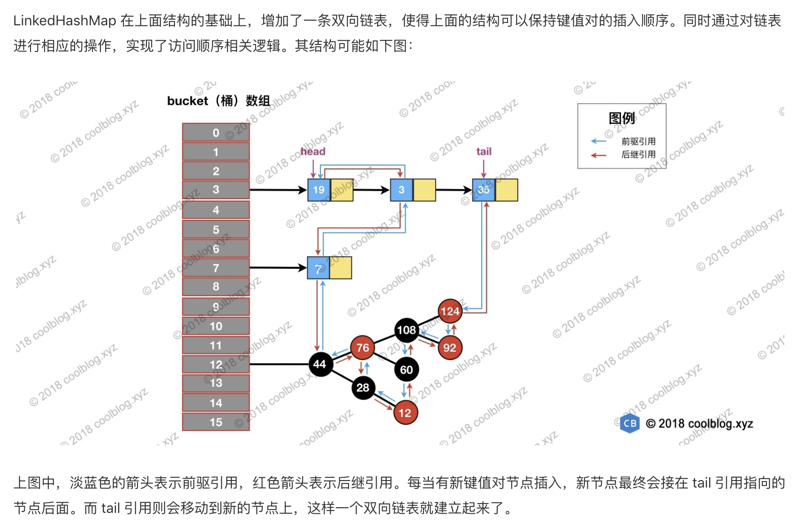

## 概览

### Collection



1. List: 
   1. ArrayList 基于动态数组（动态扩容），支持随机访问
   2. Vector 线程安全
   3. LinkedList 基于双向链表，只能顺序访问，但可快速插入和删除，还可用作栈、队列和双向链表
2. Set
   1. HashSet 哈希表实现，快速查找，不支持有序性操作
   2. TreeSet 红黑树实现，支持有序性操作
   3. LinkedHashSet  具有hashSet的查找效率，内部使用双向链表维护插入顺序
3. Queue
   1. LinkedList  ，双向队列，双向链表实现
   2. PriorityQueue 优先队列，堆实现

### Map



1. HashMap 基于哈希表实现
2. HashTable 线程安全，实现同HashMap
3. TreeMap 红黑树实现
4. LinkedHashMap 哈希表实现，使用双向链表来维护元素的顺序，顺序为插入顺序或者最近最少使用(LRU)顺序


## 容器中的设计模式

### 迭代器

Collection 继承了 Iterable 接口，其中的 iterator() 方法能够产生一个 Iterator 对象，通过这个对象就可以迭代遍历Collection 中的元素。

### 适配器

java.util.Arrays#asList() 可以把数组类型转换为 List 类型。


## 源码分析

### ArrayList

#### 概览

ArrayList 是基于数组实现的，所以支持快速随机访问。RandomAccess 接口标识着该类支持快速随机访问。

数组默认大小是10.

#### 扩容

添加元素时使用 ensureCapacityInternal() 方法来保证容量足够，如果不够时，需要使用 grow() 方法进行扩容，新容量的大小为 oldCapacity + (oldCapacity >> 1) ，也就是旧容量的 1.5 倍。

扩容操作需要调用 Arrays.copyOf() 把原数组整个复制到新数组中，这个操作代价很高，因此最好在创建ArrayList 对象时就指定大概的容量大小，减少扩容操作的次数。  

```java
 public boolean add(E e) {
    ensureCapacityInternal(size + 1);  // Increments modCount!!
    elementData[size++] = e;
    return true;
}
private void ensureCapacityInternal(int minCapacity) {
    if (elementData == DEFAULTCAPACITY_EMPTY_ELEMENTDATA) {
        minCapacity = Math.max(DEFAULT_CAPACITY, minCapacity);
    }
    ensureExplicitCapacity(minCapacity);
}
private void ensureExplicitCapacity(int minCapacity) {
    modCount++;
    // overflow-conscious code
    if (minCapacity - elementData.length > 0)
        grow(minCapacity);
}
private void grow(int minCapacity) {
    // overflow-conscious code
    int oldCapacity = elementData.length;
    int newCapacity = oldCapacity + (oldCapacity >> 1);
    if (newCapacity - minCapacity < 0)
        newCapacity = minCapacity;
    if (newCapacity - MAX_ARRAY_SIZE > 0)
        newCapacity = hugeCapacity(minCapacity);
    // minCapacity is usually close to size, so this is a win:
    elementData = Arrays.copyOf(elementData, newCapacity);
}
```


#### 删除元素

需要调用 System.arraycopy() 将 index+1 后面的元素都复制到 index 位置上，该操作的时间复杂度为 O(N)，可以看出 ArrayList 删除元素的代价是非常高的。

```java
public E remove(int index) {
    rangeCheck(index);
    modCount++;
    E oldValue = elementData(index);
    int numMoved = size - index - 1;
    if (numMoved > 0)
        System.arraycopy(elementData, index+1, elementData, index, numMoved);
    elementData[--size] = null; // clear to let GC do its work
    return oldValue;
}
```


#### Fail-Fast

modCount 用来记录 ArrayList 结构发生变化的次数。结构发生变化是指添加或者删除至少一个元素的所有操作，或者是调整内部数组的大小，仅仅只是设置元素的值不算结构发生变化。 

在进行序列化或者迭代等操作时，需要比较操作前后 modCount 是否改变，如果改变了需要抛出ConcurrentModificationException。 

```java
private void writeObject(java.io.ObjectOutputStream s)
    throws java.io.IOException{
    // Write out element count, and any hidden stuff
    int expectedModCount = modCount;
    s.defaultWriteObject();
    // Write out size as capacity for behavioural compatibility with clone()
    s.writeInt(size);
    // Write out all elements in the proper order.
    for (int i=0; i<size; i++) {
        s.writeObject(elementData[i]);
    }
    if (modCount != expectedModCount) {
        throw new ConcurrentModificationException();
		} 
}
```


#### 序列化

保存元素的数组 elementData 使用 transient 修饰，该关键字声明数组默认不会被序列化。

ArrayList 实现了 writeObject() 和 readObject() 来控制只序列化数组中有元素填充那部分内容。


使用

```java
ArrayList list = new ArrayList();
ObjectOutputStream oos = new ObjectOutputStream(new FileOutputStream(file));
oos.writeObject(list);
```

### 

### Vector

与ArrayList实现相似，但用了synchronized进行同步。

#### 与 ArrayList 的比较 

1. Vector 是同步的，因此开销就比 ArrayList 要大，访问速度更慢。最好使用 ArrayList 而不是 Vector，因为同步 操作完全可以由程序员自己来控制;
2. Vector 每次扩容请求其大小的 2 倍空间，而 ArrayList 是 1.5 倍。 

#### 替代方案

1. Collections.synchronizedList(); 得到一个线程安全的 ArrayList.
2. 使用 concurrent 并发包下的 CopyOnWriteArrayList 类。


### CopyOnWriteArrayList

#### 读写分离

写操作在一个复制的数组上进行，读操作还是在原始数组中进行，读写分离，互不影响。
写操作需要加锁，防止并发写入时导致写入数据丢失。
写操作结束之后需要把原始数组指向新的复制数组。

#### 适用场景

 CopyOnWriteArrayList 在写操作的同时允许读操作，大大提高了读操作的性能，因此很适合读多写少的应用场景。 

但是 CopyOnWriteArrayList 有其缺陷: 

1. 内存占用:在写操作时需要复制一个新的数组，使得内存占用为原来的两倍左右;
2. 数据不一致:读操作不能读取实时性的数据，因为部分写操作的数据还未同步到读数组中。

所以 CopyOnWriteArrayList 不适合内存敏感以及对实时性要求很高的场景。 


### LinkedLsit

基于双向链表实现，使用 Node 存储链表节点信息。

```java
private static class Node<E> {
    E item;
    Node<E> next;
    Node<E> prev;
}
```

每个链表存储了 first 和 last 指针:

```java
transient Node<E> first;
transient Node<E> last;
```




#### 与ArrayList比较

1. ArrayList 基于动态数组实现，LinkedList 基于双向链表实现;

2. ArrayList 支持随机访问，LinkedList 不支持;
3. LinkedList 在任意位置添加删除元素更快。

### HashMap

#### 概览

hashMap使用基于拉链的散列算法，jdk1.8起使用红黑树优化过长的链表。底层结构为数组+链表+红黑树。




#### 源码分析

##### 构造函数

比较关键的在于一些属性值得设置，初始容量、负载因子、阈值。

`threshold = capacity * loadFactor`

`MAXIMUM_CAPACITY`

| 名称                 | 用途                                                         | 默认值   |
| -------------------- | :----------------------------------------------------------- | -------- |
| initialCapacity      | HashMap 初始容量                                             | 16       |
| loadFactor           | 负载因子                                                     | 0.75     |
| threshold            | 当前 HashMap 所能容纳键值对数量的最大值，超过这个值，则需扩容 | 通过计算 |
| MAXIMUM_CAPACITY     | 最大容量                                                     | 1<<30    |
| TREEIFY_THRESHOLD    | 链表树化阈值                                                 | 8        |
| UNTREEIFY_THRESHOLD  | 链表化的阈值（小于这个值，用链表形式）                       | 6        |
| MIN_TREEIFY_CAPACITY | 最小容量                                                     | 64       |

##### 查找

原理

	1. 根据hash定位槽
 	2. 查找给定key（hash相等，key相等），依次判断，找到直接返回，否则最后返回null
      	1. 桶元素
      	2. 若桶元素为树节点类型，委托给树查找元素
      	3. 在链表中查找

code

```java
public V get(Object key) {
    Node<K,V> e;
    return (e = getNode(hash(key), key)) == null ? null : e.value;
}

final Node<K,V> getNode(int hash, Object key) {
    Node<K,V>[] tab; Node<K,V> first, e; int n; K k;
    // 1. 定位键值对所在桶的位置
    if ((tab = table) != null && (n = tab.length) > 0 &&
        (first = tab[(n - 1) & hash]) != null) {
        if (first.hash == hash && // always check first node
            ((k = first.key) == key || (key != null && key.equals(k))))
            return first;
        if ((e = first.next) != null) {
            // 2. 如果 first 是 TreeNode 类型，则调用黑红树查找方法
            if (first instanceof TreeNode)
                return ((TreeNode<K,V>)first).getTreeNode(hash, key);
                
            // 2. 对链表进行查找
            do {
                if (e.hash == hash &&
                    ((k = e.key) == key || (key != null && key.equals(k))))
                    return e;
            } while ((e = e.next) != null);
        }
    }
    return null;
}
```

##### 遍历

从`index = 0, table[index]`开始，找到一个不为null的slot，遍历链表，用到的是next引用。

##### 插入

原理：根据hash定位到槽，如果槽为空，直接插入，否则连接到链表尾部、或更新键值对

涉及到table 初始化、扩容、树化。

1. 当桶数组 table 为空时，通过扩容的方式初始化 table
2. 查找要插入的键值对是否已经存在，如果不存在，则将键值对链入链表中，并根据链表长度决定是否将链表转为红黑树
3. 如果已存在，根据条件判断是否用新值替换旧值
4. 判断键值对数量是否大于阈值，大于的话则进行扩容操作


##### 扩容

原理

1. 计算新容量newCap和新阈值newThr
2. 创建新的数组
3. 将键值对重新映射到新数组上
   1. 如果无链表，直接根据hash&(newCap-1)定位
   2. 如果是树节点，委托红黑树来拆分和重新映射
   3. 为链表，根据hash&oldCap的值分成两组，映射到j和j+oldCap

```java
final Node<K,V>[] resize() {
    Node<K,V>[] oldTab = table;
    int oldCap = (oldTab == null) ? 0 : oldTab.length;
    int oldThr = threshold;
    int newCap, newThr = 0;
    // 如果 table 不为空，表明已经初始化过了
    if (oldCap > 0) {
        // 当 table 容量超过容量最大值，则不再扩容
        if (oldCap >= MAXIMUM_CAPACITY) {
            threshold = Integer.MAX_VALUE;
            return oldTab;
        } 
        // 按旧容量和阈值的2倍计算新容量和阈值的大小
        else if ((newCap = oldCap << 1) < MAXIMUM_CAPACITY &&
                 oldCap >= DEFAULT_INITIAL_CAPACITY)
            newThr = oldThr << 1; // double threshold
    } else if (oldThr > 0) // initial capacity was placed in threshold
        /*
         * 初始化时，将 threshold 的值赋值给 newCap，
         * HashMap 使用 threshold 变量暂时保存 initialCapacity 参数的值
         */ 
        newCap = oldThr;
    else {               // zero initial threshold signifies using defaults
        /*
         * 调用无参构造方法时，桶数组容量为默认容量，
         * 阈值为默认容量与默认负载因子乘积
         */
        newCap = DEFAULT_INITIAL_CAPACITY;
        newThr = (int)(DEFAULT_LOAD_FACTOR * DEFAULT_INITIAL_CAPACITY);
    }
    
    // newThr 为 0 时，按阈值计算公式进行计算
    if (newThr == 0) {
        float ft = (float)newCap * loadFactor;
        newThr = (newCap < MAXIMUM_CAPACITY && ft < (float)MAXIMUM_CAPACITY ?
                  (int)ft : Integer.MAX_VALUE);
    }
    threshold = newThr;
    // 创建新的桶数组，桶数组的初始化也是在这里完成的
    Node<K,V>[] newTab = (Node<K,V>[])new Node[newCap];
    table = newTab;
    if (oldTab != null) {
        // 如果旧的桶数组不为空，则遍历桶数组，并将键值对映射到新的桶数组中
        for (int j = 0; j < oldCap; ++j) {
            Node<K,V> e;
            if ((e = oldTab[j]) != null) {
                oldTab[j] = null;
                if (e.next == null)
                    newTab[e.hash & (newCap - 1)] = e;
                else if (e instanceof TreeNode)
                    // 重新映射时，需要对红黑树进行拆分
                    ((TreeNode<K,V>)e).split(this, newTab, j, oldCap);
                else { // preserve order
                    Node<K,V> loHead = null, loTail = null;
                    Node<K,V> hiHead = null, hiTail = null;
                    Node<K,V> next;
                    // 遍历链表，并将链表节点按原顺序进行分组
                    do {
                        next = e.next;
                        if ((e.hash & oldCap) == 0) {
                            if (loTail == null)
                                loHead = e;
                            else
                                loTail.next = e;
                            loTail = e;
                        }
                        else {
                            if (hiTail == null)
                                hiHead = e;
                            else
                                hiTail.next = e;
                            hiTail = e;
                        }
                    } while ((e = next) != null);
                    // 将分组后的链表映射到新桶中
                    if (loTail != null) {
                        loTail.next = null;
                        newTab[j] = loHead;
                    }
                    if (hiTail != null) {
                        hiTail.next = null;
                        newTab[j + oldCap] = hiHead;
                    }
                }
            }
        }
    }
    return newTab;
}
```

###### 

###### 链表树化

1. 链表树化有两个条件，不满足采用扩容，满足再扩容
2. 树化时，将Node节点替换为TreeNode，保留next信息
3. 替换后，再从head开始，进行红黑树化（标记红黑节点、父子节点，如果root节点不是first节点，再修正next和prev？）【链表转成红黑树后，原链表的顺序仍然会被引用仍被保留了（红黑树的根节点会被移动到链表的第一位）】

在扩容过程中，树化要满足两个条件：

1. 链表长度大于等于 TREEIFY_THRESHOLD 8 
2. 桶数组容量大于等于 MIN_TREEIFY_CAPACITY 64

###### 红黑树拆分

红黑树中保留了next引用，拆分原理和链表相似

1. 根据hash拆分成两组（这时候会生成新的next关系）
2. 各组内根据情况，链化或者重新红黑树化


###### 红黑树链化

将TreeNode替换为Node


##### 删除

原理

1. 定位到槽
2. 找到删除节点
3. 删除节点，并修复链表或红黑树


### ConcurrentHashMap

相比较HashMap，主要是新增了写操作时候的同步处理

1. 扩容迁移时，可以多个线程帮助迁移


Q：ConcurrentHashMap 在 JDK 1.8 中，为什么要使用内置锁 synchronized 来代替重入锁 ReentrantLock？

①、**粒度降低了**；
②、优化后的synchronized性能与ReentrantLock不相上下，基于JVM也保证synchronized在各平台上都可使用。
③、在大量的数据操作下，对于 JVM 的内存压力，基于 API 的 **ReentrantLock 会开销更多的内存**。


#### 插入

1. 计算hash
2. 循环执行
   1. 如果数组为空，初始化initTable
   2. 如果hash定位到的槽为空，CAS替换为新节点，退出循环
   3. 如果槽不为空，节点hash为-1，说明正在迁移，helpTransfer
   4. 槽不为空，且不在迁移，那么，对头节点加监控器锁，链表或红黑树形式插入或更新节点
3. addCount


#### 计数【扩容==迁移】

主要为putVal情形下的addCount，主要逻辑：

1. 更新as的值，如果有竞争，退出方法，无竞争，根据as和baseCount统计当前节点个数s
2. 如果s大于扩容阈值
   1. 如果sizeCtl<0，说明正在迁移。如果未到迁移上限、或者迁移结束、或者新表未创建，退出本次循环，否则更新迁移线程数后进入迁移。
   2. 如果sizeCtl>=0，由当前线程启动迁移，CAS更新sizeCtl为`(rs << RESIZE_STAMP_SHIFT) + 2)`，进入迁移。
   3. 再sunCount统计s个数

```Java
private final void addCount(long x, int check) {
    CounterCell[] as; long b, s;
    if ((as = counterCells) != null ||
        !U.compareAndSwapLong(this, BASECOUNT, b = baseCount, s = b + x)) {
        CounterCell a; long v; int m;
        boolean uncontended = true;
        if (as == null || (m = as.length - 1) < 0 ||
            (a = as[ThreadLocalRandom.getProbe() & m]) == null ||
            // 如果CAS CELLVALUE失败，则进入fullAddCount，然后退出方法
            // CAS成功，说明不存在对a的竞争，继续
            !(uncontended =
              U.compareAndSwapLong(a, CELLVALUE, v = a.value, v + x))) {
            fullAddCount(x, uncontended);
            return;
        }
      // check的值为putVal的binCount时，在链表新增节点或红黑树形式下，值都>=2
        if (check <= 1)
            return;
        s = sumCount();
    }
    if (check >= 0) {
        Node<K,V>[] tab, nt; int n, sc;
        while (s >= (long)(sc = sizeCtl) && (tab = table) != null &&
               (n = tab.length) < MAXIMUM_CAPACITY) {
            int rs = resizeStamp(n);
            if (sc < 0) {
                if ((sc >>> RESIZE_STAMP_SHIFT) != rs || sc == rs + 1 ||
                    sc == rs + MAX_RESIZERS || (nt = nextTable) == null ||
                    transferIndex <= 0)
                    break;
                if (U.compareAndSwapInt(this, SIZECTL, sc, sc + 1))
                    transfer(tab, nt);
            }
            else if (U.compareAndSwapInt(this, SIZECTL, sc,
                                         (rs << RESIZE_STAMP_SHIFT) + 2))
                transfer(tab, null);
            s = sumCount();
        }
    }
}
```


#### 迁移

transfer的第二个参数为空的时候，触发扩容，创建nextTable，在addCount和tryPresize中有这样的调用。

addCount是size不精确情况下，可能触发扩容；tryPresize是已知精确size的情况下做扩容。


总结下流程

1. 计算步长stride
2. 如果nextTab未创建，则创建之，并赋给nextTable
3. 循环迁移
   1. 分配迁移区间i`和`bound`（`i`从前往后，`bound = i - stride + 1`，总之就是stride）
   2. 如果区间已达边界，将sc减1，表示本线程退出迁移。如果是最后一个迁移线程，标记finish和advance为true，进入下一循环recheck；非最后线程，直接退出方法。
   3. 若未达边界，且槽为空，CAS槽为fwd，进入下一循环
   4. 槽不为空，且槽已经是fwd，进入下一循环
   5. 最后一种情形，进行迁移
      1. 为链表，根据节点hash二进制第k位为0或1分成两组（n=2^k），1连接到高位槽上
      2. 为红黑树，分组同链表，分好的组根据节点个数判断是否链化或新生成红黑树

```Java
/**
 * Moves and/or copies the nodes in each bin to new table. See
 * above for explanation.
 */
private final void transfer(Node<K,V>[] tab, Node<K,V>[] nextTab) {
    int n = tab.length, stride;
  // (NCPU > 1) ? (n >>> 3) / NCPU : n
  // cpu个数>1的话，stride = 表长n/8/cpu个数
  // cpu个数为1，stride = 表长n
  // 最小步长为16
    if ((stride = (NCPU > 1) ? (n >>> 3) / NCPU : n) < MIN_TRANSFER_STRIDE)
        stride = MIN_TRANSFER_STRIDE; // subdivide range
  // 如果传入的nextTab是空的，先创建新数组
    if (nextTab == null) {            // initiating
        try {
            @SuppressWarnings("unchecked")
            Node<K,V>[] nt = (Node<K,V>[])new Node<?,?>[n << 1];
            nextTab = nt;
        } catch (Throwable ex) {      // try to cope with OOME
            sizeCtl = Integer.MAX_VALUE;
            return;
        }
        nextTable = nextTab;
        transferIndex = n;
    }
    int nextn = nextTab.length;
    ForwardingNode<K,V> fwd = new ForwardingNode<K,V>(nextTab);
    boolean advance = true;
    boolean finishing = false; // to ensure sweep before committing nextTab
    for (int i = 0, bound = 0;;) {
        Node<K,V> f; int fh;
      // 分配本次循环需要迁移的区间
      // 一般i=transferIndex-1，表示本次循环的上界，bound=i-stride，表示下界
        while (advance) {
            int nextIndex, nextBound;
            if (--i >= bound || finishing)
                advance = false;
            else if ((nextIndex = transferIndex) <= 0) {
                i = -1;
                advance = false;
            }
            else if (U.compareAndSwapInt
                     (this, TRANSFERINDEX, nextIndex,
                      nextBound = (nextIndex > stride ?
                                   nextIndex - stride : 0))) {
              // bound = i - stride 
              // bound = nextBound = nextIndex - stride = i + 1 - stride
                bound = nextBound;
                i = nextIndex - 1;
                advance = false;
            }
        }
      // 已到达边界，标识当前size*2的迁移finish
        if (i < 0 || i >= n || i + n >= nextn) {
            int sc;
            if (finishing) {
                nextTable = null;
                table = nextTab;
                sizeCtl = (n << 1) - (n >>> 1);
                return;
            }
            if (U.compareAndSwapInt(this, SIZECTL, sc = sizeCtl, sc - 1)) {
                if ((sc - 2) != resizeStamp(n) << RESIZE_STAMP_SHIFT)
                    return;
                finishing = advance = true;
                i = n; // recheck before commit
            }
        }
      // 如果槽为null，CAS替换为fwd
        else if ((f = tabAt(tab, i)) == null)
            advance = casTabAt(tab, i, null, fwd);
      // 如果槽已被标记为迁移，则进入下一个分配循环 while (advance)
        else if ((fh = f.hash) == MOVED)
            advance = true; // already processed
      // 执行本区间的迁移
      // 槽节点加监视器锁，如果为链表，分成高低位两组；或者为红黑树，也是利用next引用，分成两组，根据长度判断是否要链表化；结束后将advance标记为true，循环继续
        else {
            synchronized (f) {
                if (tabAt(tab, i) == f) {
                    Node<K,V> ln, hn;
                    if (fh >= 0) {
                        int runBit = fh & n;
                        Node<K,V> lastRun = f;
                        for (Node<K,V> p = f.next; p != null; p = p.next) {
                            int b = p.hash & n;
                            if (b != runBit) {
                                runBit = b;
                                lastRun = p;
                            }
                        }
                        if (runBit == 0) {
                            ln = lastRun;
                            hn = null;
                        }
                        else {
                            hn = lastRun;
                            ln = null;
                        }
                        for (Node<K,V> p = f; p != lastRun; p = p.next) {
                            int ph = p.hash; K pk = p.key; V pv = p.val;
                            if ((ph & n) == 0)
                                ln = new Node<K,V>(ph, pk, pv, ln);
                            else
                                hn = new Node<K,V>(ph, pk, pv, hn);
                        }
                        setTabAt(nextTab, i, ln);
                        setTabAt(nextTab, i + n, hn);
                        setTabAt(tab, i, fwd);
                        advance = true;
                    }
                    else if (f instanceof TreeBin) {
                        TreeBin<K,V> t = (TreeBin<K,V>)f;
                        TreeNode<K,V> lo = null, loTail = null;
                        TreeNode<K,V> hi = null, hiTail = null;
                        int lc = 0, hc = 0;
                        for (Node<K,V> e = t.first; e != null; e = e.next) {
                            int h = e.hash;
                            TreeNode<K,V> p = new TreeNode<K,V>
                                (h, e.key, e.val, null, null);
                            if ((h & n) == 0) {
                                if ((p.prev = loTail) == null)
                                    lo = p;
                                else
                                    loTail.next = p;
                                loTail = p;
                                ++lc;
                            }
                            else {
                                if ((p.prev = hiTail) == null)
                                    hi = p;
                                else
                                    hiTail.next = p;
                                hiTail = p;
                                ++hc;
                            }
                        }
                      // new TreeBin<K,V>(lo) 中，调整红黑树
                        ln = (lc <= UNTREEIFY_THRESHOLD) ? untreeify(lo) :
                            (hc != 0) ? new TreeBin<K,V>(lo) : t;
                        hn = (hc <= UNTREEIFY_THRESHOLD) ? untreeify(hi) :
                            (lc != 0) ? new TreeBin<K,V>(hi) : t;
                        setTabAt(nextTab, i, ln);
                        setTabAt(nextTab, i + n, hn);
                        setTabAt(tab, i, fwd);
                        advance = true;
                    }
                }
            }
        }
    }
}
```


#### 


#### 查找


### LinkedHashMap

#### 概览

1. Entry继承自HashMap.Entry，增加before和after引用
2. 增加head和tail引用
3. 默认维护插入顺序，accessOrder = false。构造函数中允许传入accessOrder = true，维护访问顺序（最近访问的移动到tail），实现LRU（Least recently used,最近最少使用）策略的缓存。
4. 新增节点newNode时，若tail为空，head指向当前节点，tail指向当前节点。一般在put时候调用newNode方法。

```Java
Node<K,V> newNode(int hash, K key, V value, Node<K,V> e) {
    LinkedHashMap.Entry<K,V> p =
        new LinkedHashMap.Entry<K,V>(hash, key, value, e);
    linkNodeLast(p);
    return p;
}
```

```Java
private void linkNodeLast(LinkedHashMap.Entry<K,V> p) {
    LinkedHashMap.Entry<K,V> last = tail;
    tail = p;
    if (last == null)
        head = p;
    else {
        p.before = last;
        last.after = p;
    }
}
```

5. 删除节点时，将当前节点的before和after建立连接
6. 维护访问顺序时，构造函数中传入accessOrder = true，在调用get/getOrDefault/replace等方法时，会将访问节点移动到链表末尾。实现方式是，先连接起当前节点的before和after，再将当前节点连接到原tail后面。
7. 基于LinkedHashMap实现LRU缓存时，还可通过覆写`removeEldestEntry`（移除最老节点的策略，比如设定个最大链表大小，超过这个大小就返回true，移除最老节点）方法，实现自定义策略的LRU缓存。


继承自 HashMap，具有和 HashMap 一样的快速查找特性。

内部维护了一个双向链表，用来维护插入顺序或者 LRU 顺序。

```java
/**
 * The head (eldest) of the doubly linked list.
 */
transient LinkedHashMap.Entry<K,V> head;
/**
 * The tail (youngest) of the doubly linked list.
 */
transient LinkedHashMap.Entry<K,V> tail;
```


accessOrder 决定了顺序，默认为 false，此时维护的是插入顺序。

```java
final boolean accessOrder;
```


LinkedHashMap 最重要的是以下用于维护顺序的函数，它们会在 put、get 等方法中调用。

#### afterNodeAccess() 

当一个节点被访问时，如果 accessOrder 为 true，则会将该节点移到链表尾部。也就是说指定为 LRU 顺序之后，在每次访问一个节点时，会将这个节点移到链表尾部，保证链表尾部是最近访问的节点，那么链表首部就是最近最久未使用的节点。 

```java
void afterNodeAccess(Node<K,V> e) { // move node to last
    LinkedHashMap.Entry<K,V> last;
    if (accessOrder && (last = tail) != e) {
        LinkedHashMap.Entry<K,V> p =
            (LinkedHashMap.Entry<K,V>)e, b = p.before, a = p.after;
        p.after = null;
        if (b == null)
            head = a;
        else
            b.after = a;
        if (a != null)
            a.before = b;
        else
            last = b;
        if (last == null)
            head = p;
        else {
            p.before = last;
            last.after = p;
        }
        tail = p;
        ++modCount;
    }
}
```

#### afterNodeInsertion()

在 put 等操作之后执行，当 removeEldestEntry() 方法返回 true 时会移除最晚的节点，也就是链表首部节点 first。
evict 只有在构建 Map 的时候才为 false，在这里为 true。

```java
void afterNodeInsertion(boolean evict) { // possibly remove eldest
    LinkedHashMap.Entry<K,V> first;
    if (evict && (first = head) != null && removeEldestEntry(first)) {
        K key = first.key;
        removeNode(hash(key), key, null, false, true);
    }
}
```


每当有新键值对节点插入，新节点最终会接在 tail 引用指向的节点后面。而 tail 引用则会移动到新的节点上，这样一个双向链表就建立起来了。




### WeekHashMap