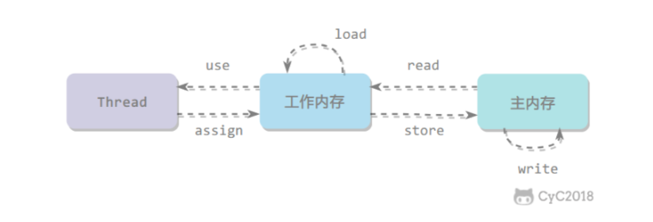
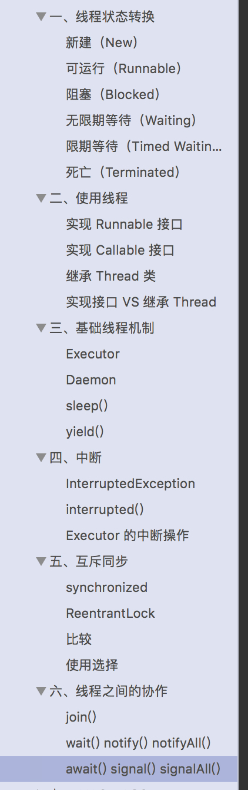

## 线程状态转换

同JVM中记录


## 使用线程

1. 实现Runnable接口
2. 实现Callable接口
3. 继承Thread类


## Condition的概念

Condition主要是为了在J.U.C框架中提供和Java传统的监视器风格的wait，notify和notifyAll方法类似的功能。

 

JDK的官方解释如下：

条件（也称为条件队列 或条件变量）为线程提供了一个含义，以便在某个状态条件现在可能为 true 的另一个线程通知它之前，一直挂起该线程（即让其“等待”）。因为访问此共享状态信息发生在不同的线程中，所以它必须受保护，因此要将某种形式的锁与该条件相关联。等待提供一个条件的主要属性是：以原子方式 释放相关的锁，并挂起当前线程，就像 Object.wait 做的那样。

Condition实质上是被绑定到一个锁上。


```java
/**
 * 生产者、消费者示例
 */
@Slf4j
public class ConditionTest {

    private int storage;
    private int putCounter;
    private int getCounter;
    private Lock lock = new ReentrantLock();
    private Condition putCondition = lock.newCondition();
    private Condition getCondition = lock.newCondition();

    public void put() throws InterruptedException {
        try {
            lock.lock();
            if (storage >= 100) {
                putCondition.await();
            }
            storage++;
            log.info("put => storage = {}, putCounter = {}", storage, putCounter++);
            getCondition.signal();
        } finally {
            lock.unlock();
        }
    }

    public void get() throws InterruptedException {
        try {
            lock.lock();
            if (storage <= 0) {
                getCondition.await();
            }
            storage--;
            log.info("get => storage = {}, getCounter = {}", storage, getCounter++);
            putCondition.signal();
        } finally {
            lock.unlock();
        }
    }

    public class PutThread extends Thread {
        @Override
        public void run() {
            for (int i = 0; i < 10000; i++) {
                try {
                    put();
                } catch (InterruptedException e) {
                }
            }
        }
    }

    public class GetThread extends Thread {
        @Override
        public void run() {
            for (int i = 0; i < 10000; i++) {
                try {
                    get();
                } catch (InterruptedException e) {
                }
            }
        }
    }

    public static void main(String[] args) {
        final ConditionTest test = new ConditionTest();
        Thread put = test.new PutThread();
        Thread get = test.new GetThread();
        put.start();
        get.start();
    }
}

```


## Java内存模型

### 内存间交互操作

Java 内存模型定义了 8 个操作来完成主内存和工作内存的交互操作。




read:把一个变量的值从主内存传输到工作内存中
load:在 read 之后执行，把 read 得到的值放入工作内存的变量副本中
use:把工作内存中一个变量的值传递给执行引擎
assign:把一个从执行引擎接收到的值赋给工作内存的变量
store:把工作内存的一个变量的值传送到主内存中
write:在 store 之后执行，把 store 得到的值放入主内存的变量中
lock:作用于主内存的变量
unlock


### 内存模型特性

1. 原子性
   1. Java 内存模型保证了 read、load、use、assign、store、write、lock 和 unlock 操作具有原子性，例如对一个 int类型的变量执行 assign 赋值操作，这个操作就是原子性的。
   2. i++ 不是线程安全的操作
2. 可见性
   1. 可见性指当一个线程修改了共享变量的值，其它线程能够立即得知这个修改。
   2. 三种实现方式：volatile，synchronized（对一个变量执行 unlock 操作之前,必须把变量值同步回主内存），final
3. 有序性：单线程内有序


### 先行发生原则

1. 单一线程原则：在一个线程内，在程序前面的操作先行发生于后面的操作。
2. 管程锁定原则：一个 unlock 操作先行发生于后面对同一个锁的 lock 操作。
3. Volatile变量原则：对一个 volatile 变量的写操作先行发生于后面对这个变量的读操作。
4. 线程启动原则：Thread 对象的 start() 方法调用先行发生于此线程的每一个动作。
5. 线程加入原则：Thread 对象的结束先行发生于 join() 方法返回。
6. 线程中断原则：对线程 interrupt() 方法的调用先行发生于被中断线程的代码检测到中断事件的发生，可以通过 interrupted() 方法检测到是否有中断发生。
7. 对象终结原则：一个对象的初始化完成(构造函数执行结束)先行发生于它的 finalize() 方法的开始。
8. 传递性：如果操作 A 先行发生于操作 B，操作 B 先行发生于操作 C，那么操作 A 先行发生于操作 C。


## 线程安全

同JVM

1. 不可变：final、 String、 Number子类、Collections.unmodifiableXX等
2. 互斥同步：synchronized、ReentrantLock
3. 非阻塞同步：CAS、juc原子类、AtomicStampedReference
4. 无同步方案：栈封闭（方法内临时变量）、线程本地存储（ThreadLocal）、可重入代码（不依赖堆上的对象和系统公共资源、用到的状态参数都由变量传入、不调用不可重入方法）


## 其他

