## 运行时数据区域

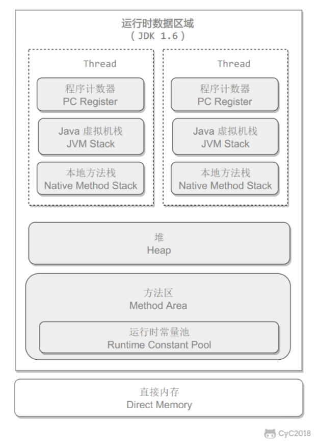

1. 程序计数器：

   记录正在执行的虚拟机字节码指令地址

2. Java虚拟机栈：

   Java方法执行时创建的栈帧，用于存储临时变量表、操作数栈、常量池引用等信息。

   -Xss指定栈大小，jdk1.4默认256k，jdk1.5+默认1M.

   ```java
   java -Xss2M HackTheJava
   ```

   该区域可能抛出以下异常:

   当线程请求的**栈深度超过最大值**，会抛出 StackOverflowError 异常; 

   栈进行动态扩展时如果**无法申请到足够内存**，会抛出 OutOfMemoryError 异常。 

3. 本地方法栈：

   与 Java 虚拟机栈类似，它们之间的区别是本地方法栈为本地方法服务。

4. 堆：

   所有对象都在这里分配内存，是垃圾收集的主要区域("GC 堆")。

   现代的垃圾收集器基本都是采用分代收集算法，主要思想是**针对不同类型的对象采取不同的垃圾回收算法**。

   可以将堆分成两块:

   新生代(Young Generation) 

   老年代(Old Generation) 

   堆不需要连续内存，并且可以动态增加其内存，增加失败会抛出 OutOfMemoryError 异常。

   通过 -Xms 和 -Xmx 这两个虚拟机参数来指定一个程序的堆内存大小，第一个参数设置初始值，第二个参数设置最大值。 

   ```shell
    java -Xms1M -Xmx2M HackTheJava
   ```

5. 方法区

   用于存放**已被加载的类信息、常量、静态变量、即时编译器编译后的代码**等数据。

   和堆一样不需要连续的内存，并且可以动态扩展，动态扩展失败一样会抛出 OutOfMemoryError 异常。

   从 JDK1.8 开始，移除永久代，并把方法区移至元空间，它位于本地内存中，而不是虚拟机内存中。

6. 运行时常量池

   **运行时常量池是方法区的一部分**。

   Class 文件中的常量池（编译生成的字面量和符号引用）会在类加载后被放入这个区域。

   除了在编译期生成的常量，还允许动态生成，例如 String 类的 intern()。

7. 直接内存

   在 JDK 1.4 中新引入了 NIO 类，它可以使用 Native 函数库直接分配堆外内存，然后通过 Java 堆里的DirectByteBuffer 对象作为这块内存的引用进行操作。这样能在一些场景中显著提高性能，因为避免了在堆内存和堆外内存来回拷贝数据。

## 垃圾收集

### 判断一个对象是否可被回收

1. 引用计数法

为对象添加一个引用计数器，当对象增加一个引用时计数器加 1，引用失效时计数器减 1。引用计数为 0 的	对象可被回收。

存在循环引用的问题。

2. 可达性分析

以 GC Roots 为起始点进行搜索，可达的对象都是存活的，不可达的对象可被回收。

**GC Roots** 一般包含以下内容: 

	1. 虚拟机栈中局部变量表中引用的对象
	
	2. 本地方法栈中 JNI 中引用的对象
	
	3. 方法区中类静态属性引用的对象
	
	4. 方法区中的常量引用的对象

### 方法区的回收

方法区主要存放永久代对象，回收率比较低

主要是对常量回收和对类卸载

**类卸载的条件**：

	1. 该类的所有实例都已回收
	
	2. 加载该类的classloader已回收
	
	3. 该类对应的Class对象没有被引用，意味着不能通过反射生成该类实例、访问该类方法

### 引用类型

#### 1. 强引用类型

被强引用关联的对象不会被回收。

使用new一个新对象的方式来创建强引用。   

Object obj = new Object();


#### 2. 软引用类型

被软引用关联的对象只有在内存不够的情况下才会被回收。
使用 SoftReference 类来创建软引用。

   ```Java
   Object obj = new Object();
   SoftReference<Object> sf = new SoftReference<Object>(obj);
   obj = null; // 使对象只被软引用关联
   ```

#### 3. 弱引用类型

被弱引用关联的对象一定会被回收，也就是说它只能存活到下一次垃圾回收发生之前。
使用 WeakReference 类来创建弱引用。

   ```Java
   Object obj = new Object();
   WeakReference<Object> wf = new WeakReference<Object>(obj);
   obj = null;
   ```

#### 4. 虚引用类型

又称为幽灵引用或者幻影引用，一个对象是否有虚引用的存在，不会对其生存时间造成影响，也无法通过虚引用得到一个对象。 为一个对象设置虚引用的唯一目的是能在这个对象被回收时收到一个系统通知。 

使用 PhantomReference 来创建虚引用。 

   ```Java
   Object obj = new Object();
   PhantomReference<Object> pf = new PhantomReference<Object>(obj, null);
   obj = null;
   ```

### 垃圾收集算法

#### 1. 标记 - 清除


在标记阶段，程序会检查每个对象是否为活动对象，如果是活动对象，则程序会在对象头部打上标记。

在清除阶段，会进行对象回收并取消标志位 。

回收对象就是把对象作为分块，连接到被称为 “空闲链表” 的单向链表，之后进行分配时只需要遍
历这个空闲链表，就可以找到分块。

不足: 

- 标记和清除过程效率都不高;
- 会产生大量不连续的内存碎片，导致无法给大对象分配内存。


#### 2. 标记 - 整理

让所有存活的对象都向一端移动，然后直接清理掉端边界以外的内存。

优点: 

- 不会产生内存碎片

不足: 

- 需要移动大量对象，处理效率比较低。

#### 3. 复制

将内存划分为大小相等的两块，每次只使用其中一块，当这一块内存用完了就将还存活的对象复制到另一块上面，然后再把使用过的内存空间进行一次清理。

#### 4. 分代收集

现在的商业虚拟机采用分代收集算法，它根据对象存活周期将内存划分为几块，不同块采用适当的收集算法。 一般将堆分为新生代和老年代。 

新生代使用:复制算法
 老年代使用:标记 - 清除 或者 标记 - 整理 算法 

### 垃圾收集器

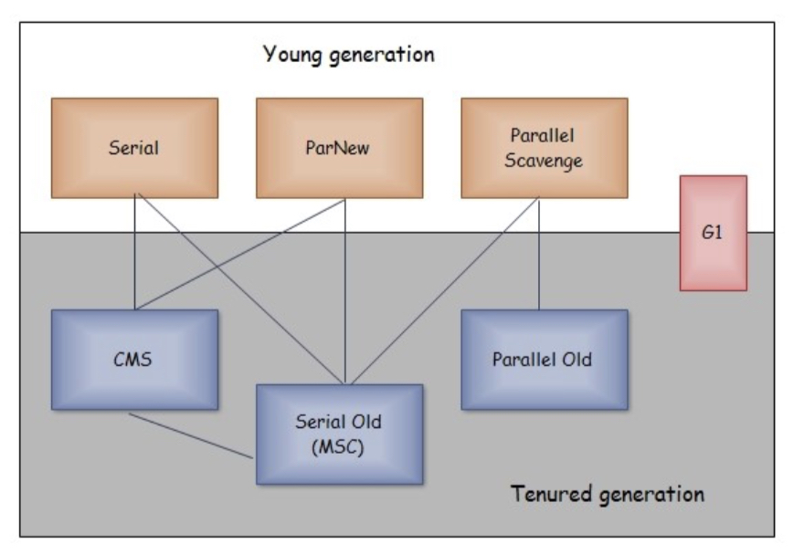


stop the world：停顿所有Java执行线程。


Safepoint：并非所有地方都能停顿下来开始GC，只有在到达安全点时才能停顿。安全点选取“长时间执行”的代码片段，例如方法调用、循环跳转、异常跳转等。

抢占式中断：先挂起线程，发现不是安全点就恢复线程，让线程跑到安全点。不采用。

主动式中断：线程执行到安全点时，主动去轮询中断标志，触发自身中断。


安全区域：指一段代码片段之中，引用关系不会发生变化。Safe Region可以看成是Safepoint的扩展。

为了解决“不执行”--没有分配CPU时间，sleep或blocked等--的线程的无法主动式中断。线程执行到安全区域时，会标识自己的安全区域状态，虚拟机GC时忽略这些线程。如果线程运行到要离开安全区域，但GC还未结束，则需要等待到GC结束。


- 单线程与多线程:单线程指的是垃圾收集器只使用一个线程，而多线程使用多个线程;
- 串行与并行:串行指的是垃圾收集器与用户程序交替执行，这意味着在执行垃圾收集的时候需要停顿用户程序;并行指的是垃圾收集器和用户程序同时执行。除了 CMS 和 G1 之外，其它垃圾收集器都是以串行的方式执行。

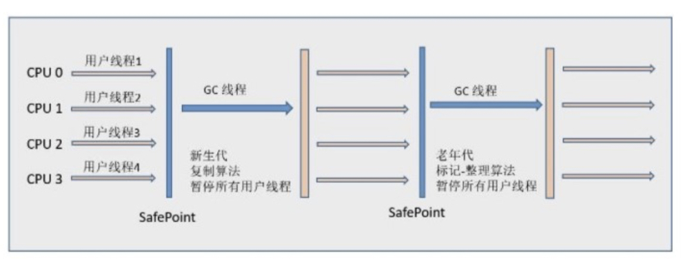
<center>Serial 和 Serial old</center>
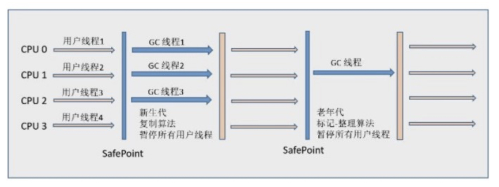

<center>ParNew 和 Serial Old</center>
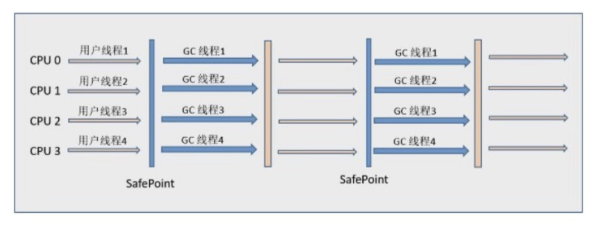

<center>Parallel Scavenge 和 Parallel Old</center>
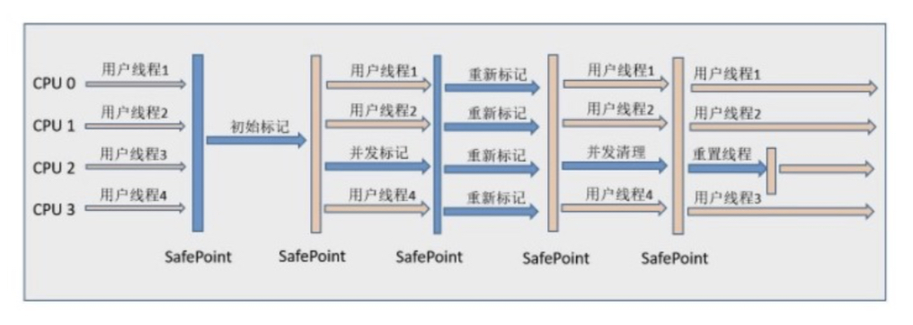

<center>CMS</center>
#### 1. Serial

单线程，复制，新生代，简单高效，需要暂停用户线程，client端可接受

#### 2. ParNew

serial多线程版本，server端默认新生代收集器，与CMS配合

#### 3. Parallel Scavenge

多线程，新生代，目标是可控吞吐量，称为“吞吐量优先”收集器（吞吐量：CPU用于用户程序的时间占总时间比值）

有参数可打开 GC 自适应的调节策略，就不需要手工指定新生代的大小(-Xmn)、Eden 和 Survivor 区的比例、晋升老年代对象年龄等细节参数了。虚拟机会根据当前系统的运行情况收集性能监控信息，动态调整这些参数以提供最合适的停顿时间或者最大的吞吐量。

#### 4. Serial Old

serial的老年代收集器，标记清除-整理。CMS的后背预案，在并发收集发生 Concurrent Mode Failure 时使用。

#### 5. Parallel Old

Parallel Scavenge的老年代收集器，注重吞吐量。

#### 6. CMS

老年代收集器。

CMS(Concurrent Mark Sweep)，Mark Sweep 指的是标记 - 清除算法。 
分为以下四个流程: 

- 初始标记:仅仅只是标记一下 GC Roots 能直接关联到的对象，速度很快，需要停顿。
- 并发标记:进行 GC Roots Tracing 的过程，它在整个回收过程中耗时最长，不需要停顿。
- 重新标记:为了修正并发标记期间因用户程序继续运作而导致标记产生变动的那一部分对象的标记记录，需要 停顿。
- 并发清除:不需要停顿。 

在整个过程中耗时最长的并发标记和并发清除过程中，收集器线程都可以与用户线程一起工作，不需要进行停顿。
具有以下缺点:

- 吞吐量低：低停顿时间是以牺牲吞吐量为代价的，导致 CPU 利用率不够高。**CPU换取低停顿**。
- 无法处理浮动垃圾，可能出现 Concurrent Mode Failure。浮动垃圾是指并发清除阶段由于用户线程继续运行 而产生的垃圾，这部分垃圾只能到下一次 GC 时才能进行回收。由于浮动垃圾的存在，因此需要预留出一部分 内存，意味着 CMS 收集不能像其它收集器那样等待老年代快满的时候再回收。如果预留的内存不够存放浮动垃 圾，就会出现 Concurrent Mode Failure，这时虚拟机将临时启用 Serial Old 来替代 CMS。
- 标记 - 清除算法导致的空间碎片，往往出现老年代空间剩余，但无法找到足够大连续空间来分配当前对象，不得 不提前触发一次 Full GC。 


#### 7. G1

意在替换 CMS 收集器

G1 把堆划分成多个大小相等的独立区域(Region)，新生代和老年代不再物理隔离。

有优先级的区域回收方式。维护了优先队列。

整体上是标记-整理，局部（两个region间）是复制。----没有具体说明

每个 Region 都有一个 Remembered Set，用来记录该 Region 对象的引用对象所在的 Region。避免可达性分析时全堆扫描。存储着**其他分区中的对象对本分区对象的引用**。minor gc的时候，只要扫描RSet中的其他old区对象对于本young区的引用，不需要扫描所有old区。


[G1收集器](https://blog.csdn.net/lijingyao8206/article/details/80513383)

Young GC 新生代。

MixGC 混合收集，回收部分老年代对象，G1特有

FullGC 老年代收集，JDK1.8不提供。


如果不计算维护 Remembered Set 的操作，G1 收集器的运作大致可划分为以下几个步骤: 

- 初始标记
- 并发标记
- 最终标记:为了修正在并发标记期间因用户程序继续运作而导致标记产生变动的那一部分标记记录，虚拟机将 这段时间对象变化记录在线程的 Remembered Set Logs 里面，最终标记阶段需要把 Remembered Set Logs 的数据合并到 Remembered Set 中。这阶段需要停顿线程，但是可并行执行。
- 筛选回收:首先对各个 Region 中的回收价值和成本进行排序，根据用户所期望的 GC 停顿时间来制定回收计 划。此阶段其实也可以做到与用户程序一起并发执行，但是因为只回收一部分 Region，时间是用户可控制的， 而且停顿用户线程将大幅度提高收集效率。 

具备如下特点: 

- 空间整合:整体来看是基于“标记 - 整理”算法实现的收集器，从局部(两个 Region 之间)上来看是基于“复制”算法实现的，这意味着运行期间不会产生内存空间碎片。 ----没有具体说明，不理解啊。每个region里是复制？？
- 可预测的停顿:能让使用者明确指定在一个长度为 M 毫秒的时间片段内，消耗在 GC 上的时间不得超过 N 毫 秒。 


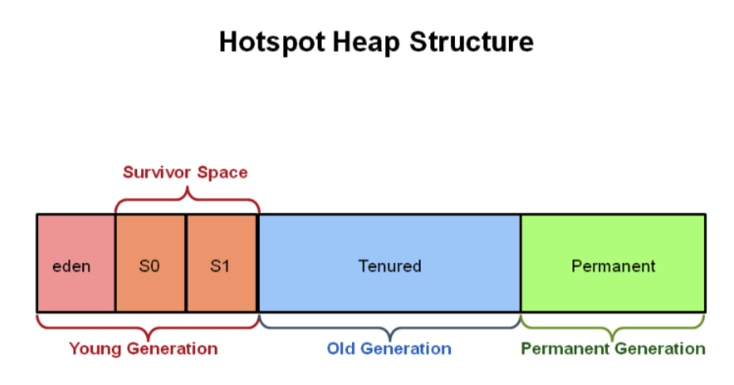

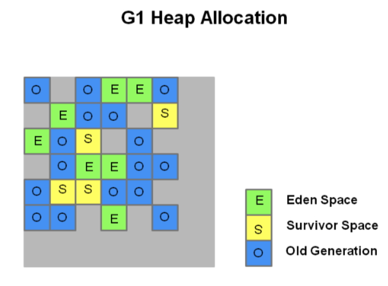


## 内存分配与回收策略

### MinorGC与FullGC

minorGC: 回收新生代对象。

fullGC: 回收新生代与老年代对象。

### 内存分配策略

1. 新对象优先分配在Eden。
2. 大对象直接进入老年代。
3. 超过一定年龄的对象进入老年代。（长期存活的对象）
4. 动态对象年龄判定。（某个年龄对象的总和超过survivor容量的一半）
5. 空间分配担保。（会触发fullGC，参数HandlePromotionFailure设置是否允许担保失败。）

### MinorGC的触发条件

Eden区空间不足

### FullGC的触发条件

1. System.gc() 并未真正执行full gc
2. 老年代空间不足
3. 空间分配担保失败
4. jdk1.7以前的永久代空间不足
5. Concurrent Mode Failure, CMS gc过程中，有对象进入老年代

## 类加载机制

### 类的生命周期

加载-验证-准备-解析-初始化-使用-卸载

### 类加载过程

加载-验证-准备-解析-初始化

### 类初始化时机

1. new/getstatic/putstatic/invokestatic 指令
2. reflect包反射调用时，若类未初始化，则初始化
3. 初始化一个类时，若类的父类未初始化，则先初始化父类
4. 虚拟机启动时，初始化主类
5. Jdk1.7动态语言，遇到方法句柄REF_putstatic/REF_getstatic/REF_invokestatic（方法句柄所对应的类没有进行过初始 化，则需要先触发其初始化）

### 类与类加载器

### 类加载器分类

虚拟机层面，分两类：

1. 启动类加载器，cpp实现，Bootstrap ClassLoader
2. Java程序里的加载器，Java实现
   1. BootstrapLoader
   2. ExtClassLoader
   3. AppClassLoader


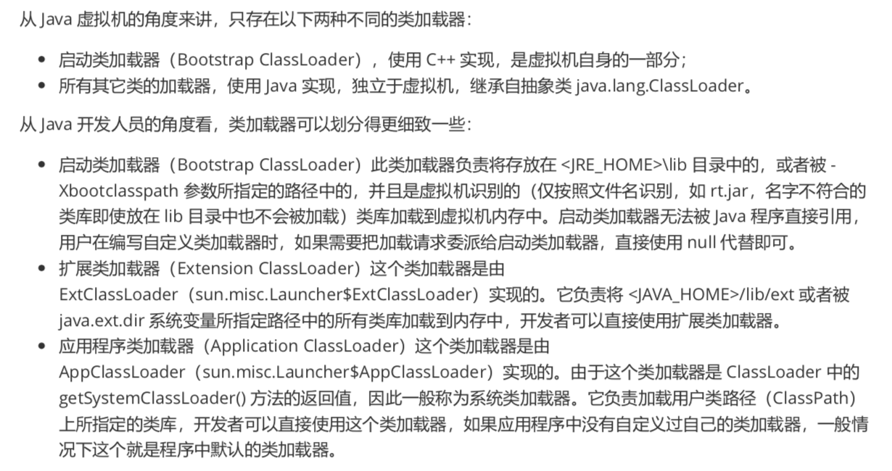

### 双亲委派模型

模型要求除了顶层的启 动类加载器外，其它的类加载器都要有自己的父类加载器。这里的父子关系一般通过组合关系(Composition)来实 现，而不是继承关系(Inheritance)。


工作原理：

一个类加载器首先将类加载请求转发到父类加载器，只有当父类加载器无法完成时才尝试自己加载。

好处：

使得基础类得到统一


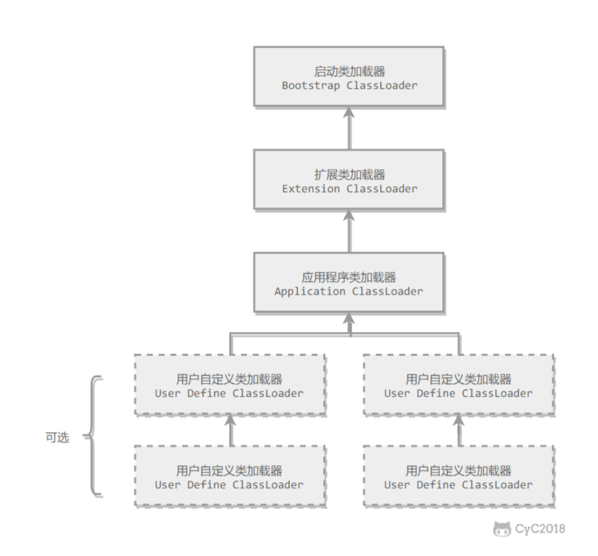

### 为什么有三个加载器？

1. 保证唯一性
   1. 通过双亲委派模型，保证同一个类只会被一个加载器加载，保证类的唯一性。

2. 保证安全性
   1. 自定义的同名类不会覆盖基础类，保证JVM的安全性


[为什么java里面会用三种classloader，这样设计目的是什么？](https://segmentfault.com/q/1010000015149054)

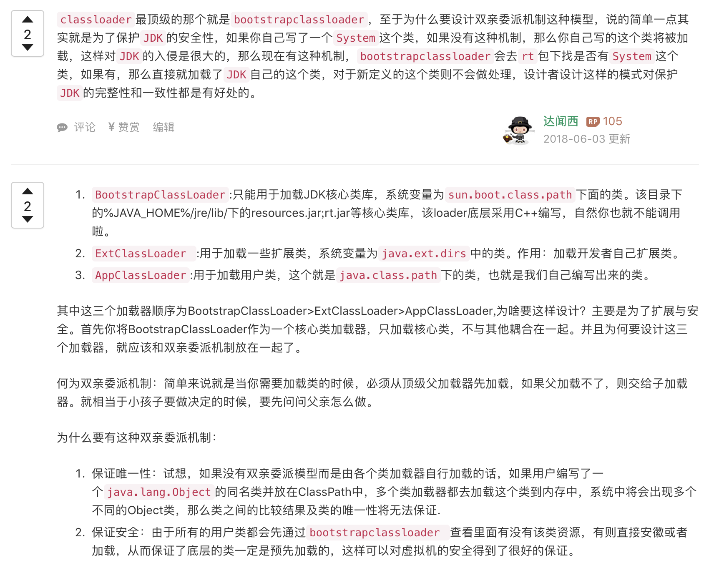

## JVM调优

## 类文件结构

### 无关性的基石

可以运行在各种不同平台上的虚拟机，这些虚拟机可以载入和执行同一种平台无关的字节码，从而实现程序的“一次编写，到处运行”。

实现语言无关性的基础是虚拟机和字节码存储格式。

### Class类文件的结构----看不懂！

1. 魔数与class文件的版本号
2. 常量池
3. 访问标志
4. 类索引、父类索引、接口索引集合
5. 字段表集合
6. 方法表集合
7. 属性表集合

### 字节码指令简介----看不懂！+1


## 虚拟机字节码执行引擎

可能会有解释执行和编译执行两种选择，也可能两者兼备，甚至还可能包含几个不同级别的编译期执行引擎。

从外观（Facade）看来，所有的Java虚拟机的执行引擎都是一致的：输入字节码文件，处理过程是字节码解析的等效过程，输出的是执行结果。

### 运行时栈帧结构

1. 局部变量表

2. 操作数栈

3. 动态连接

4. 方法返回地址

5. 一些附加信息，例如调试相关的信息等，取决于具体的虚拟机实现

### 方法调用

1. 解析：静态过程，在编译期就完全确定，在类加载的解析阶段把涉及的符号引用全部转变为可确定的直接引用
2. 分派：可能静态，也可能动态。


注意编译期多态（重载 同一个类里方法名相同）与运行期多态（重写override 父子类里方法签名相同）。


### 基于栈的字节码解释执行引擎

采用基于栈架构指令集的方式，依赖操作数栈进行工作

（另一种是基于寄存器的指令集，主流物理机采用）

优点：可移植，平台无关

缺点：相对于寄存器（硬件直接提供）方式，速度稍慢一些


## 编译优化

### 早期

javac编译时

1. 解析与填充符号表
   1. 词法、语法分析
   2. 填充符号表
2. 注解处理：读取、修改、添加抽象语法树中的任意元素
3. 语义分析与字节码生成：保证源程序是符合逻辑的
   1. 标注检查：变量使用前是否被声明、数据类型匹配等
   2. 数据及控制流分析：局部变量使用前是否有赋值、方法的每条路径是否有返回值、所有受查异常都被处理
   3. 解语法糖
   4. 字节码生成：生成构造器、代码替换以优化实现逻辑（字符串+替换为stringbuild或stringbuffer的append等，取决于目标代码的版本大于或等于jdk1.5）


Java语法糖

1. 泛型与类型擦除
2. 自动装箱、拆箱与遍历循环
3. 条件编译

### 晚期

jvm 即时编译器 （just in time compiler JIT编译期）

 C1 (client compiler)和C2 (server compiler)

热点代码：某个方法或代码块的运行特别频繁。

在运行时，虚拟机会将热点代码编译成本地平台相关的机器码，并进行各种层次的优化。


jvm内会同时存在解释器与编译器，可指定执行模式（只解释，只编译，或混合）


#### 编译优化技术

比较好理解的。。。

1. 公共子表达式消除
2. 数据边界检查消除（假如数组访问发生在循环内，编译期通过数据流分析判定循环变量的取值在[0,length)之内，整个循环中就可以把数组的上下界检查消除，可以减少很多的条件判定操作）
3. 方法内联
4. 逃逸分析


## 高效并发

### Java内存模型与线程

#### Java内存模型

1. 主内存与工作内存

2. volatile
   1. 保证可见性
   2. 防止指令重排序

3. 原子性、可见性与有序性

4. 先行发生原则


#### Java与线程

抢占式调度

基于操作系统原生线程模型来实现


线程状态

1. 新建 new
2. 运行 runnable
3. 无限期等待 waiting  
   1. Object.wait()/ Thread.join()
   2. 需要被其他线程显式唤醒
4. 限期等待 timed waiting
   1. thread.sleep() / Object.wait(time) / Thread.join(time) / LockSupport.parkNanos()/ LockSupport.partUntil()
   2. 过一定时间后由系统自动唤醒
5. 阻塞 blocked： 等待一个排它锁
6. 结束 terminated


### 线程安全与锁优化

#### 线程安全

如果一个对象可以安全地被多个线程同时使用，那它就是线程安全地。


1. 代码本身封装了所有必要的正确性保障手段（如互斥同步等）
2. 调用者无须关心多线程的问题，也无需自己采用任何措施保证多线程的正确使用


Java语言中的线程安全

1. 不可变 final
2. 绝对线程安全
3. 相对线程安全
   1. 对对象的单独的操作是线程安全的
   2. 某些特定顺序的连续调用，需要调用端额外采用同步手段
   3. vector hashtable等
4. 线程兼容
   1. 对象本身不是线程安全地
   2. 调用端正确地使用同步手段来保证对象在并发环境中可以安全地使用
   3. arraylist hashmap等
5. 线程对立
   1. 无论是否采用同步手段，都不能在并发环境中使用
   2. 不常见


线程安全的方式

1. 互斥同步
   1. 互斥：临界区、互斥量、信号量
   2. Java中，synchronized
   3. ReentrantLock
2. 非阻塞同步
   1. CAS (compare and swap, 基于系统指令支持）
3. 无同步方案
   1. 可重入代码
   2. 线程本地存储


#### 锁优化

1. 自旋锁与自适应自旋
   1. 基于共享数据的锁定状态只会持续很短一段时间的经验数据
   2. 同一线程进入，无需加锁、解锁
   3. 竞争线程自旋等待，超过限定时间没有获得锁，触发锁膨胀
   4. 自适应自旋，是指竞争线程在争用锁时，动态判定自旋次数
   5. Jdk1.6起，默认开启
2. 锁消除
3. 锁粗化
4. 轻量级锁
   1. 获取锁 
      1. 替换Mark Word。如果成功，线程拥有锁。如果失败，先检查Mark Word是否指向当前线程，是的话说明获得锁，继续执行。否则说明被其他线程抢占了。如果有两条以上线程争用同一个锁，轻量级锁不再有效，膨胀为重量级锁（Mark Word存储变为重量级锁的指针，后面等待锁的线程进入阻塞状态）。
   2. 释放锁
      1. CAS替换Mark Word，如果成功，则释放成功
      2. 失败，说明存在竞争（Mark Word已指向重量级锁），释放锁时，唤醒其他的在等待的线程。
5. 偏向锁
   1. 如果无竞争，整个同步都消除掉，不需要执行CAS操作
   2. 偏向第一个获得它的线程，如果锁没有被其他线程获取，则持有偏向锁的线程永远不需要再进行同步


## 其他

### this逃逸

```java
public class ThisEscape {  
      public final int id;  
      public final String name;  
      public ThisEscape(EventSource<EventListener> source) {  
            id = 1;  
            source.registerListener(new EventListener() {  //内部类是可以直接访问外部类的成员变量的（外部类引用this被内部类获取了）
                  public void onEvent(Object obj) {  
                        System.out.println("id: "+ThisEscape.this.id);  
                        System.out.println("name: "+ThisEscape.this.name);  
                  }  
            });  
            name = "flysqrlboy";               
      } }

```


copyright@[cs-notes](https://cyc2018.github.io/CS-Notes/#/README)