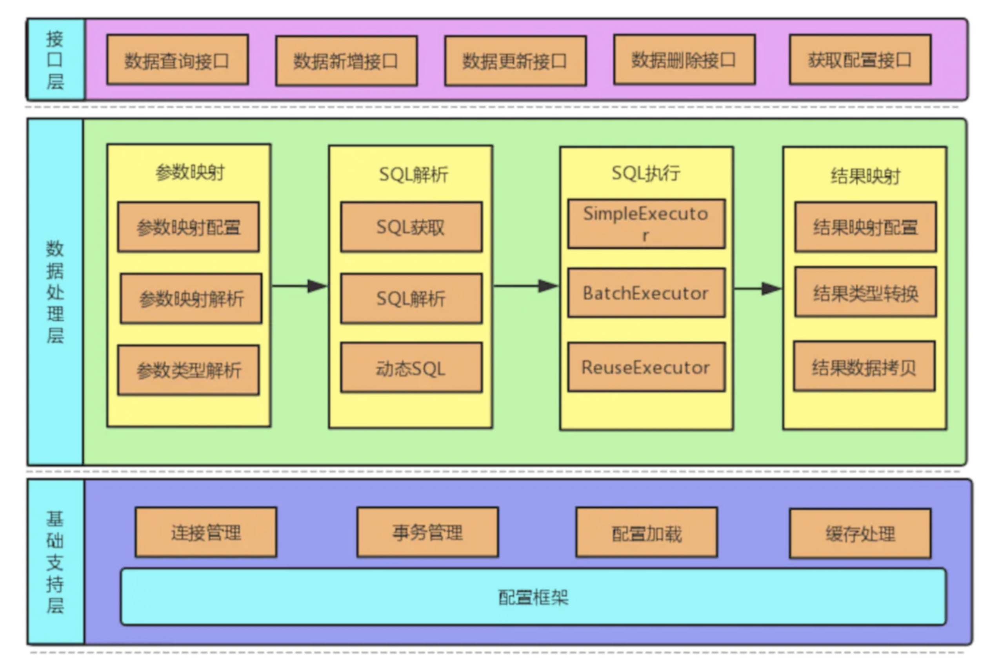
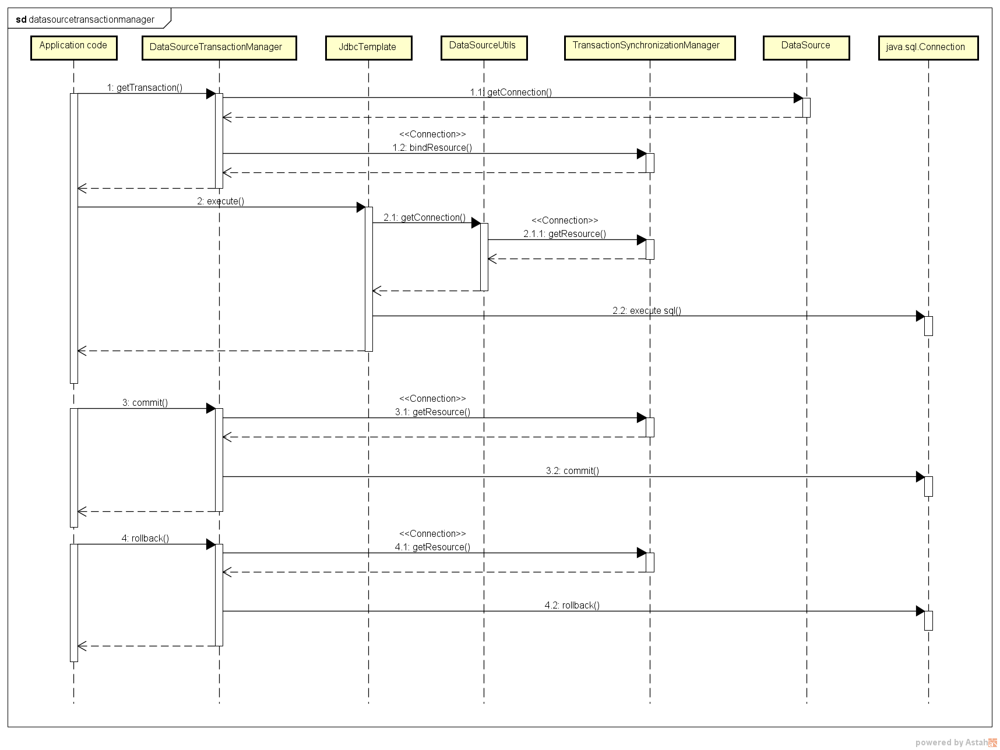
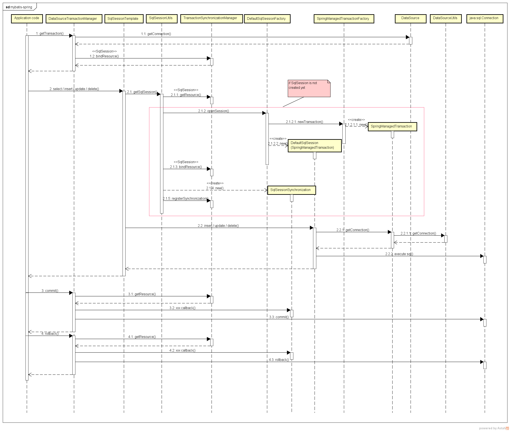

MyBatis 消除了大部分 JDBC 的样板代码、手动设置参数以及检索结果。**通过简洁的设计最大限度地简化开发和提升性能。**

解除SQL与程序代码的耦合，通过提供dao层，将业务逻辑和数据访问逻辑分离开。设计更清晰，更易维护。

MyBatis整体架构



MyBatis层级结构


裸用`sqlSession`是上面的红框

spring用mapper/dao接口代理，本质上是一个MapperProxy，从下面的红框开始执行


spring事务是在哪个环节起作用？

https://mybatis.org/spring/zh/transactions.html

> 一个使用 MyBatis-Spring 的其中一个主要原因是它允许 MyBatis 参与到 Spring 的事务管理中。而不是给 MyBatis 创建一个新的专用事务管理器，MyBatis-Spring 借助了 Spring 中的 DataSourceTransactionManager 来实现事务管理。
>
> 一旦配置好了 Spring 的事务管理器，你就可以在 Spring 中按你平时的方式来配置事务。并且支持 @Transactional 注解和 AOP 风格的配置。在事务处理期间，一个单独的 `SqlSession` 对象将会被创建和使用。当事务完成时，这个 session 会以合适的方式提交或回滚。
>
> 事务配置好了以后，MyBatis-Spring 将会透明地管理事务。

所以，最外层是事务，每个事务会起一个`SqlSession`。


几篇文章：

入门，裸用mybatis：https://juejin.im/post/5aa5c6fb5188255587232e5a#heading-0

mybatis执行，包括整合spring后的流程：https://juejin.im/post/5e350d895188254dfd43def5#heading-9

关于JDBC：https://juejin.im/post/5c75e6666fb9a049cd54dc88

Mybatis和spring整合的使用：https://juejin.im/post/5cdfed6ef265da1b6720dcaf


mybatis框架说明：


整体执行流程说明：


sqlSession执行流程说明：


关键流程（以下整个可以看成裸用MyBatis的执行流程）

config文件加载：解析xml文件配置项

mapper文件加载：上一个流程中的一个环节，解析完后封装成MappedStatement，存入configuration

SqlSource创建流程：上一流程的一个环节，SqlSource是MappedStatement的一部分，主要存放sql和占位的参数名称

-- 解析环节结束

SqlSession执行流程：`sqlSessionFactory.openSession`主要是建立了一个和数据库的连接connection

获取BoundSql流程：`sqlSession.xx`方法执行时，需要获取BoundSql，BoundSql本质上是SqlSource和执行请求的入参的一个组合

参数映射流程：根据顺序，或者根据名称（只是大略看了一眼）

结果集映射流程：根据名称（只是大略看了一眼）


mybatis的openSession默认开启事务，autocommit为false，隔离级别为null

mybatis的JdbcTransaction


整合spring的几个组件

`org.mybatis.spring.SqlSessionFactoryBean` 注入sqlSessionFactory

`org.mybatis.spring.mapper.MapperScannerConfigurer`扫描指定包

1. 将包下class文件加入到beanDefinition中，bean类型指定为MapperFactoryBean
2. SqlSessionFactoryBean构建sqlSessionFactory时，扫描mapper xml文件，根据namespace在MapperRegistry中注入对应mapper接口的MapperProxyFactory
3. MapperFactoryBean->getObject中生成mapper的代理类MapperProxy（通过MapperFactoryBean中的interface，即mapper的namespace找到MapperProxyFactory，再生产出代理类）


以下大概知道了

现在差一个中间环节，mapper的beanDefinition怎么变成MapperProxy..以及MapperFactoryBean的作用

还有个SqlSessionTemplate：https://juejin.im/post/5cea1f386fb9a07ea803a70e

还有MapperProxyFactory -- 来创建MapperProxy

Java动态代理：https://juejin.im/post/5c1ca8df6fb9a049b347f55c


MapperFactoryBean

MapperProxy

MapperMethod -- 到这里之后，流程就转到sqlSession.selectOne之类的了


Mybatis缓存

https://juejin.im/post/5e81fb126fb9a03c546c22bb

MyBatis 系统中默认定义了两级缓存：**一级缓存**和**二级缓存** 

- 默认情况下，只有一级缓存开启。（SqlSession级别的缓存，也称为本地缓存） 
- 二级缓存需要手动开启和配置，它是基于 namespace 级别的缓存，缓存只作用于 cache 标签所在的映射文件中的语句。


spring 事务实现

Spring事务的底层依赖MySQL的事务，代码层面上利用AOP实现。

常用的是`@Transactional`注解，会被解析生成一个代理服务，**TransactionInterceptor**对它进行拦截处理，进行事务开启、 commit或者rollback的操作。

另外，spring还定义了事务传播行为，有7种类型，项目中常见的是PROPAGATION_REQUIRED。如果没有事务就新建事务，如果存在事务，就加入这个事务。

执行事务的时候使用**TransactionInterceptor**进行拦截，然后处理


[事务传播行为](https://segmentfault.com/a/1190000013341344)

| 事务传播行为类型             | 说明                                                         |
| ---------------------------- | ------------------------------------------------------------ |
| **PROPAGATION_REQUIRED**     | 如果当前没有事务，就新建一个事务，如果已经存在一个事务中，加入到这个事务中。这是最常见的选择。（如果父方法有事务，加入父方法的事务；父方法没有事务，则自己新建一个事务） |
| PROPAGATION_SUPPORTS         | 支持当前事务，如果当前没有事务，就以非事务方式执行。（如果父方法有事务，加入父方法的事务；父方法没有事务，则以非事务执行） |
| PROPAGATION_MANDATORY        | 使用当前的事务，如果当前没有事务，就抛出异常。（依赖父方法事务） |
| **PROPAGATION_REQUIRES_NEW** | 新建事务，如果当前存在事务，把当前事务挂起。（如果父方法有事务，把父方法事务挂起，自己新建事务；父方法没有事务，则自己新建一个事务） |
| PROPAGATION_NOT_SUPPORTED    | 以非事务方式执行操作，如果当前存在事务，就把当前事务挂起。（如果父方法有事务，把父方法事务挂起，以非事务执行自己的操作；父方法没有事务，则以非事务执行）（总是以非事务执行，不报错） |
| PROPAGATION_NEVER            | 以非事务方式执行，如果当前存在事务，则抛出异常。（总是以非事务执行，如果父方法存在事务，抛异常） |
| **PROPAGATION_NESTED**       | 如果当前存在事务，则在嵌套事务内执行。如果当前没有事务，则执行与PROPAGATION_REQUIRED类似的操作。 |

REQUIRED、REQUIRES_NEW、NESTED的对比

REQUIRED共用一个事务。

REQUIRES_NEW 有独立的子事务，子事务异常**不会**导致父事务回滚，父事务异常也**不会**导致子事务回滚，相互独立。

NESTED 子事务嵌套在父事务中，父事务回滚会引起子事务回滚；父事务正常、子事务异常，子事务可以单独回滚。


[源码详解](https://juejin.im/post/59e87b166fb9a045030f32ed)

1. txNamespaceHandle注册的`InfrastructureAdvisorAutoProxyCreator`是一个BeanPostProcessor，主要是为了创建动态代理（wrapIfNecessary）

这几个类是可以自动创建代理的

  

  

2. 在创建代理的时候，获取切面

   txNamespaceHandler注册了一个Advisor（BeanFactoryTransactionAttributeSourceAdvisor），再在这个advisor中判断是否当前bean符合这个切面（主要实现就是看有没有@Transactional注解）


3. `TransactionInterceptor`是advice，增强，执行切面工作


摘录：https://my.oschina.net/fifadxj/blog/785621

spring-jdb的事务流程：

```java
DefaultTransactionDefinition def = new DefaultTransactionDefinition();
PlatformTransactionManager txManager = new DataSourceTransactionManager(dataSource);

TransactionStatus status = txManager.getTransaction(def);
try {
    //get jdbc connection...
    //execute sql...

    txManager.commit(status);
}
catch (Exception e) {
    txManager.rollback(status);
    throw e;
}
```

PlatformTransactionManager的getTransaction(), rollback(), commit()是spring处理事务的核心api，分别对应事务的开始，提交和回滚。

- TransactionSynchronizationManager负责从ThreadLocal中存取jdbc connection
- 创建事务的时候会通过dataSource.getConnection()获取一个新的jdbc connection，然后绑定到ThreadLocal
- 在业务代码中执行sql时，通过DataSourceUtils.getConnection()从ThreadLocal中获取当前事务的jdbc connection, 然后在该jdbc connection上执行sql
- commit和rollback事务时，从ThreadLocal中获取当前事务的jdbc connection，然后对该jdbc connection进行commit和rollback



mybatis-spring的事务流程：

配置

```xml
<bean id="transactionManager" class="org.springframework.jdbc.datasource.DataSourceTransactionManager">
  <property name="dataSource" ref="dataSource" />
</bean>

<bean id="sqlSessionFactory" class="org.mybatis.spring.SqlSessionFactoryBean">
  <property name="dataSource" ref="dataSource" />
  <property name="transactionFactory">
    <bean class="org.apache.ibatis.spring.transaction.SpringManagedTransactionFactory" />
  </property> 
</bean>

<bean id="sqlSession" class="org.mybatis.spring.SqlSessionTemplate">
  <constructor-arg index="0" ref="sqlSessionFactory" />
</bean>
```

- mybatis-spring依赖DataSourceTransactionManager来处理事务，并没有创建自己的PlatformTransactionManager实现。
- mybatis通过SqlSessionFactoryBuilder创建SqlSessionFactory，而mybatis-spring通过SqlSessionFactoryBean创建SqlSessionFactory。
- 配置使用SpringManagedTransactionFactory来创建MyBatis的Transaction实现SpringManagedTransaction
- 配置使用SqlSessionTemplate代替通过SqlSessionFactory.openSession()获取SqlSession

调用过程



可以看到mybatis-spring处理事务的主要流程和spring jdbc处理事务并没有什么区别，都是通过DataSourceTransactionManager的getTransaction(), rollback(), commit()完成事务的生命周期管理，而且jdbc connection的创建也是通过DataSourceTransactionManager.getTransaction()完成，mybatis并没有参与其中，mybatis只是在执行sql时通过DataSourceUtils.getConnection()获得当前thread的jdbc connection，然后在其上执行sql。

sqlSessionTemplate是DefaultSqlSession的一个代理类，它通过SqlSessionUtils.getSqlSession()试图从ThreadLocal获取<u>当前事务所使用的SqlSession</u>。如果是第一次获取时会调用SqlSessionFactory.openSession()创建一个SqlSession并绑定到ThreadLocal，同时还会通过TransactionSynchronizationManager注册一个SqlSessionSynchronization。

<u>SqlSessionSynchronization是一个事务生命周期的callback接口，mybatis-spring通过SqlSessionSynchronization在事务提交和回滚前分别调用DefaultSqlSession.commit()和DefaultSqlSession.rollback()</u>

这里的DefaultSqlSession只会进行一些自身缓存的清理工作，并不会真正提交事务给数据库，原因是<u>这里的DefaultSqlSession使用的Transaction实现为SpringManagedTransaction，SpringManagedTransaction在提交事务前会检查当前事务是否应该由spring控制，如果是，则不会自己提交事务，而将提交事务的任务交给spring，所以DefaultSqlSession并不会自己处理事务。</u>

<u>DefaultSqlSession执行sql时，会通过SpringManagedTransaction调用DataSourceUtils.getConnection()从ThreadLocal中获取jdbc connection并在其上执行sql。</u>

**mybatis-spring做的最主要的事情是：**

1. **在SqlSession执行sql时通过用SpringManagedTransaction代替mybatis的JdbcTransaction，让SqlSession从spring的ThreadLocal中获取jdbc connection。**
2. **通过注册事务生命周期callback接口SqlSessionSynchronization，让SqlSession有机会在spring管理的事务提交或回滚时清理自己的内部缓存。**