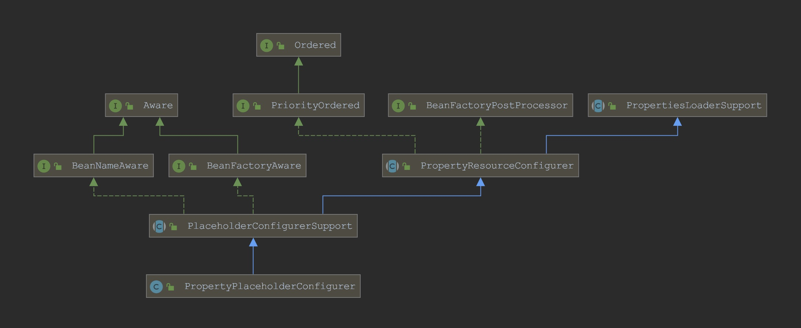
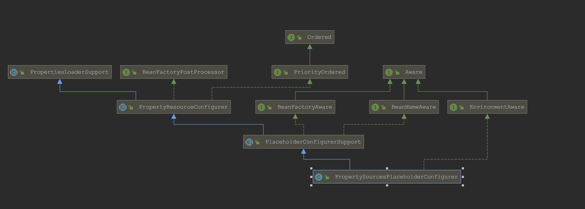
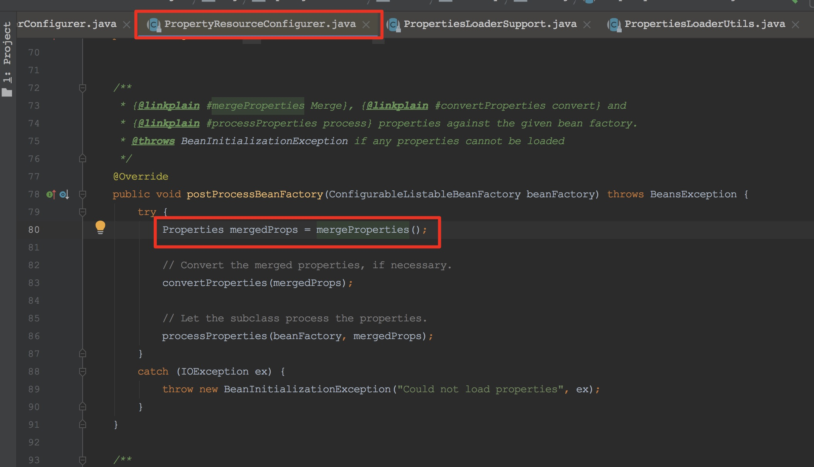
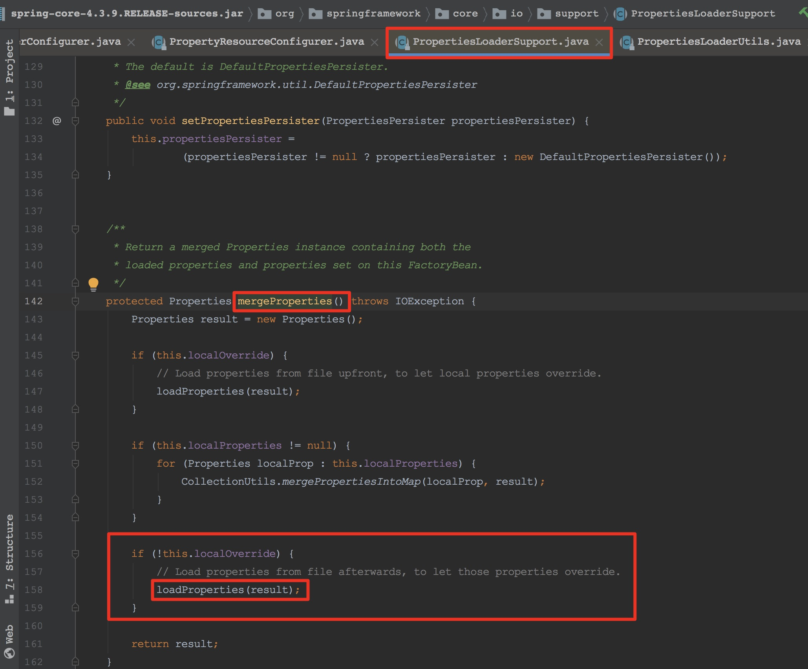
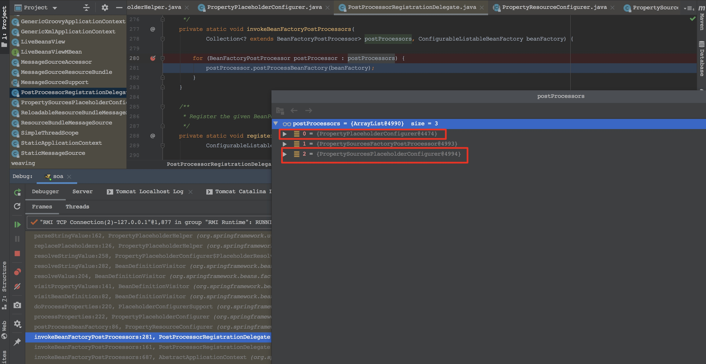

加载配置文件的地方






# Case Study

项目中注册了两个PropertyPlaceholderConfigurer，一个是xml中配置的`PropertyPlaceholderConfigurer`，显示设置`ignoreUnresolvablePlaceholders`为true（忽略找不到的占位符）；另一个是第三方组件注册的`PropertySourcesPlaceholderConfigurer`，默认配置。

```xml
    <bean id="propertyConfigurer" class="org.springframework.beans.factory.config.PropertyPlaceholderConfigurer">
        <property name="ignoreUnresolvablePlaceholders" value="true"/>
        <property name="ignoreResourceNotFound" value="true"/>
        <property name="properties" ref="prop"/>
        <property name="locations">
            <list>
                <value>classpath:config/*.properties</value>
            </list>
        </property>
    </bean>
```


