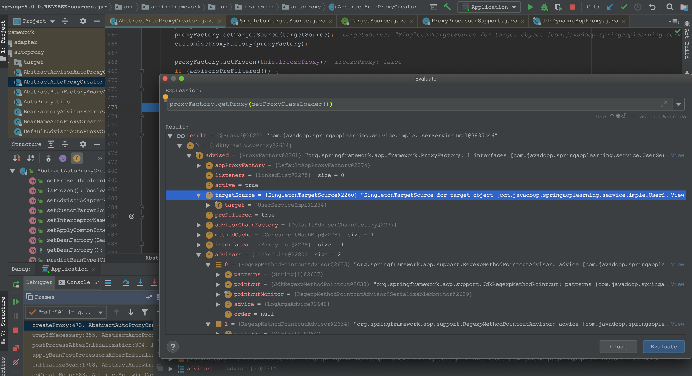
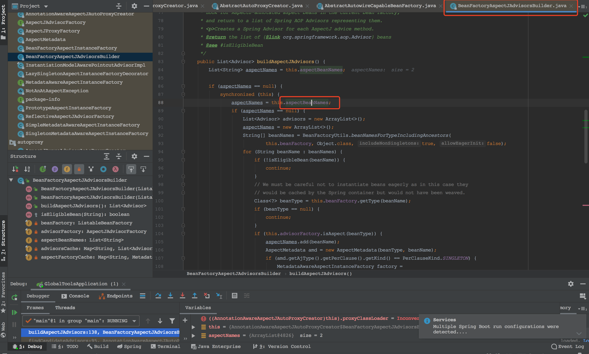
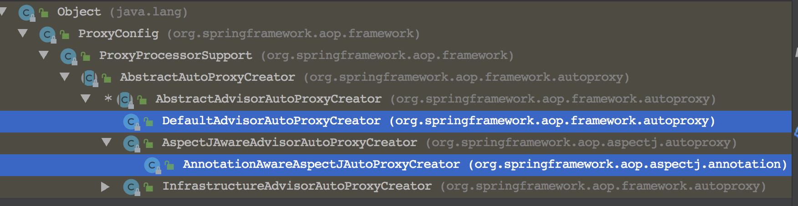
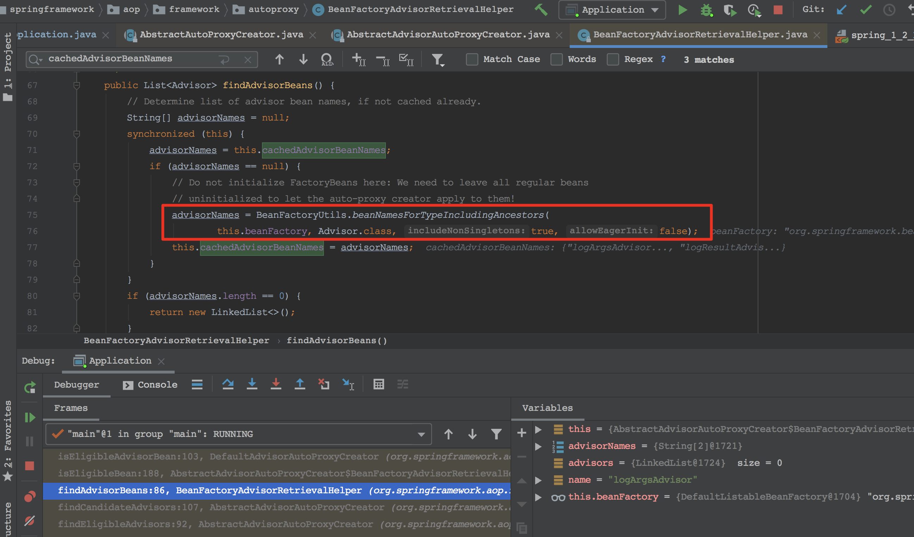
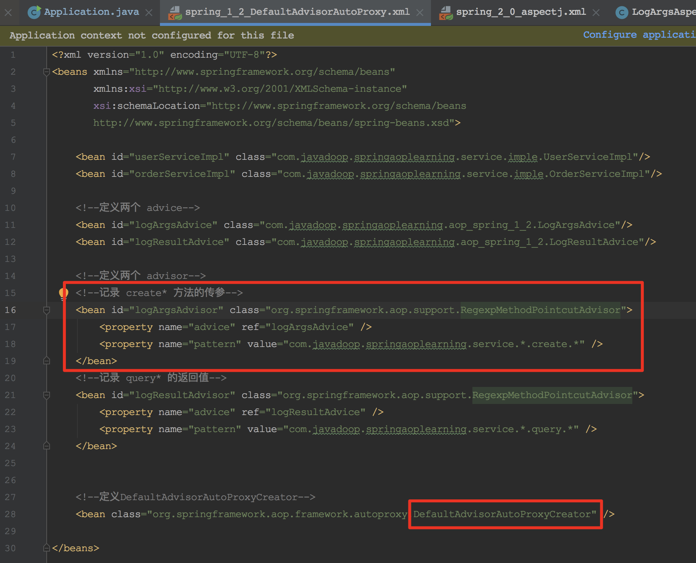
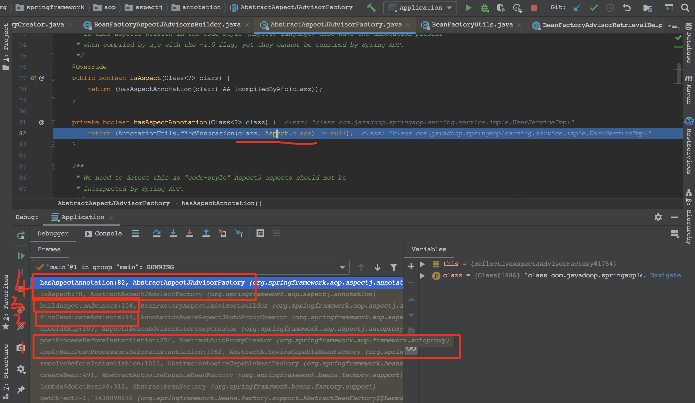
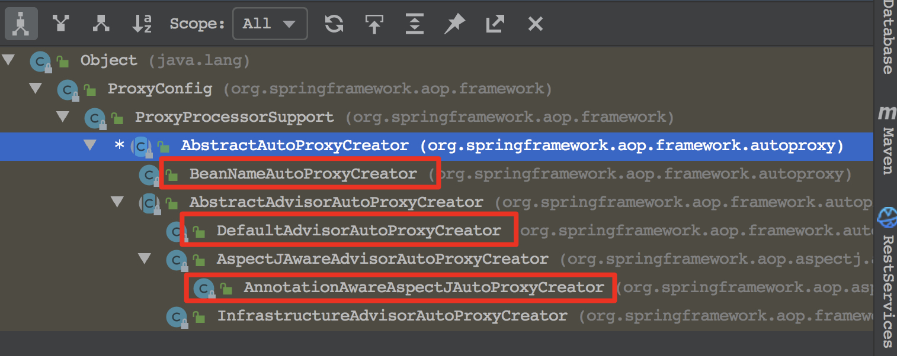

# 疑问

1. aspectJ、cglib、asm分别是什么？有什么联系？

   aspectJ和cglib是代理框架，asm是字节码框架。

   cglib用到了asm。

2. spring aop或者其他的aop，有多个before、around、after时，需要定义先后顺序吗？如何实现？

   order或者实现Order接口，定义顺序数值。值越小越先执行（越在同心圆外圈）。

3. spring的aspectJ，是spring aop代理？用的动态代理，还是cglib？

   用的动态代理。

   spring只用到了aspectJ的注解，没用到aspectJ的各种织入。

4. 稍稍了解下，cglib怎么修改字节码。


# 小结

1. spring aop
   1. <font color = 'red'>基于动态代理实现，在容器启动的时候生成代理实例</font>（cglib起什么作用？）
   2. 作用于容器中的所有bean
   3. 提供了对asjectJ的支持（怎么理解）？
   4. 沿用（使用）了AsjectJ @AsjectJ、@Pointcut等注解，但注解的实现是spring自己实现的一套
2. AspectJ是AOP编程的完全解决方案。
   1. 静态织入，通过修改代码实现
   2. 织入时机包括
      1. 编译期织入 compile-time weaving
      2. 编译后织入 post-compile weaving 已经生成.class文件了
      3. 加载时织入 load-time weaving 在加载类的时候织入，方式包括自定义加载类，或在JVM启动时指定AspectJ提供的agent `-javaagent:xxx/xxx/aspectjweaver.jar`


# Spring aop 源码

配置`DefaultAdvisorAutoProxyCreator`的方式，使所有的`advisor`都生效。

`DefaultAdvisorAutoProxyCreator`继承了`BeanPostProcessor`，在每个bean实例化后被调用，`doCreateBean..initializeBean..applyBeanPostProcessorsAfterInitialization(..)..`调用每个`BeanPostProcessor`的`postProcessAfterInitialization`。

在`DefaultAdvisorAutoProxyCreator`（父类`AbstractAutoProxyCreator`）的`postProcessAfterInitialization`中，生成bean的代理，将这个代理返回，放在容器中。

```java
// AbstractAutowireCapableBeanFactory.java
protected Object initializeBean(final String beanName, final Object bean, RootBeanDefinition mbd) {
   ...
   Object wrappedBean = bean;
   if (mbd == null || !mbd.isSynthetic()) {
      // 1. 执行每一个 BeanPostProcessor 的 postProcessBeforeInitialization 方法
      wrappedBean = applyBeanPostProcessorsBeforeInitialization(wrappedBean, beanName);
   }

   try {
      // 调用 bean 配置中的 init-method="xxx"
      invokeInitMethods(beanName, wrappedBean, mbd);
   }
   ...
   if (mbd == null || !mbd.isSynthetic()) {
      // 我们关注的重点是这里！！！
      // 2. 执行每一个 BeanPostProcessor 的 postProcessAfterInitialization 方法
      wrappedBean = applyBeanPostProcessorsAfterInitialization(wrappedBean, beanName);
   }
   return wrappedBean;
}

  //AbstractAutoProxyCreator.java
	/**
	 * Create a proxy with the configured interceptors if the bean is
	 * identified as one to proxy by the subclass.
	 * @see #getAdvicesAndAdvisorsForBean
	 */
	@Override
	public Object postProcessAfterInitialization(@Nullable Object bean, String beanName) throws BeansException {
		if (bean != null) {
			Object cacheKey = getCacheKey(bean.getClass(), beanName);
			if (!this.earlyProxyReferences.contains(cacheKey)) {
				return wrapIfNecessary(bean, beanName, cacheKey);
			}
		}
		return bean;
	}
```

`DefaultAopProxyFactory`有两种默认实现方式，JDK动态代理和cglib代理。

设置optimize、proxyTargetClass或当前类没有实现接口是，使用cglib代理（如果类本身是接口、或是代理类，也使用jdk动态代理）。

其他情况下用JDK动态代理。

<font color='red'>一般情况下，指定proxyTargetClass来使用cglib，指定一个或多个接口来使用JDK代理。</font>


## jdk代理

### 原理

基于反射机制。

JDK利用反射机制生成一个<font color='red'>实现代理接口的匿名类</font>，然后重写方法，实现方法的增强。

生成匿名类很快，但后续调用栈比较深，执行速度会相对慢一些。

流程：

1. 为接口创建代理类的字节码文件（重写的方法里调用了InvokeHandler的invoke方法）
2. 使用ClassLoader加载类文件进JVM

附录1给出了一个反编译出来的匿名类的代码。


### 代码

```java
// JdkDynamicAopProxy.java
// JdkDynamicAopProxy也是一个InvocationHandler，实现了invoke方法，在调用到代理时，执行的就是invoke方法
// invoke中实现了对advisor的调用
@Override
public Object getProxy(@Nullable ClassLoader classLoader) {
   if (logger.isDebugEnabled()) {
      logger.debug("Creating JDK dynamic proxy: target source is " + this.advised.getTargetSource());
   }
   Class<?>[] proxiedInterfaces = AopProxyUtils.completeProxiedInterfaces(this.advised, true);
   findDefinedEqualsAndHashCodeMethods(proxiedInterfaces);
   return Proxy.newProxyInstance(classLoader, proxiedInterfaces, this);
}

// Proxy.java
@CallerSensitive
public static Object newProxyInstance(ClassLoader loader,
                                      Class<?>[] interfaces,
                                      InvocationHandler h) {
  // ...
  return newProxyInstance(caller, cons, h);
}
```


生成的JDK动态代理实例如图中所式示

1. 是一个Proxy类型的实例，有一个名称为h的成员变量，h为JdkDynamicAopProxy类型（父类未InvocationHandler），这里都和jdk动态代理是一致的
2. JdkDynamicAopProxy主要有advised变量，内部有advisors（理解为增强方法）和targetSource（封装了被代理实例）
3. 调用proxy时，实际上是调用了InvocationHandler的invoke方法，简化了说，先执行advisors的方法，再反射调用`method.invoke(target, args)`，或是链式执行。




## cglib代理

### 原理

cglib基于继承机制，继承被代理类，通过字节码重写，增强父类的方法。

底层基于asm第三方框架，加载被代理类的class文件，**修改字节码生成子类**。

可以用于接口，也可以用于类。


# 设计模式

代理模式

责任链模式


# 切面执行顺序

更确切的说，是advisor的执行顺序。

每个`@Aspect`类，根据`@Before`、`@After`可生成相应个数的advisor（也有order值）。

可为Aspect指定order，order值越小，越先执行。


内容来自：[基于AspectJ的Spring AOP Advice执行顺序](https://segmentfault.com/a/1190000011283029)

> 参考文档:[aop-ataspectj-advice-ordering](https://docs.spring.io/spring/docs/current/spring-framework-reference/htmlsingle/#aop-ataspectj-advice-ordering)

> When two pieces of advice defined in different aspects both need to run at the same join point, unless you specify otherwise the order of execution is undefined. You can control the order of execution by specifying precedence. This is done in the normal Spring way by either implementing the org.springframework.core.Ordered interface in the aspect class or annotating it with the Order annotation. Given two aspects, the aspect returning the lower value from Ordered.getValue() (or the annotation value) has the higher precedence.

> 上面的内容简单的说就是,当对于同一个Join Point有两个Advice定义在不同的Aspect中的时候,他们的执行顺序是根据Aspect类的@Order注解的值,或者通过实现Order并重写getValue方法的值来决定的.同时,Order的值越小,优先级越高.

> When two pieces of advice defined in the same aspect both need to run at the same join point, the ordering is undefined

> 当同一个Aspect中对同一个Join Point有两个Advice的话,这两个Advice的顺序是不固定的.


# AOP应用

全局日志、异常、事务管理等


# 参考文献

- [aop源码分析](https://javadoop.com/post/spring-aop-source)
- [AspectJ使用介绍](https://www.javadoop.com/post/aspectj)
- [spring aop 使用介绍](https://javadoop.com/post/spring-aop-intro)
- [Spring AOP,AspectJ, CGLIB](https://www.jianshu.com/p/fe8d1e8bd63e)
- [JDK动态代理实现原理](https://www.cnblogs.com/zuidongfeng/p/8735241.html)
- [基于AspectJ的Spring AOP Advice执行顺序](https://segmentfault.com/a/1190000011283029)

# 附录

## 反编译出的Proxy0

成员变量是原接口的方法，在重写的相应的方法中被调用。

例如Method m1是原接口实例的equals方法，`Class.forName("java.lang.Object").getMethod("equals", Class.forName("java.lang.Object"))`，在新的equals方法中被反射调用，`super.h.invoke(this, m1, new Object[]{var1})).booleanValue();`。

```java
//
// Source code recreated from a .class file by IntelliJ IDEA
// (powered by Fernflower decompiler)
//

package com.sun.proxy;

import com.lnjecit.proxy.Subject;
import java.lang.reflect.InvocationHandler;
import java.lang.reflect.Method;
import java.lang.reflect.Proxy;
import java.lang.reflect.UndeclaredThrowableException;

public final class $Proxy0 extends Proxy implements Subject {
    private static Method m1;
    private static Method m3;
    private static Method m2;
    private static Method m0;

    public $Proxy0(InvocationHandler var1) throws  {
        super(var1);
    }

    public final boolean equals(Object var1) throws  {
        try {
            return ((Boolean)super.h.invoke(this, m1, new Object[]{var1})).booleanValue();
        } catch (RuntimeException | Error var3) {
            throw var3;
        } catch (Throwable var4) {
            throw new UndeclaredThrowableException(var4);
        }
    }

    public final void doSomething() throws  {
        try {
            super.h.invoke(this, m3, (Object[])null);
        } catch (RuntimeException | Error var2) {
            throw var2;
        } catch (Throwable var3) {
            throw new UndeclaredThrowableException(var3);
        }
    }

    public final String toString() throws  {
        try {
            return (String)super.h.invoke(this, m2, (Object[])null);
        } catch (RuntimeException | Error var2) {
            throw var2;
        } catch (Throwable var3) {
            throw new UndeclaredThrowableException(var3);
        }
    }

    public final int hashCode() throws  {
        try {
            return ((Integer)super.h.invoke(this, m0, (Object[])null)).intValue();
        } catch (RuntimeException | Error var2) {
            throw var2;
        } catch (Throwable var3) {
            throw new UndeclaredThrowableException(var3);
        }
    }

    static {
        try {
            m1 = Class.forName("java.lang.Object").getMethod("equals", Class.forName("java.lang.Object"));
            m3 = Class.forName("com.lnjecit.proxy.Subject").getMethod("doSomething");
            m2 = Class.forName("java.lang.Object").getMethod("toString");
            m0 = Class.forName("java.lang.Object").getMethod("hashCode");
        } catch (NoSuchMethodException var2) {
            throw new NoSuchMethodError(var2.getMessage());
        } catch (ClassNotFoundException var3) {
            throw new NoClassDefFoundError(var3.getMessage());
        }
    }
}	
```


# 补充

## spring aop代理每个bean的流程小结

1. 每个advisor是一个bean，连接了一个advice和一个pattern
2. 在DefaultAdvisorAutoProxyCreator这个BeanPostProcessor中，warpIfNessary
   1. 在容器中查询出所有advisor，常用的是基于正则的advisor`RegexpMethodPointcutAdvisor`（还会对不同类型的advisor做一些处理，比如用`DefaultPointcutAdvisor`封装`MethodInterceptor`类型的advisor）
   2. 将bean与advisors放入proxyFactory，创建代理对象


这里缓存着@Aspect注解的类。它又是怎么生成的呢？遍历beanDefinitions，取className对应的Class，看有没有注解




bpp判断要不要代理：先获取候选advisor，对每个Advisor判断是不是当前bean需要的（通过正则等），如果都没有需要的Advisor，则不代理；否则生成代理。


## 获得xml配置的advisor

比较古老的通过配置文件定义切面的方式。

可以看出，每个advisor连接了一个advice和一个pattern。advice是方法维度的，例如是一个`MethodBeforeAdvice`。

这里`DefaultAdvisorAutoProxyCreator`是一个`BeanPostProcessor`，在bean实例化后的回调方法中，触发代理的创建。

ps: `DefaultAdvisorAutoProxyCreator`与下面`@Aspect`要用的`AnnotationAwareAspectJAutoProxyCreator`同宗啊。




default方式的查找advisors，是直接通过获取Advisor类型的bean实现的。

从XML配置中可以看到，advisor实现了RegexpMethodPointcutAdvisor接口，是Advisor类型的。







## 获得`@Aspect`注解的advisor

那通过`@Aspect`注解的切面是怎么组装的呢？

首先，`@Aspect`注解的类需要在xml中配置成bean、或者加`@Component`注解等，能够托管在IOC容器中。

其次，需要开启`@Aspect`注解的自动解析。

`AopNamespaceHandler`会注册一个`AspectJAutoProxyBeanDefinitionParser`。【在什么时候使用到这个parser？】parser在parse方法中，注册了`AnnotationAwareAspectJAutoProxyCreator.class`（是`SmartInstantiationAwareBeanPostProcessor`的一个实现），就是这个类起着寻找并创建advisor的重要作用。从截图的2步骤开始。

```xml
<!--开启 @AspectJ 配置-->
<aop:aspectj-autoproxy/>
```

寻找并创建advisor的流程：

1. 从beanFactory中取出所有的beanNames
2. 对每一个beanName判断是否为aspect，其中一种判断就是看是否有Aspect注解，如截图步骤4.
3. 如果是aspect，由`ReflectiveAspectJAdvisorFactory`生成类中的各advisors。





## 几种proxyCreator

第四个没见过

beanName，就是在xml文件中直接写出哪些beanName是Advice，同时bean会实现`MethodBeforeAdvice`等接口。可能是比较古老的方式。



