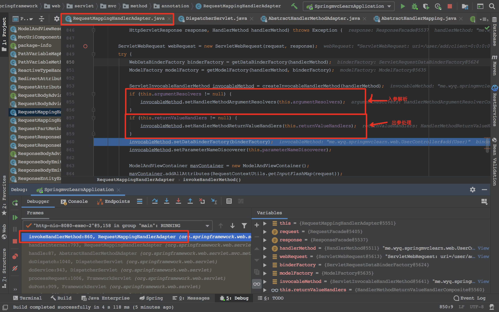

## request处理与找到method

`getHandler`返回需要的method，在这里就是`UserController`的`query`方法。

入参和出参都是在进入method invoke后才处理的

真正执行数据绑定的地方

## invoke与response处理

在反射执行完controller中的方法后，通过`selectHandler`找到匹配的处理返回结果的Processor。例如返回结果是json或xml格式的，都是在这个processor中。和`@ResponseBody`的数据绑定是同一个。

