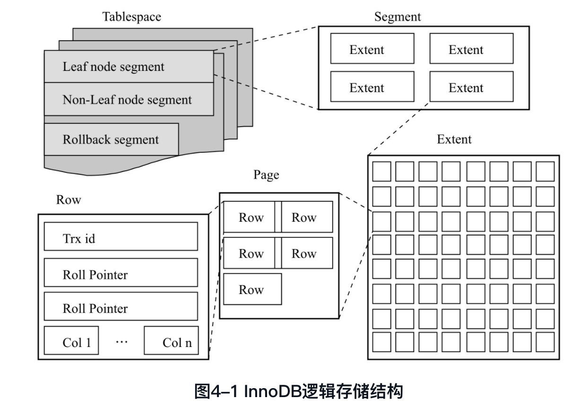

# 简单版

#### 架构与执行流程

##### 系统架构

###### MySQL架构


□ 连接池组件□ 管理服务和工具组件□ SQL接口组件□ 查询分析器组件□ 优化器组件□ 缓冲（Cache）组件□ 插件式存储引擎□ 物理文件

###### innodb架构


##### 执行流程图

https://juejin.im/post/5c6ece80f265da2de7134d86


1. MySQL客户端通过协议将**SQL语句发送**给MySQL服务器。

2. 服务器会先检查**查询缓存**中是否有执行过这条SQL，如果命中缓存，则将结果返回，否则进入下一个环节（查询缓存默认不开启）。

3. 服务器端进行**SQL解析**，预处理，然后由查询**优化器生成对应的执行计划**。

4. 服务器根据查询优化器给出的执行计划，再调用存储引擎的API**执行查询**。

5. 将结果返回给客户端，如果开启查询缓存，则会**备份一份到查询缓存**中。


##### innodb内存结构


后台线程

内存池

物理文件

###### 内存池

https://dev.mysql.com/doc/refman/5.7/en/innodb-buffer-pool.html


##### 物理存储结构

###### MySQL二进制文件的格式

STATEMENT：逻辑SQL语句

ROW：记录表的行更改情况

MIXED：混合 主要是statement 部分row


###### 表空间文件

ibdata

也可以单表一个表空间文件（独立表空间文件），.idb，存该表的数据、索引、插入缓冲bitmap等，其他数据还是在总的表空间文件里


###### 重做日志

关于每个页（Page）的更改的物理情况

从重做日志缓冲往磁盘写入时，是按512个字节，也就是一个扇区的大小进行写入。因为扇区是写入的最小单位，因此可以保证写入必定是成功的。因此在重做日志的写入过程中不需要有doublewrite。


从表3-2可以看到重做日志条目是由4个部分组成：

1. redo_log_type占用1字节，表示重做日志的类型
2. space表示表空间的ID，但采用压缩的方式，因此占用的空间可能小于4字节
3. page_no表示页的偏移量，同样采用压缩的方式
4. redo_log_body表示每个重做日志的数据部分，恢复时需要调用相应的函数进行解析


LSN（log sequence number， 表示从日志记录创建开始到特定的日志记录已经写入的字节数）

http://mysql.taobao.org/monthly/2017/09/07/


##### innodb物理逻辑存储结构

###### 索引组织表

在InnoDB存储引擎表中，每张表都有个主键（Primary Key），如果在创建表时没有显式地定义主键，则InnoDB存储引擎会按如下方式选择或创建主键：

1. 首先判断表中是否有非空的唯一索引（Unique NOT NULL），如果有，则该列即为主键。
2. 如果不符合上述条件，InnoDB存储引擎自动创建一个6字节大小的指针。

主键的选择根据的是定义索引的顺序，而不是建表时列的顺序。


###### InnoDB逻辑存储结构

表空间tablespace，段segment，区extent，页page，行row

常见的段有数据段、索引段、回滚段等

任何情况下，每个区的大小都为1MB

每个页的大小为16KB，即一个区有64个页


InnoDB 1.0.x版本开始引入<u>压缩页</u>，即每个页的大小可以通过参数KEY_BLOCK_SIZE设置为2K、4K、8K，因此每个区对应页的数量就应该为512、256、128。

InnoDB 1.2.x版本新增了参数innodb_page_size，通过该参数可以<u>将默认页的大小设置为4K、8K</u>，但是页中的数据库不是压缩。这时区中页的数量同样也为256、128。**总之，不论页的大小怎么变化，区的大小总是为1M。**



###### 表空间

共享表空间

可以有独立表空间 innodb_file_per_table=ON

###### 段

数据段、索引段、回滚段等

数据即索引，索引即数据

数据段即为B+树的叶子节点（图4-1的Leaf node segment），索引段即为B+树的非索引节点（图4-1的Non-leaf node segment）

###### 区

大小为1M

1.0.x压缩页，KEY_BLOCK_SIZE设置页为2K、4K、8K，对应页数512、256、128

1.2.x非压缩页的页大小设置，innodb_page_size设置为4K、8K，页数为256、128.

###### 页

在InnoDB存储引擎中，常见的页类型有：

1. 数据页（B-tree Node）
2. undo页（undo Log Page）
3. 系统页（System Page）
4. 事务数据页（Transaction system Page）
5. 插入缓冲位图页（Insert Buffer Bitmap）
6. 插入缓冲空闲列表页（Insert Buffer Free List）
7. 未压缩的二进制大对象页（Uncompressed BLOB Page）
8. 压缩的二进制大对象页（compressed BLOB Page）

###### 行

每个页最多允许存放16KB/2-100行的记录，即7992行记录 -- 没看懂

###### 数据页结构 -- 再看吧

https://mp.weixin.qq.com/s?__biz=MzIxNTQ3NDMzMw==&mid=2247483678&idx=1&sn=913780d42e7a81fd3f9b747da4fba8ec&chksm=979688eca0e101fa0913c3d2e6107dfa3a6c151a075c8d68ab3f44c7c364d9510f9e1179d94d&scene=21#wechat_redirect


#### 索引

##### 索引的实现

###### B+树

B+树的高度一般在2~4层，查找某一键值的行记录时最多只需要2~4次的IO，查询时间在0.02~0.04秒（当前一般的机械磁盘每秒至少可以做100次IO）。


###### Cardinality

Cardinality/n_rows_in_table应尽可能地接近1

Cardinality值非常关键，**表示索引中不重复记录数量的预估值**


###### 联合索引的使用

1. 最左匹配原则
2. 覆盖索引，即从辅助索引中就可以得到查询的记录（而不需要查询聚集索引中的记录，减少大量的IO操作）


###### hash索引

innodb有自适应哈希索引，是数据库自身创建的，DBA不能干预

冲突机制：链表方式

哈希函数：除法散列 `h(k)=k mod m`


###### 全文检索 -- 不会，pass

倒排索引 inverted index

在辅助表（Auxiliary Table）中存储了单词与单词自身在一个或多个文档中所在位置之间的映射。

通常利用关联数组实现。

两种表现形式：

1. inverted file index，其表现形式为{单词，单词所在文档的ID}
2. full inverted index，其表现形式为{单词，（单词所在文档的ID，在具体文档中的位置）}

innodb采用full inverted index。

全文检索通过MATCH函数进行查询，查询带有指定word的文档。


##### explain查询计划分析

看下面的问答


#### 锁和事务

##### innodb存储引擎中的锁

###### 锁的类型

行级锁

共享锁 S Lock：允许事务读一行数据

排他锁 X Lock：允许事务删除或更新一行数据

表级锁

意向共享锁 IS Lock：事务想要获得一张表中某几行的共享锁

意向排他锁 IX Lock：事务想要获得一张表中某几行的排他锁

InnoDB存储引擎支持的是行级别的锁，因此意向锁其实不会阻塞除全表扫以外的任何请求。


Record Lock: 单个行记录上的锁

Gap Lock: 间隙锁，锁定一个范围，但不包含记录本身

Next-Key Lock：Gap Lock + Record Lock，锁定一个范围，并锁定记录本身，邻键锁。解决幻读。锁定范围如(10,11]，前开后闭。

**A next-key lock is a combination of a record lock on the index record and a gap lock on <u>the gap before the index record</u>.**

PS1: MySQL官方定义的不可重复读包括不可重复读和幻读，都可以通过Next-Key Lock来解决，即设定为RR隔离级别。

PS2: 还有previous-key lock，锁定范围如[10,11)，前闭后开。

当查询索引含有唯一值时，存储引擎会对next-key lock做优化，降级为record lock.


###### next-key lock加锁范围的示例

[这篇文章](https://juejin.im/post/5ed0867de51d4578724e3760)说的比较清楚，需要考虑主键的位置

首先是对应记录本身加锁，即j，然后前后记录都会加间隙锁，可以理解为(g,m)，新插入的记录如果索引也是g或m，就看主键在原g或m记录的前面还是后面。（一般自增的话，就会是[g,m)了。）

(29,'g') 成功

(31,'g') 阻塞

(49,'m') 阻塞

(51,'m') 成功


###### 一致性非锁定读

是指innodb存储引擎通过行多版本控制的方式来读取当前执行时间数据库中行的数据。

如果读取的行正在执行delete或update操作，读取操作不会因此去等待行上锁的释放。相反，innodb存储引擎会去读取行的一个快照数据。


之所以称为非锁定读，是因为不需要等待访问的行上X锁的释放。

快照数据是通过undo段来完成。

undo用来在事务中回滚数据。

读快照数据是不需要上锁的，因为没有事务需要对历史的数据进行修改操作。


###### 多版本并发控制

multi version concurrency control, MVCC

RC: Read Committed 读已提交

RR: Repeatable Read 可重复读 innodb默认隔离级别

RC和RR都使用非锁定一致性读

**RC：总是读取被锁定行的最新一份快照数据**

**RR：总是读取事务开始时的那份快照**


###### 一致性锁定读

```sql
select .. for update
select .. in share mode
```


###### 设置隔离级别

```sql
select @@global.transaction_isolation, @@transaction_isolation;
set global transaction isolation level read committed;
set session transaction isolation level read committed;

```


##### 锁的算法


<u>有两个索引，要分别加锁</u>


###### 插入意向锁

是一种gap lock，insert操作在插入行之前加的锁


##### 锁问题

脏读：一个事务可以读到另一个事务未提交的数据。发生在隔离级别Read Uncommitted下。

不可重复读：两次读取数据值不一样。在隔离级别Read Committed下。

幻读：第二次读到了之前不存在的行。

还有丢失更新，一般在当前数据库的任何隔离级别下都不会导致丢失更新。因为操作在事务里，而事务里的更新操作是会加排他锁的，另一个事务里的更新操作会阻塞。只有不在事务里的操作才可能引起“丢失更新”..


##### 阻塞

InnoDB存储引擎在大部分情况下都不会对异常进行回滚。

等待锁超时会抛出异常，默认50秒。

innodb_lock_wait_timeout


##### 死锁

###### 死锁和解决方案

指两个或两个以上的事务再执行过程中，因争夺锁资源而造成的一种互相等待的现象。（若无外力作用，事务都将无法推进下去）

解决方式：

1. 超时机制，将超时的一个进行回滚，另一个等待的就可以进行下去。
2. <u>等待图</u>。进行死锁检测。


###### 死锁的示例

1. AB-BA死锁，A等待B，B在等待A

   


2. 当前事务持有了待插入记录的下一个记录的X锁，但是在等待队列中存在一个S锁的请求，则可能会发生死锁

   


###### 其他

一个SQL用的是非聚集索引，那么对非聚集索引加锁，也会对聚集索引加锁。

如果一个加锁SQL没有对应的索引，那会对整张表（中的记录）进行加锁


##### 事务的实现

原子性、持久性是通过redo log实现的 （重做日志，属于物理日志，记录页的物理修改）

一致性通过undo log实现 （逻辑日志，记录行）

redo恢复提交事务修改的页操作

undo回滚记录到某个特定版本

###### redo

两部分组成，内存中的重做日志缓冲，磁盘的重做日志文件。

与二进制日志的区别：二进制日志在事务提交完成后进行一次写入。重做日志在事务进行中不断地被写入（不是按事务提交的顺序进行写入的）。

重做日志以块（block）的方式进行保存，块大小为512字节，和磁盘扇区大小一样，因此写入可以保证原子性，不需要doublewrite技术。

日志块由三部分组成，重做日志块512字节，日志块头12字节，尾8字节。


redo块里有LSN编号，log sequence number，

checkpoint表示已刷新到磁盘上的LSN。奔溃恢复的时候，只需恢复redo log当中比checkpoint大的那些LSN所在的页数据。


<u>Log sequence number表示当前的LSN，Log flushed up to表示刷新到重做日志文件的LSN，Last checkpoint at表示刷新到磁盘的LSN。</u>


###### undo

redo通常是物理日志，记录的是页的物理修改操作。

undo是逻辑日志，根据每行记录进行记录。——这里的逻辑日志和物理日志，可以这么理解：物理日志记录一整页的修改，不区分行；逻辑日志，不等于是一个反向的sql语句，而是一行数据、每个列的值，等等。


#### 性能分析

##### 慢查询日志分析

何时开启慢查询日志

慢查询的时间设置多长

分析慢查询日志的工具


##### 查询计划分析

##### profile查询性能分析


#### 性能优化

##### 服务器层面

1. 增加缓冲池大小innodb_buffer_pool_size
2. 内存预热——不太了解
3. 增加重做日志大小innodb_log_file_size
4. 使用SSD磁盘提高读写速度

##### 库表设计层面

1. 中间表
2. 冗余字段
3. 字段拆分
4. 数据拆分：分库分表

##### SQL层面

1. 正确建立索引和使用索引
2. limit优化


#### 补充

###### 插入缓冲

 1. 应用于非唯一的非聚集索引
 2. 属于buffer pool的一部分（所以也需要double write）

###### redo log重做日志

 1. 物理逻辑日志（非纯物理）
 2. lsn 当前lsn，写入重做日志文件lsn，checkpoint 刷新到磁盘数据页的lsn

###### doublewrite

 1. 应用于buffer pool的数据页写入磁盘
  2. 两部分组成：
      1. 内存中两次写缓存，2MB；
       2. 磁盘上的两次写文件，2MB（两个区）
  3. doublewrite每次写1M，in a large sequential chunk，再马上调用fsync，所以wr中不会有部分写失败的问题（？）。回答：也是有可能失败的，分两种情况分析：
      1. doublewrite缓冲写入磁盘失败，表示脏页没有刷到磁盘，这时候数据库进行恢复，会使用redo log及现有磁盘数据重新计算出正确的buffer pool，再进行double write的流程
       2. doublewrite缓冲写入磁盘成功，脏页写磁盘时断电，那么磁盘数据可能有损了，恢复的时候根据doublewrite文件先恢复磁盘数据，再根据redo log和恢复后的磁盘数据恢复buffer pool（怎么理解页数据有损？比如redo日志是 偏移量2的位置写入aaa，这是可以重复写入的，但可能，偏移量10的地方是异常时写入一半的数据，整体上是不对的）


## MySql

###### 查询中哪些情况不会使用索引？

1. 使用or
2. like以"%xx"开始匹配
3. 联合（复合）索引，不符合最左匹配
4. 索引列数据类型隐形转换，比如列是字符串，但用数值来查询就用不上索引
5. 在where子句中，对索引列有数学运算、或者使用函数，用不了索引
6. MySQL估计全表扫描比查询索引快时（比如数据量非常少）


[MYSQL 索引类型、什么情况下用不上索引、什么情况下不推荐使用索引](https://blog.csdn.net/kaka1121/article/details/53395628)

[MySQL性能优化的最佳21条经验](https://www.cnblogs.com/hongfei/archive/2012/10/19/2731342.html) -- 没大用

[mysql explain执行计划详解](https://blog.csdn.net/kaka1121/article/details/53394426) -- 有错字之类的

type: const 命中唯一索引或主键的时候


###### 数据库隔离级别

1. 读未提交
2. 读提交
3. 可重复读
4. 可串行化


###### 数据库索引，底层是怎样实现的，为什么要用B+树索引？

MySQL底层使用B+树实现的。

MyISAM引擎，B+树主索引、辅助索引叶节点是数据记录的地址，称为非聚集索引（与InnoDB区分）

InnoDB的主键索引是聚集索引，叶节点存的完整的数据记录；辅助索引，叶节点存的是主键的值。


###### 为什么用B+树索引？

1. 数据文件比较大，一般存储在磁盘上

2. 索引的组织结构要尽量减少查找过程中磁盘IO次数。

3. 数据库系统利用磁盘预读原理，将一个节点的大小设为一个页的大小，则只需要一次IO就可以将一个节点的数据都读入

     

B+树只有叶子节点存放数据，非叶子节点作为索引，这样树出度大，树高小，一般3层，查询目标数据的io次数比较少，效率高。

使用节点大小正好等于磁盘一页大小的B+树，可以减少io操作次数，提高查询效率。


从数组、哈希表、二叉树等数据结构的对比来回答，见下面这篇文章

[MySQL为什么不用数组、哈希表、二叉树等数据结构作为索引呢](https://juejin.im/post/5e920646e51d4546f5790713)

[orderby底层执行过程](https://juejin.im/post/5e945b9651882573b7537c2a)


###### Mysql主从同步的实现原理？

原理：在主库上记录二进制日志，在备库重放日志的方式实现异步数据复制。

复制有三个步骤：

1. 主库记录二进制日志，每次准备提交事务（完成数据库更新）前先记录二进制日志（记录日志完后，再执行数据库更新）
2. 备库将主库的二进制文件复制到本地的中继日志中。
   1. 备库会启动一个工作线程，称为IO工作线程，负责和主库建立一个普通的客户端连接
   2. 如果该进程追赶上了主库，它将进入睡眠状态，直到主库有新的事件产生，会被唤醒，将接收到的事件记录到中继日志中
3. 备库的SQL线程读取中继日志并在备库执行
   1. 中继日志一般在系统缓存中，开销低，也可以根据配置选项来决定是否写入自己的二进制日志中


常见复制架构：

1. 一主多从

2. 主主

3. 环型复制

   


[MySQL复制详解](https://blog.51cto.com/amyhehe/1699168)


###### MySQL是怎么用B+树？

innodb引擎用B+树当索引，索引文件同时是数据文件。聚集索引，也就是主键索引，叶节点存储的完整行数据；辅助索引，也称为非聚集索引，叶节点存对应行记录的主键。

MyISAM引擎也是用B+树当索引，为非聚集索引，索引不是数据文件，叶节点存的是行记录的地址。


###### 谈谈数据库乐观锁与悲观锁？

1. 悲观锁，认为操作会发生冲突，提前加锁，直到自己操作结束再释放锁。
2. MySQL的显式锁定 写锁 `select .. for update` & 读锁 `select .. lock in share mode`
3. 乐观锁，认为不会发生冲突，在提交更新的时候会判断一下期间数据有没有被修改。类似于CAS操作，常用方式有版本号、时间戳。


###### mvcc，怎么实现rr rc todo


###### mysql间隙锁有没有了解，死锁有没有了解，写一段会造成死锁的sql语句，死锁发生了如何解决，mysql有没有提供什么机制去解决死锁

gap lock


###### MySQL几种常用的存储引擎区别

InnoDB与MyISAM比较典型的几个区别：

1. innodb支持事务、MVCC快照读、行级锁粒度、hash索引、聚集索引、支持外键
2. myisam支持全文索引、空间索引、数据压缩
3. innodb存储成本高、内存成本高、插入速度低，myisam反过来

来源：MySQL技术内幕


 


###### explain 可以看到哪些信息，什么信息说明什么，explain的结果列讲一下

https://dev.mysql.com/doc/refman/8.0/en/explain-output.html

| Column                                                       | JSON Name       | Meaning                                                      |
| ------------------------------------------------------------ | --------------- | ------------------------------------------------------------ |
| [`id`](https://dev.mysql.com/doc/refman/8.0/en/explain-output.html#explain_id) | `select_id`     | The `SELECT` identifier     select标识                       |
| [`select_type`](https://dev.mysql.com/doc/refman/8.0/en/explain-output.html#explain_select_type) | None            | The `SELECT` type    select类型                              |
| [`table`](https://dev.mysql.com/doc/refman/8.0/en/explain-output.html#explain_table) | `table_name`    | The table for the output row    表名                         |
| [`partitions`](https://dev.mysql.com/doc/refman/8.0/en/explain-output.html#explain_partitions) | `partitions`    | The matching partitions 使用的分区                           |
| [`type`](https://dev.mysql.com/doc/refman/8.0/en/explain-output.html#explain_type) | `access_type`   | The join type  join类型                                      |
| [`possible_keys`](https://dev.mysql.com/doc/refman/8.0/en/explain-output.html#explain_possible_keys) | `possible_keys` | The possible indexes to choose  可能使用的索引               |
| [`key`](https://dev.mysql.com/doc/refman/8.0/en/explain-output.html#explain_key) | `key`           | The index actually chosen   实际使用的索引                   |
| [`key_len`](https://dev.mysql.com/doc/refman/8.0/en/explain-output.html#explain_key_len) | `key_length`    | The length of the chosen key  实际使用的索引的长度           |
| [`ref`](https://dev.mysql.com/doc/refman/8.0/en/explain-output.html#explain_ref) | `ref`           | The columns compared to the index   与索引进行对比的列       |
| [`rows`](https://dev.mysql.com/doc/refman/8.0/en/explain-output.html#explain_rows) | `rows`          | Estimate of rows to be examined  预估要检查的行数            |
| [`filtered`](https://dev.mysql.com/doc/refman/8.0/en/explain-output.html#explain_filtered) | `filtered`      | Percentage of rows filtered by table condition   符合条件的数据的百分比 |
| [`Extra`](https://dev.mysql.com/doc/refman/8.0/en/explain-output.html#explain_extra) | None            | Additional information  额外的信息                           |

1. select_type

   常见的有SIMPLE（简单查询，无union、subqueries）、PRIMARY（子查询的外层）、SUBQUERY、UNION等

2. type

   1. system：表中只有一行数据，const的特殊情况

   2. const：至多有一行matching，可以理解为主键或唯一索引的=  （单表，对tbl_name来说，1是const）

      ```sql
      SELECT * FROM tbl_name WHERE primary_key=1;
      
      SELECT * FROM tbl_name
        WHERE primary_key_part1=1 AND primary_key_part2=2;
      ```

   3. eq_ref：主键或唯一索引的=   （多表关联，other_table的结果不定，所以对ref_table来说，选择不是const）

      ```sql
      SELECT * FROM ref_table,other_table
        WHERE ref_table.key_column=other_table.column;
      
      SELECT * FROM ref_table,other_table
        WHERE ref_table.key_column_part1=other_table.column
        AND ref_table.key_column_part2=1;
      ```

   4. ref：（非主键与非唯一索引的）其他索引的=

      ```sql
      SELECT * FROM ref_table WHERE key_column=expr;
      
      SELECT * FROM ref_table,other_table
        WHERE ref_table.key_column=other_table.column;
      
      SELECT * FROM ref_table,other_table
        WHERE ref_table.key_column_part1=other_table.column
        AND ref_table.key_column_part2=1;
      ```

   5. fulltext

      用到了全文索引

   6. ref_or_null

      类似ref，会额外检索包含null的行

   7. index_merge

      用到了多个索引，索引合并优化

   8. unique_subquery

      替换下面的in子查询，子查询返回不重复的集合

      ```sql
      value IN (SELECT primary_key FROM single_table WHERE some_expr)
      ```

   9. index_subquery

      区别于unique_subquery，用于非唯一索引，可以返回重复值

      ```sql
      value IN (SELECT key_column FROM single_table WHERE some_expr)
      ```

   10. range

       索引范围查找，包括主键、唯一索引、其他索引——即，所有key

        [`=`](https://dev.mysql.com/doc/refman/8.0/en/comparison-operators.html#operator_equal), [`<>`](https://dev.mysql.com/doc/refman/8.0/en/comparison-operators.html#operator_not-equal), [`>`](https://dev.mysql.com/doc/refman/8.0/en/comparison-operators.html#operator_greater-than), [`>=`](https://dev.mysql.com/doc/refman/8.0/en/comparison-operators.html#operator_greater-than-or-equal), [`<`](https://dev.mysql.com/doc/refman/8.0/en/comparison-operators.html#operator_less-than), [`<=`](https://dev.mysql.com/doc/refman/8.0/en/comparison-operators.html#operator_less-than-or-equal), [`IS NULL`](https://dev.mysql.com/doc/refman/8.0/en/comparison-operators.html#operator_is-null), [`<=>`](https://dev.mysql.com/doc/refman/8.0/en/comparison-operators.html#operator_equal-to), [`BETWEEN`](https://dev.mysql.com/doc/refman/8.0/en/comparison-operators.html#operator_between), [`LIKE`](https://dev.mysql.com/doc/refman/8.0/en/string-comparison-functions.html#operator_like), or [`IN()`](https://dev.mysql.com/doc/refman/8.0/en/comparison-operators.html#operator_in) 

       ```sql
       SELECT * FROM tbl_name
         WHERE key_column = 10;
       
       SELECT * FROM tbl_name
         WHERE key_column BETWEEN 10 and 20;
       
       SELECT * FROM tbl_name
         WHERE key_column IN (10,20,30);
       
       SELECT * FROM tbl_name
         WHERE key_part1 = 10 AND key_part2 IN (10,20,30);
       ```

   11. index

       类似all，但是只扫描索引，有两种情况

       1. 覆盖索引，select中的列都在索引中，extra中显示using index
       2. 利用索引的顺序进行全表扫描（比如有order by），extra中不显示using index

   12. all

       全表扫描

3. rows和filtered

   1. rows：MySQL认为需要检查的行数
   2. filtered：rows中会被过滤出来的——即符合条件的——的数据的百分比
   3. rows*filtered=查询出的结果数

4. extra 常见的有

   1. using index 列信息只从索引出，不用再从实际行取。使用了覆盖索引
   2. using where 没有可用的索引，通过where条件过滤
   3. using filesort 需要额外排序
   4. Using index condition  Index Condition Pushdown (ICP) 简单说，就是在索引里进行where过滤。比如 like '%xx'本来是用不到索引的，如果开了ICP，则可以用这个条件在索引上做过滤，筛出更小的一部分数据，减少IO。参考[文章](https://developer.aliyun.com/article/27751)
   5. ....还有好多


###### group by 和 order by

不能利用索引的有序性的话，需要额外进行排序，using filesort

group by，先排序后分组

distinct基于group by

排序算法：双路排序（两次IO，第一次IO后用rowid+排序关键字进行排序，排完序后根据rowid再读一次数据）和单路排序（一次IO，查询的列和排序关键字一起在内存中进行排序，空间换时间）

https://blog.csdn.net/wuseyukui/article/details/72627667

https://blog.csdn.net/qq_37113604/article/details/88973260


###### 索引优化 todo 看看高性能书，有硬件层面和开发层面？

https://juejin.im/post/5b68e3636fb9a04fd343ba99#heading-3

1. 如果MySQL评估使用索引比全表扫描还慢，则不会使用索引

2. 前导模糊查询（like '%xx'）不会使用索引，可以优化为非前导模糊查询（like 'xx%'）

3. 数据类型出现隐式转换的时候不会命中索引，特别是当列类型是字符串，一定要将字符常量值用引号引起来

4. 复合索引，要满足最左匹配原则

5. union、in、or 都能够命中索引，建议使用 in

   查询的CPU消耗：or (id=1 or id=2)> in (id in (1,2)) >union(id = 1 union id = 2)

6. 用or分割开的条件，如果or前的条件中列有索引，而后面的列中没有索引，那么涉及到的索引都不会被用到

   因为or后面的条件列中没有索引，那么后面的查询肯定要走全表扫描，在存在全表扫描的情况下，就没有必要多一次索引扫描增加IO访问。

7. 负向条件查询不能使用索引，可以优化为 in 查询

   负向条件有：!=、<>、not in、not exists、not like 等。

8. 范围条件查询可以命中索引

   范围条件有：<、<=、>、>=、between等（返回数据的比例超过30%，会不使用索引）

9. 查询条件（带有计算函数）执行计算不会命中索引

10. 利用覆盖索引进行查询，避免回表

11. 建议索引的列设置为非null

12. 更新十分频繁的字段上不宜建立索引

13. 区分度不大的字段上不宜建立索引

14. 业务上具有唯一特性的字段，建议建立唯一索引

15. 多表关联时，关联字段建议有索引

16. 创建索引时避免以下错误观念

    1. 索引越多越好，认为一个查询就需要建一个索引。

    2. 宁缺勿滥，认为索引会消耗空间、严重拖慢更新和新增速度。

    3. 抵制唯一索引，认为业务的唯一性一律需要在应用层通过“先查后插”方式解决。

    4. 过早优化，在不了解系统的情况下就开始优化。


## 其他数据库

###### 有使用过哪些NoSQL数据库？MongoDB和Redis适用哪些场景？

工程中用过Redis，主要是小部分数据的缓存 其他不太了解

NoSql not only sql 非关系型数据库

[memcache、redis、mongoDB 如何选择？](https://zhuanlan.zhihu.com/p/32940868)


###### ~~Redis和memcache有什么区别？Redis为什么比memcache有优势？~~

不太了解


###### 考虑redis的时候，有没有考虑容量？大概数据量会有多少？

没有，公司维护的Redis组件 -- **redis & nosql 需要再深入一点呀**


###### Redis的缓存淘汰策略、更新策略

1. 过期策略

   1. 定期删除：默认每隔100ms随机抽取一些设置了过期时间的key，检查是否过期，如果过期就删除（因为全表扫描非常耗时、耗性能，所以是随机，也因此要配合惰性删除）
   2. 惰性删除：在客户端要获取某个key时，判断key是否设置过期以及是否过期，如果过期先删除

2. 内存淘汰策略

   Redis在使用内存达到某个阈值（通过maxmemory配置)的时候，就会触发内存淘汰机制，选取一些key来删除。

   ```shell
   # maxmemory <bytes> 配置内存阈值
   # maxmemory-policy noeviction 
   ```

   1. noeviction：当内存不足以容纳新写入数据时，新写入操作会报错。**默认策略**
   2. allkeys-lru：当内存不足以容纳新写入数据时，在键空间中，移除最近最少使用的key。
   3. allkeys-random：当内存不足以容纳新写入数据时，在键空间中，随机移除某个key。
   4. volatile-lru：当内存不足以容纳新写入数据时，在设置了过期时间的键空间中，移除最近最少使用的key。
   5. volatile-random：当内存不足以容纳新写入数据时，在设置了过期时间的键空间中，随机移除某个key。
   6. volatile-ttl：当内存不足以容纳新写入数据时，在设置了过期时间的键空间中，有更早过期时间的key优先移除。

   如何选取合适的策略？**比较推荐的是两种lru策略**。根据自己的业务需求。如果你使用Redis只是作为缓存，不作为DB持久化，那推荐选择allkeys-lru；如果你使用Redis同时用于缓存和数据持久化，那推荐选择volatile-lru。

   [redis过期策略和内存淘汰策略](https://juejin.im/post/5d8bf523e51d4577ff0d9e8c)

   [java实现LRU](https://www.cnblogs.com/lzrabbit/p/3734850.html)


###### redis的数据结构

[Redis基础](https://juejin.im/post/5db66ed9e51d452a2f15d833)

Redis 键值（Key-Value）存储数据库

1. string 字符类型
2. map 散列类型
3. list 列表类型
4. set 集合类型
5. sortedset 有序集合类型

###### redis如何实现分布式锁，zk如何实现分布式锁，两者的区别。如果service还没执行完，分布式锁在redis中已经过期了，怎么解决这种问题

redis实现分布式锁：setNX，创建成功表明获得了锁（要注意设置超时、谁加锁谁解锁、解锁的原子性）

zk实现分布式锁：在路径下创建临时顺序节点，序号最小的节点表示获得了锁，其他竞争者监听自己的前一个节点


redisson给的答案是锁获取成功后，注册一个定时任务，每隔一定时间(this.internalLockLeaseTime / 3L, 10s)就去续约

加一个监听器，如果key快要超时了，就进行续约（重置成30s）


