## Spring&SpringMVC

###### 请详细描述springmvc处理请求全流程？


1. 通用的流程：

   1. 客户端提交请求到DispatcherServlet

   2. DispatcherServlet寻找Handler（HandlerExecutionChain）(包括handler , common interceptors和MappedInterceptor)

   3. DispatcherServlet调用controller

   4. controller调用业务逻辑，返回ModelAndView

   5. DispatcherServlet寻找ViewResolver，找到对应视图

   6. 渲染视图显示到客户端

        

2. restful的一些细节（上述2、3、4过程的细化，restful的mav一般是空的）：

   1. getHandler取到一个HandlerExecutionChain mappedHandler，包含URL对应的controller方法HandlerMethod，和一些interceptors
   2. HandlerMethod取到对应的handlerAdapter，数据绑定就再这个ha中做的
   3. mappedHandler执行拦截器的preHandle
   4. handlerAdapter执行controller方法，包含请求前的数据绑定（数据转换），和请求后的数据转换（转换后将数据按需要的格式写入response）
   5. mappedHandler执行拦截器的postHandle
   6. 以上过程如果有抛出异常，由全局异常处理器来处理
   7. mappedHandler触发拦截器的afterCompletion


###### ioc原理、aop原理和应用

1. ioc原理 控制反转（依赖注入）

   1. 本质是，spring维护了一个实例的容器，在需要使用某个实例的地方，自动注入这个实例
   2. 主要运用了反射机制，通过反射来创建约定的实例，并维护在容器中

2. aop原理 面向切面编程

   [AOP原理](https://juejin.im/post/5bf4fc84f265da611b57f906)

   1. 原理是动态代理。代理模式的定义：给某一个对象提供一个代理，并由代理对象控制对原对象的引用。实现方式：

      1. 首先有接口A，类a实现接口A

      2. 接着创建一个b InvocationHandler类，实现InvocationHandler接口，持有一个被代理对象的实例target，invoke方法中触发method

         ```java
             /**
              * proxy: 代表动态代理对象，编译时候生成的
              * method：代表正在执行的方法
              * args：代表调用目标方法时传入的实参
              */
             public Object invoke(Object proxy, Method method, Object[] args) throws Throwable {
                 System.out.println("代理执行" +method.getName() + "方法");
                 Object result = method.invoke(target, args);
                 return result;
             }
         ```

      3. 创建代理对象

         ```
         A a = (A) Proxy.newProxyInstance(A.class.getClassLoader(), new Class<?>[]{A.class}, handler)
         ```

         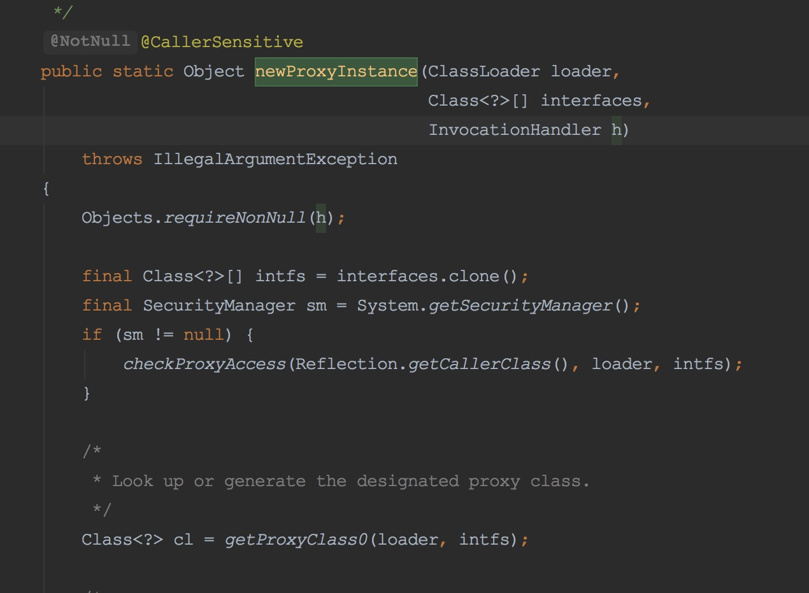

   2. 比如日志、监控等公共行为可以通过AOP来实现，避免大量重复代码

   3. 元素

      1. 切面：拦截器类，定义切点以及通知
      2. 切点：具体拦截的某个业务点
      3. 通知：切面当中的方法，声明通知方法在目标业务层的执行位置，通知类型如下：
         1. 前置通知：@Before 在目标业务方法执行之前执行
         2. 后置通知：@After 在目标业务方法执行之后执行
         3. 返回通知：@AfterReturning 在目标业务方法返回结果之后执行
         4. 异常通知：@AfterThrowing 在目标业务方法抛出异常之后
         5. 环绕通知：@Around 功能强大，可代替以上四种通知，还可以控制目标业务方法是否执行以及何时执行

   4. aspectj切面扫描的细节再看下


###### spring 事务实现

Spring事务的底层依赖MySQL的事务，代码层面上利用AOP实现。

常用的是`@Transactional`注解，会被解析生成一个代理服务，**TransactionInterceptor**对它进行拦截处理，进行事务开启、 commit或者rollback的操作。

另外，spring还定义了事务传播行为，有7种类型，项目中常见的是PROPAGATION_REQUIRED。如果没有事务就新建事务，如果存在事务，就加入这个事务。

执行事务的时候使用**TransactionInterceptor**进行拦截，然后处理


[事务传播行为](https://segmentfault.com/a/1190000013341344)

| 事务传播行为类型             | 说明                                                         |
| ---------------------------- | ------------------------------------------------------------ |
| **PROPAGATION_REQUIRED**     | 如果当前没有事务，就新建一个事务，如果已经存在一个事务中，加入到这个事务中。这是最常见的选择。（如果父方法有事务，加入父方法的事务；父方法没有事务，则自己新建一个事务） |
| PROPAGATION_SUPPORTS         | 支持当前事务，如果当前没有事务，就以非事务方式执行。（如果父方法有事务，加入父方法的事务；父方法没有事务，则以非事务执行） |
| PROPAGATION_MANDATORY        | 使用当前的事务，如果当前没有事务，就抛出异常。（依赖父方法事务） |
| **PROPAGATION_REQUIRES_NEW** | 新建事务，如果当前存在事务，把当前事务挂起。（如果父方法有事务，把父方法事务挂起，自己新建事务；父方法没有事务，则自己新建一个事务） |
| PROPAGATION_NOT_SUPPORTED    | 以非事务方式执行操作，如果当前存在事务，就把当前事务挂起。（如果父方法有事务，把父方法事务挂起，以非事务执行自己的操作；父方法没有事务，则以非事务执行）（总是以非事务执行，不报错） |
| PROPAGATION_NEVER            | 以非事务方式执行，如果当前存在事务，则抛出异常。（总是以非事务执行，如果父方法存在事务，抛异常） |
| **PROPAGATION_NESTED**       | 如果当前存在事务，则在嵌套事务内执行。如果当前没有事务，则执行与PROPAGATION_REQUIRED类似的操作。 |

REQUIRED、REQUIRES_NEW、NESTED的对比

REQUIRED共用一个事务。

REQUIRES_NEW 有独立的子事务，子事务异常**不会**导致父事务回滚，父事务异常也**不会**导致子事务回滚，相互独立。

NESTED 子事务嵌套在父事务中，父事务回滚会引起子事务回滚；父事务正常、子事务异常，子事务可以单独回滚。


[源码详解](https://juejin.im/post/59e87b166fb9a045030f32ed)

1. txNamespaceHandle注册的`InfrastructureAdvisorAutoProxyCreator`是一个BeanPostProcessor，主要是为了创建动态代理（wrapIfNecessary）

这几个类是可以自动创建代理的

  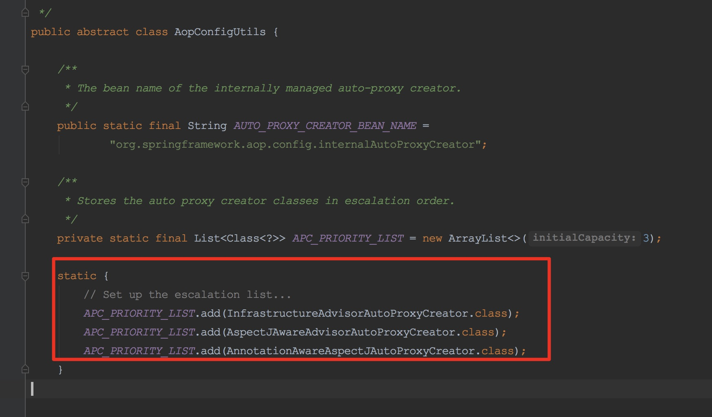

  

2. 在创建代理的时候，获取切面

   txNamespaceHandler注册了一个Advisor（BeanFactoryTransactionAttributeSourceAdvisor），再在这个advisor中判断是否当前bean符合这个切面（主要实现就是看有没有@Transactional注解）

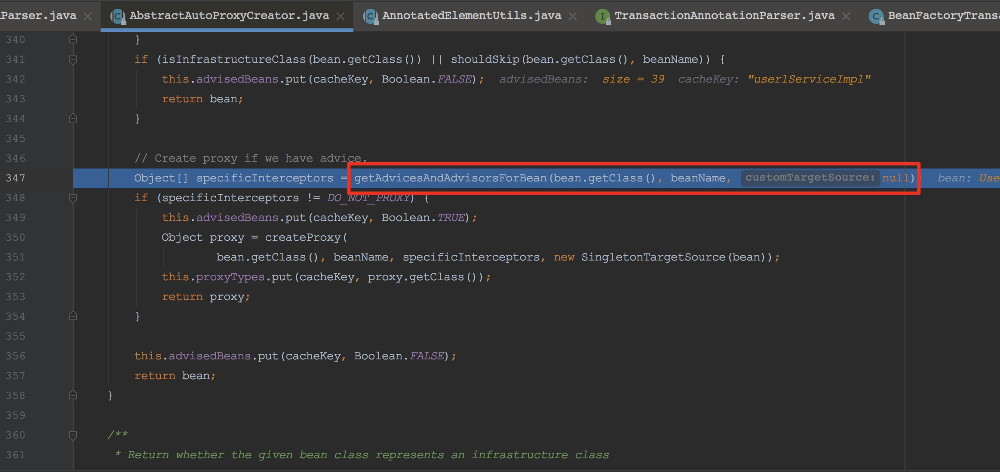


3. `TransactionInterceptor`是advice，增强，执行切面工作


摘录：https://my.oschina.net/fifadxj/blog/785621

spring-jdb的事务流程：

```java
DefaultTransactionDefinition def = new DefaultTransactionDefinition();
PlatformTransactionManager txManager = new DataSourceTransactionManager(dataSource);

TransactionStatus status = txManager.getTransaction(def);
try {
    //get jdbc connection...
    //execute sql...

    txManager.commit(status);
}
catch (Exception e) {
    txManager.rollback(status);
    throw e;
}
```

PlatformTransactionManager的getTransaction(), rollback(), commit()是spring处理事务的核心api，分别对应事务的开始，提交和回滚。

- TransactionSynchronizationManager负责从ThreadLocal中存取jdbc connection
- 创建事务的时候会通过dataSource.getConnection()获取一个新的jdbc connection，然后绑定到ThreadLocal
- 在业务代码中执行sql时，通过DataSourceUtils.getConnection()从ThreadLocal中获取当前事务的jdbc connection, 然后在该jdbc connection上执行sql
- commit和rollback事务时，从ThreadLocal中获取当前事务的jdbc connection，然后对该jdbc connection进行commit和rollback

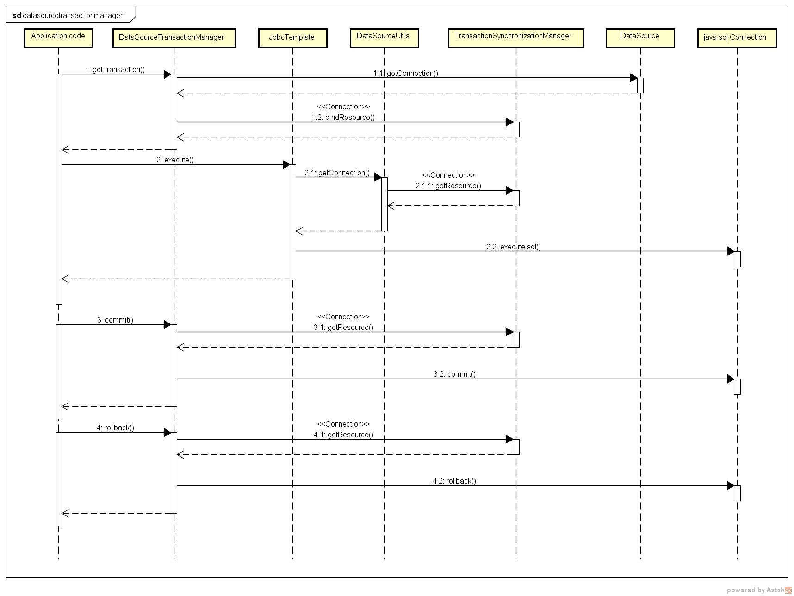

mybatis-spring的事务流程：

配置

```xml
<bean id="transactionManager" class="org.springframework.jdbc.datasource.DataSourceTransactionManager">
  <property name="dataSource" ref="dataSource" />
</bean>

<bean id="sqlSessionFactory" class="org.mybatis.spring.SqlSessionFactoryBean">
  <property name="dataSource" ref="dataSource" />
  <property name="transactionFactory">
    <bean class="org.apache.ibatis.spring.transaction.SpringManagedTransactionFactory" />
  </property> 
</bean>

<bean id="sqlSession" class="org.mybatis.spring.SqlSessionTemplate">
  <constructor-arg index="0" ref="sqlSessionFactory" />
</bean>
```

- mybatis-spring依赖DataSourceTransactionManager来处理事务，并没有创建自己的PlatformTransactionManager实现。
- mybatis通过SqlSessionFactoryBuilder创建SqlSessionFactory，而mybatis-spring通过SqlSessionFactoryBean创建SqlSessionFactory。
- 配置使用SpringManagedTransactionFactory来创建MyBatis的Transaction实现SpringManagedTransaction
- 配置使用SqlSessionTemplate代替通过SqlSessionFactory.openSession()获取SqlSession

调用过程

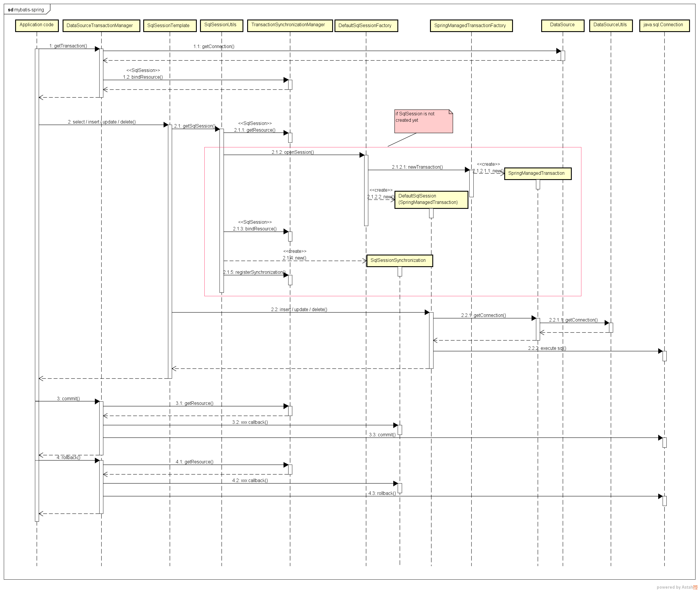

可以看到mybatis-spring处理事务的主要流程和spring jdbc处理事务并没有什么区别，都是通过DataSourceTransactionManager的getTransaction(), rollback(), commit()完成事务的生命周期管理，而且jdbc connection的创建也是通过DataSourceTransactionManager.getTransaction()完成，mybatis并没有参与其中，mybatis只是在执行sql时通过DataSourceUtils.getConnection()获得当前thread的jdbc connection，然后在其上执行sql。

sqlSessionTemplate是DefaultSqlSession的一个代理类，它通过SqlSessionUtils.getSqlSession()试图从ThreadLocal获取当前事务所使用的SqlSession。如果是第一次获取时会调用SqlSessionFactory.openSession()创建一个SqlSession并绑定到ThreadLocal，同时还会通过TransactionSynchronizationManager注册一个SqlSessionSynchronization。

SqlSessionSynchronization是一个事务生命周期的callback接口，mybatis-spring通过SqlSessionSynchronization在事务提交和回滚前分别调用DefaultSqlSession.commit()和DefaultSqlSession.rollback()

这里的DefaultSqlSession只会进行一些自身缓存的清理工作，并不会真正提交事务给数据库，原因是这里的DefaultSqlSession使用的Transaction实现为SpringManagedTransaction，SpringManagedTransaction在提交事务前会检查当前事务是否应该由spring控制，如果是，则不会自己提交事务，而将提交事务的任务交给spring，所以DefaultSqlSession并不会自己处理事务。

DefaultSqlSession执行sql时，会通过SpringManagedTransaction调用DataSourceUtils.getConnection()从ThreadLocal中获取jdbc connection并在其上执行sql。

**mybatis-spring做的最主要的事情是：**

1. **在SqlSession执行sql时通过用SpringManagedTransaction代替mybatis的JdbcTransaction，让SqlSession从spring的ThreadLocal中获取jdbc connection。**

2. **通过注册事务生命周期callback接口SqlSessionSynchronization，让SqlSession有机会在spring管理的事务提交或回滚时清理自己的内部缓存。**


###### spring的循环依赖如何解决？为什么要三级缓存？

https://juejin.im/post/5c98a7b4f265da60ee12e9b2

https://juejin.im/post/5e927e27f265da47c8012ed9

spring对循环依赖的处理有三种情况：

1. 构造器的循环依赖：这种依赖spring是处理不了的，直接抛出BeanCurrentlylnCreationException异常。
2. 单例模式下的setter循环依赖：通过“三级缓存”处理循环依赖。 
3. 非单例循环依赖：无法处理。


如何解决的？

只能解决单例的属性循环依赖的情况。本质上是通过将创建好的、或正在创建中的bean缓存起来。比如A和B循环依赖，创建A时先将A的实例放入缓存，自动注入属性B时，发现缓存中没有B，那么来创建B的实例，将B实例化放入缓存，注入属性A，发现A在缓存中，取出来赋值给A。bean B创建完成返回，赋值给A的属性B。这时候A和B的bean就都创建好了。


为什么要三级？看起来一级就可以实现呀？

[为什么要三级缓存](https://juejin.im/post/5ec88da26fb9a047e25d5691#h-2)：循环依赖的关键点：**提前暴露绑定A原始引用的工厂类到工厂缓存。等需要时触发后续操作处理A的早期引用，将处理结果放入二级缓存**

只有一级singeltonObjects肯定是不行的，需要一个放半成品的地方

实际上二级就够了，可以解决循环依赖的问题

考虑到代理的情况，就需要objectFactories这个三级缓存了，因为代理的创建是在第三步，这时候动态代理还没产生，注入了也不是最终的实例。放入三级缓存时，重写了getObject方法，会调用BeanPostProcessor的getEarlyBeanReference，这时候取到的就会是动态代理后的。


singletonFactories ： 进入实例化阶段的单例对象工厂的cache （三级缓存）

earlySingletonObjects ：完成实例化但是尚未初始化的，提前暴光的单例对象的Cache （二级缓存）

singletonObjects：完成初始化的单例对象的cache（一级缓存）


## Zookeeper

###### zk挂了怎么办？ **todo**

1. 指zk集群挂了其中一台机器？ -- 集群自己可以处理
   1. 挂的是master
   2. 挂的是follower
   3. 挂的是..

2. 集群全挂了？---那就是全挂了啊 趁早加入监控和降级策略


## Dubbo&Netty&RPC

https://juejin.im/post/5e215783f265da3e097e9679

###### RPC

1. remote procedure call 远程过程调用，是一种进程间的通信方式，是一种技术思想，而不是规范

2. 一次完整的rpc调用流程。RPC的目标是把2-8封装起来，对用户透明。

   (1):服务消费方(client)以本地调用方式调用服务。

   (2):client stub接收到调用后负责将方法、参数等组装成能够进行网络传输的消息体。

   (3):client stub找到服务地址，并将消息发送到服务端。

   (4):server stub收到消息后进行解码。

   (5):server stub根据解码结果调用本地的服务。

   (6):本地服务执行并将结果返回给server stub。

   (7):server stub将返回结果打包成消息并发送至消费方。

   (9):client stub接收到消息，并进行解码。

   (9):服务消费方得到最终结果。

3. 决定rpc效率的两个重要因素：通信效率，序列化和反序列化效率

4. 常见rpc框架：dubbo、gRPC、Thrift、HSF（high speed service framework）

   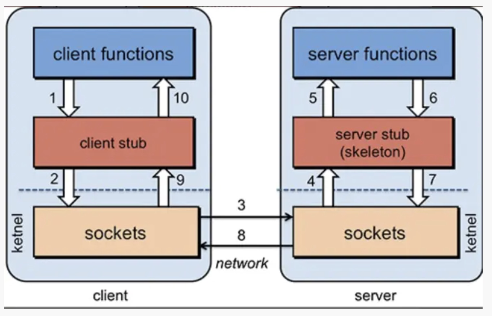

   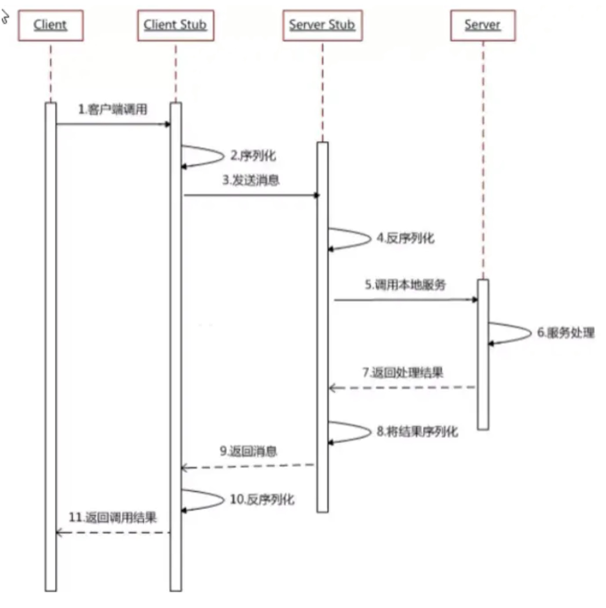

   

    

###### netty [理解netty](https://juejin.im/post/5bdaf8ea6fb9a0227b02275a)

1. netty是一个异步事件驱动的网络应用程序框架，是基于NIO的多路复用模型实现的。

2. 传统HTTP服务

   【HTTP服务器之所以称为HTTP服务器，是因为编码解码协议是HTTP协议，如果协议是Redis协议，那它就成了Redis服务器，如果协议是WebSocket，那它就成了WebSocket服务器，等等。 使用Netty可以定制编解码协议，实现自己的特定协议的服务器。】

   1. 创建一个ServerSocket，监听并绑定一个端口
   2. 一系列客户端来请求这个端口
   3. 服务器使用Accept，获得一个来自客户端的Socket连接对象
   4. 启动一个新线程处理连接
      1. 读Socket，得到字节流
      2. 解码协议，得到HTTP请求对象
      3. 处理HTTP请求，得到一个结果，封装成一个HTTPResponse对象
      4. 编码协议，将结果序列化字节流写入Socket，发给客户端
   5. 循环步骤3

3. NIO

   1. 不是Java独有的概念，NIO代表IO多路复用。

   2. 由操作系统提供的功能，早期select，后期linux-epoll/max-kqueue。一般就说是epoll（没人用mac当服务器）

   3. Netty基于Java NIO进行了封装，提供易于操作的使用模式和接口。

   4. BIO (Blocking IO)，如何理解blocking

      1. 服务端监听时，accept是阻塞的，只有新连接来了，accept才会返回，主线程才能继续
      2. 读写Socket时，read是阻塞的，只有请求消息来了（需要读完吗？），read才能返回，子线程才能继续处理
      3. 读写Socket时，write是阻塞的，只有客户端把消息接收了（客户端把消息接收了是什么表现？），write才能返回，子线程才能继续

   5. NIO利用**事件机制**（=事件驱动机制）实现非阻塞。【可以用一个线程把Accept，读写操作，请求处理的逻辑全干了。如果什么事都没得做，它也不会死循环，它会将线程休眠起来，直到下一个事件来了再继续干活，这样的一个线程称之为NIO线程。】

      伪代码

      ```shell
      while true {
          events = takeEvents(fds)  // 获取事件，如果没有事件，线程就休眠
          for event in events {
              if event.isAcceptable {
                  doAccept() // 新链接来了
              } elif event.isReadable {
                  request = doRead() // 读消息
                  if request.isComplete() {
                      doProcess()
                  }
              } elif event.isWriteable {
                  doWrite()  // 写消息
              }
          }
      }
      ```

4. Reactor（基于事件驱动）线程模型

   【netty可以基于以下模型灵活配置，比较常见的是用第三种。】

   【在Netty里面，Accept连接可以使用单独的线程池去处理，读写操作又是另外的线程池来处理。】

   【Accept连接和读写操作也可以使用同一个线程池来进行处理。请求处理逻辑既可以使用单独的线程池进行处理，也可以跟读写线程放在一块处理。】

   【线程池中的每一个线程都是NIO线程。用户可以根据实际情况进行组装，构造出满足系统需求的高性能并发模型。】

   1. Reactor单线程模型。一个NIO线程+一个accept线程。reactor线程负责分发，read、decode等操作都由其他线程处理。就和上面的伪代码差不多。

      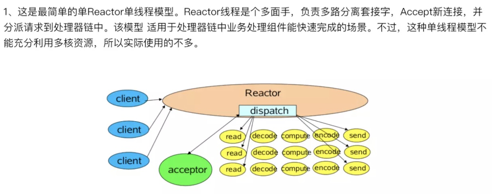

   2. Reactor多线程模型。相比上一种，【其他线程】由线程池来托管。

      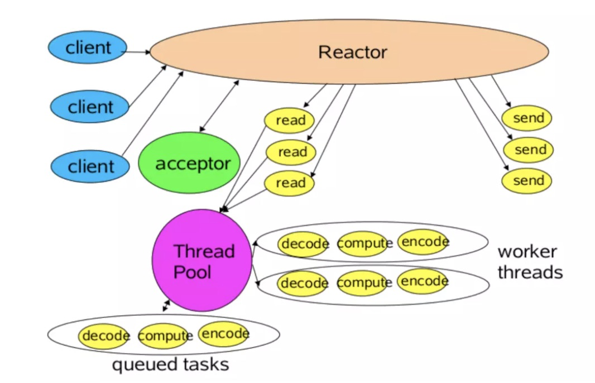

   3. Reactor主从模型。多个acceptor的NIO线程池用于接收客户端的连接。

      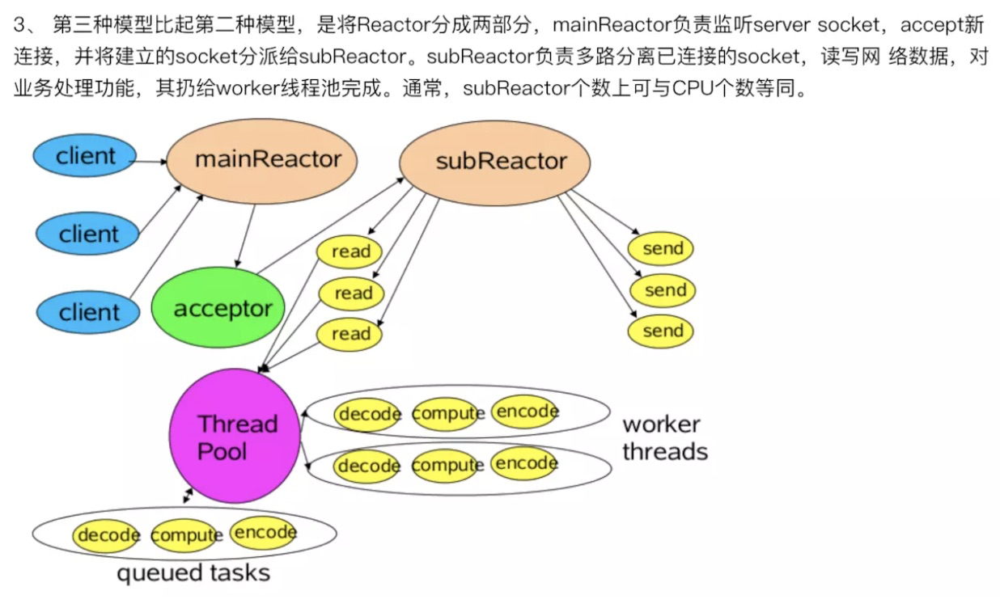

5. TCP粘包拆包

   1. 现象

      1. 假设使用netty在客户端重复写100次数据"你好，我的名字是xxx!"给服务端，用ByteBuf存放这个数据
      2. 服务端接收后输出，一般存在三种情况
         1. 完整的一个字符串
         2. 字符串多了
         3. 字符串少了

   2. 原因：尽管client按照ByteBuf为单位发送数据，server按照ByteBuf读取，但操作系统底层是tcp协议，按照字节发送和接收数据，在netty应用层，重新拼装成的ByteBuf与客户端发送过来的ByteBuf可能不是对等的。

      因此，我们**需要自定义协议来封装和解封应用层的数据包**。

   3. netty中定义好的拆包器

      1. 固定长度的拆包器 FixedLengthFrameDecoder
      2. 行拆包器 LineBasedFrameDecoder
      3. 分隔符拆包器 DelimiterBasedFrameDecoder （行拆包器的通用版本，可自定义分隔符）
      4. 长度域拆包器 LengthFieldBasedFrameDecoder （最通用，在协议中包含长度域字段）

6. 零拷贝

   1. 传统方式的拷贝

      `File.read(bytes)`
      `Socket.send(bytes)`

      需要四次数据拷贝和四次上下文切换

      1. 数据从磁盘读取到内核的read buffer

      2. 数据从内核缓冲区拷贝到用户缓冲区

      3. 数据从用户缓冲区拷贝到内核的socket buffer

      4. 数据从内核的socket buffer拷贝到网卡接口（硬件）的缓冲区

   2. 零拷贝的概念

      1. 上面的第二步和第三步是没有必要的，通过java的FileChannel.transferTo方法，可以避免上面两次多余的拷贝（需要操作系统支持）

      2. 调用transferTo,数据从文件由DMA引擎拷贝到内核read buffer

         接着DMA从内核read buffer将数据拷贝到网卡接口buffer

         上面的两次操作都不需要CPU参与，达到了零拷贝。

   3. Netty中的零拷贝

      体现在三个方面：

      1. bytefuffer

         Netty发送和接收消息主要使用bytebuffer，bytebuffer使用直接内存（DirectMemory）直接进行Socket读写。

         原因：如果使用传统的堆内存进行Socket读写，JVM会将堆内存buffer拷贝一份到直接内存中然后再写入socket，多了一次缓冲区的内存拷贝。DirectMemory中可以直接通过DMA发送到网卡接口

      2. Composite Buffers

         传统的ByteBuffer，如果需要将两个ByteBuffer中的数据组合到一起，需要先创建一个size=size1+size2大小的新的数组，再将两个数组中的数据拷贝到新的数组中。

         使用Netty提供的组合ByteBuf，就可以避免这样的操作。CompositeByteBuf并没有真正将多个Buffer组合起来，而是保存了它们的引用，从而避免了数据的拷贝，实现了零拷贝。

      3. 对FileChannel.transferTo的使用

         Netty中使用了FileChannel的transferTo方法，该方法依赖于操作系统实现零拷贝。

   

###### dubbo

1. 简介与特性：dubbo是一款高性能、轻量级的开源Java RPC框架，提供三大核心能力：**面向接口的远程方法调用**、**智能容错和负载均衡**、**服务自动注册和发现**。

   1. 【以下几点是官网上的特性介绍...】
   2. 面向接口的远程方法调用：提供高性能的基于代理的远程调用能力，服务以接口为粒度，为开发者屏蔽远程调用底层细节。
   3. 智能负载均衡：内置多种负载均衡策略（有哪些？），感知下游节点的健康状况，显著减少调用延迟，提高系统吞吐量。
   4. 服务自动注册与发现：支持多种注册中心服务（有哪些？），服务实例上下线实时感知（具体实现是什么？）。
   5. 高度可扩展能力：遵循微内核+插件的设计原则，所有核心能力如Protocol、Transport、Serialization被设计为可扩展点，平等的对待内置实现和第三方实现。（SPI设计模式？）
   6. 运行期流量调度：内置条件、脚本等路由策略，通过配置不同的路由规则，实现灰度发布、同机房优先等功能。
   7. 可视化的服务治理与运维：提供丰富服务治理、运维工具：随时查看服务元数据、服务健康状态以及调用统计，实时下发路由策略、调度配置参数。

2. dubbo架构

   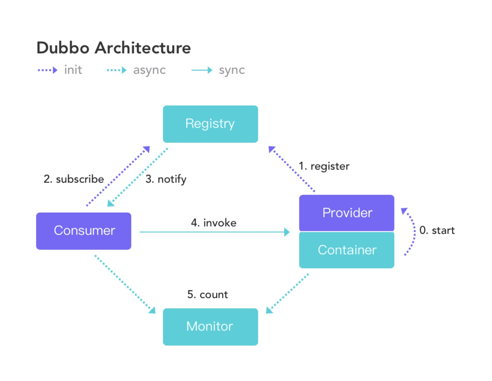

   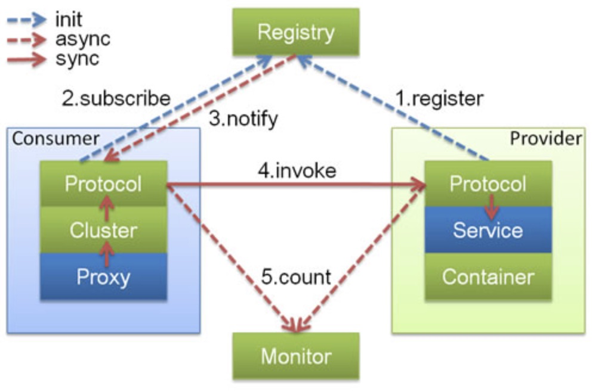

   以上两张图说明dubbo执行流程：

   1. dubbo容器启动后，provider将自己提供的服务注册到注册中心（注册中心便知道有哪些服务上线了）
   2. consumer启动后，从注册中心订阅需要的服务。
   3. 注册中心以长连接的方式向consumer发送服务变更通知。
   4. consumer同步调用provider的服务（如果服务有多个节点，可通过负载均衡算法选择一个节点进行调用）
   5. consumer和provider会定期将调用信息（调用时间、调用服务信息）发送给监控中心
   6. Dubbo容器启动、服务生产者注册自己的服务、服务消费者从注册中心中订阅服务是在Dubbo应用启动时完成的；consumer调用provider是同步过程；注册中心向consumer发送服务变更通知是异步的；consumer和provider向监控中心发送信息是异步的。

   调用链整体展开：

   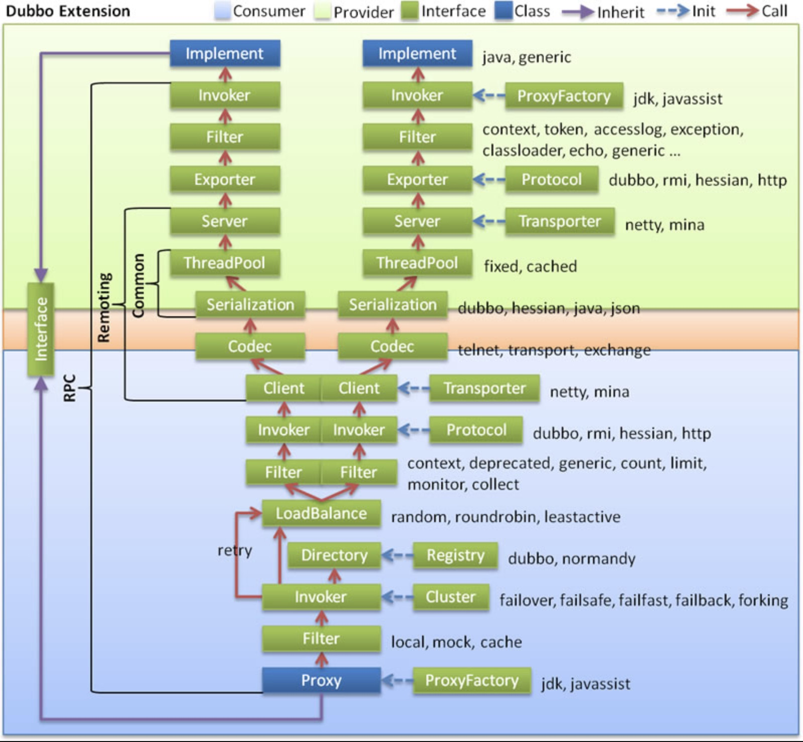

   下面这张图看起来有点复杂了..

   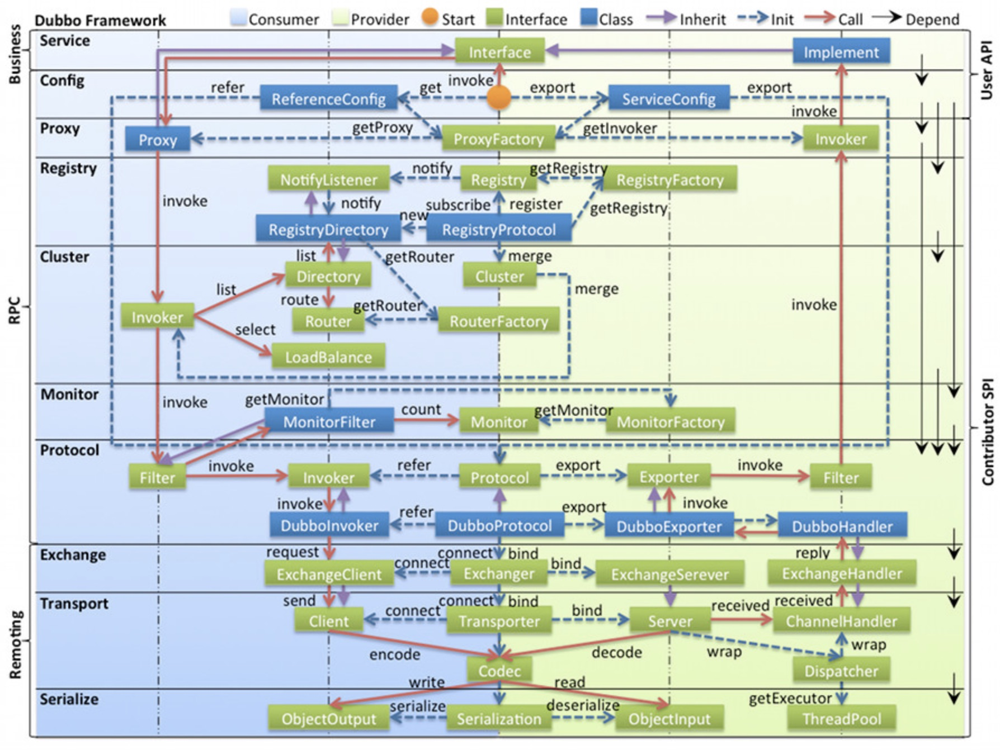

3. Dubbo配置的覆盖关系 (1):方法级优先、接口级次之，全局配置优先级最低。 (2):如果级别一样，则消费者优先，提供方次之。

4. dobbo高可用

   1. 注册中心Zookeeper宕机，还可以消费Dubbo暴露的服务。
   2. Dubbo的监控中心宕机，不会影响Dubbo的正常使用，只是丢失了部分采样数据。
   3. 数据库宕机后，注册中心仍然可以通过缓存提供服务列表查询，但是不能注册新的服务。
   4. 注册中心集群的任意一个节点宕机，将自动切换到另外一台。
   5. 注册中心全部宕机，服务提供者和消费者可以通过本地缓存通讯。
   6. 服务提供者无状态，任意一台宕机后，不影响使用。 
   7. 服务提供者全部宕机，服务消费者应用将无法使用，并且会无限次重连等待服务提供者恢复。

5. 负载均衡策略

   1. 【默认为随机】

   2. 基于**权重的随机**负载均衡：Random LoadBalance，比如orderService想要远程调用userService，而userService分别在三台机器上，我们可以给每台机器设置权重，比如三台机器的权重依次为100、200、50，则总权重为350，则选择第一台的概率就是100/350.

   3. 基于**权重的轮询**负载均衡：RoundRobin LoadBalance（可以理解为按照权重占比进行轮询。占比少的，当权重比较低时就不会再去权重低的机器上请求。如果某台机器性能一般，但权重占比高，就很可能卡在这里）

   4. 最少活跃数负载均衡：LeastActive LoadBalance，比如三台服务器上一次处理请求所花费的时间分别为100ms、1000ms、300ms，则这一次请求回去上一次处理请求时间最短的机器，所以这次一号服务器处理这次请求。

   5. 一致性Hash负载均衡：ConsistentHash LoadBalance

      原文：https://blog.csdn.net/revivedsun/java/article/details/71022871

      一致性Hash负载均衡涉及到两个主要的配置参数为hash.arguments 与hash.nodes。

      hash.arguments ： 当进行调用时候根据调用方法的哪几个参数生成key，并根据key来通过一致性hash算法来选择调用结点。例如调用方法invoke(String s1,String s2); 若hash.arguments为1(默认值)，则仅取invoke的参数1（s1）来生成hashCode。

      hash.nodes： 为结点的副本数。

      ```xml
      缺省只对第一个参数Hash，如果要修改，请配置
      <dubbo:parameter key="hash.arguments" value="0,1" />
      
      缺省用160份虚拟节点，如果要修改，请配置
      <dubbo:parameter key="hash.nodes" value="320" />
      ```

   6. 降级服务

      当服务器压力剧增的情况下，根据实际业务及流量，对一些服务和页面有策略地不处理或者换种简单的方式处理，从而释放服务器资源以保证核心交易正常或高效运行。

      1. mock=force:return+null:表示消费方对该服务的方法都返回null值，不发起远程调用。用来屏蔽不重要的服务不可用时对调用方的影响，可以直接在Dubbo客户端(localhost:7001)对服务消费者设置，屏蔽掉即可。

      2. mock=fall:return+null:表示消费方对该服务的方法调用在失败后，再返回null，不抛出异常。用来容忍不重要服务不稳定时对调用方的影响，可以直接在Dubbo客户端(localhost:7001)对服务消费者设置，容错掉即可。

   7. 集群容错

      1. Failover Cluster:失败自动切换，当出现失败，重试其他服务器。通常用于读操作，但重试会带来更长延迟。可通过retries=n来设置重试次数。
      2. Failfast Cluster:快速失败，只发起一次调用，失败立即报错。通常用于非幂等性的写操作，比如新增操作。
3. Forking Cluster:并行调用多个服务器，只要一个成功即返回。通常用于实时性要求较高的读操作，但需要浪费更多的服务资源。通过过fork=n设置最大并行数。
      4. Broadcast Cluster:广播调用所有提供者，逐个调用，任意一台报错则报错，通常用于通知所有服务提供者更新缓存或日志等本地资源信息。

   8. **远程调用细节**
   
      1. 服务提供者暴露一个服务的概要过程
         1. ServiceConfig引用对外提供服务的实现类ref，如GreetingServiceImpl
         2. 通过ProxyFactory的实现类的getInvoker()方法使用ref生成一个AbstractProxyInvoker实例
         3. DubboProtocol的export方法，会启动NettyServer监听服务连接，并将服务注册到注册中心
      2. 服务方如何处理请求
         1. NettyServer是一个Handler，接收到一个请求
         2. 将请求派发到dubbo内部的业务线程池（默认线程模型为all，所有消息都派发给业务线程，包括请求事件、响应事件、连接事件、断开事件、心跳事件等，AllChannelHandler）
         3. 调用到DubboProtocol的connected方法，触发AbstractProxyInvoker执行，有返回值的写入Channel
      3. 消费方启动流程
         1. ReferenceConfig的get()触发，到init() -> createProxy()，创建一个代理，处理类是DubboInvoker（共享同一台服务方机器的NettyClient），再包装上RegistryDirectory和Cluster，做路由、负载均衡和容错
      4. 服务消费者消费一个服务的概要过程
         1. ReferenceConfig的init()方法调用Protocol实现类的refer()方法生成Invoker实例
         2. 把Invoker转换为客户端需要的接口，如GreetingService，发生在ProxyFactory实现类的getProxy()方法中，主要是使用代理（对服务接口的调用转换为对Invoker的调用）
   
   9. 模块简单介绍
   
      1. 业务线程、用户线程、io线程


## 消息队列

###### 作用

1. 解耦
2. 异步
3. 削峰/限流


###### 原理介绍 todo


###### 如何保证RocketMQ 消息的顺序性，如何解决重复消费问题

针对kafka来说

如何保证消息的顺序性：

一个分区内的消息是顺序的

一个主题的不同分区之间，消息不能保证有序

-- 对同一类消息指定相同的key，相同的key会哈希到同一个分区，这样可以保证这部分消息的有序性


https://www.cnblogs.com/756623607-zhang/p/10506909.html

如何解决重复消费：

1. kafka自带的消费机制

   consumer消费后，会定期将消费过的offset偏移量提交给broker。如果consumer重启，会继续上次的offset开始消费。

2. 业务上保证幂等性

   如果进程挂了或机器宕机，没来得及提交offset，需要业务上进行幂等。

   比如建立一张消息表。

   1. 生产者，发送消息前判断库中是否有记录（有记录说明已发送），没有记录，先入库，状态为待消费，然后发送消息并把主键id带上。

   2. 消费者，接收消息，通过主键ID查询记录表，判断消息状态是否已消费。若没消费过，则处理消息，处理完后，更新消息记录的状态为已消费。


## MyBatis

###### MyBatis，Mybatis与Spring

MyBatis 消除了大部分 JDBC 的样板代码、手动设置参数以及检索结果。**通过简洁的设计最大限度地简化开发和提升性能。**

解除SQL与程序代码的耦合，通过提供dao层，将业务逻辑和数据访问逻辑分离开。设计更清晰，更易维护。

MyBatis整体架构

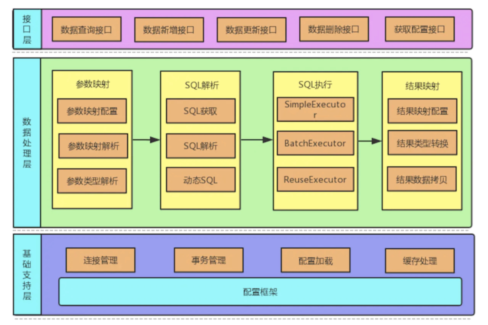

MyBatis层级结构

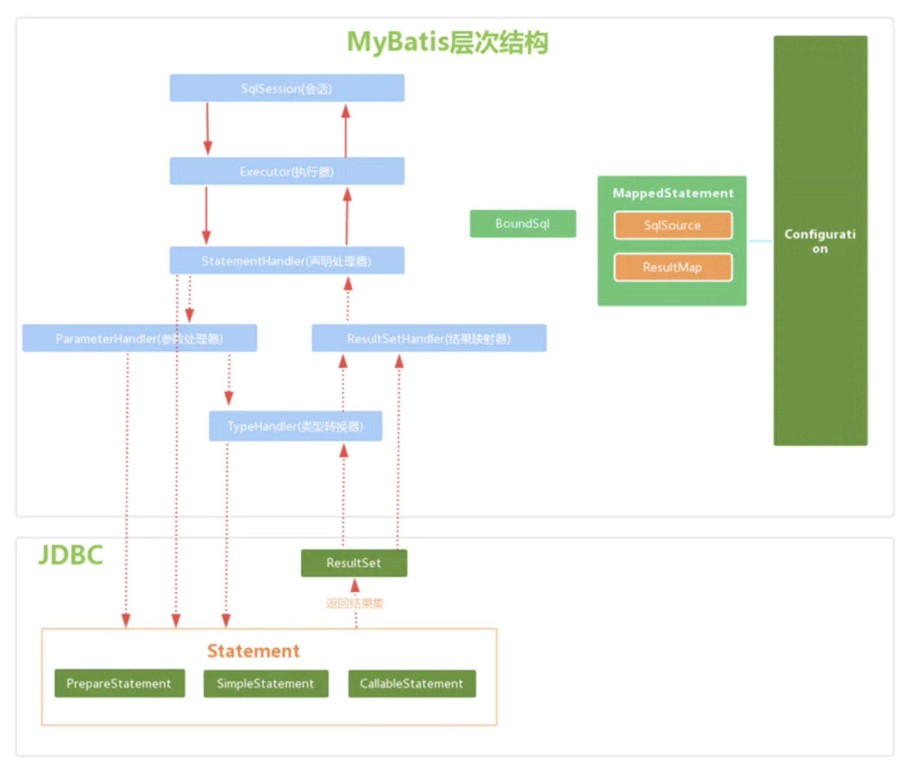


裸用`sqlSession`是上面的红框

spring用mapper/dao接口代理，本质上是一个MapperProxy，从下面的红框开始执行

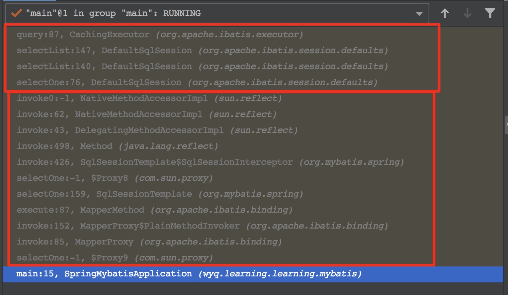

spring事务是在哪个环节起作用？

https://mybatis.org/spring/zh/transactions.html

> 一个使用 MyBatis-Spring 的其中一个主要原因是它允许 MyBatis 参与到 Spring 的事务管理中。而不是给 MyBatis 创建一个新的专用事务管理器，MyBatis-Spring 借助了 Spring 中的 DataSourceTransactionManager 来实现事务管理。
>
> 一旦配置好了 Spring 的事务管理器，你就可以在 Spring 中按你平时的方式来配置事务。并且支持 @Transactional 注解和 AOP 风格的配置。在事务处理期间，一个单独的 `SqlSession` 对象将会被创建和使用。当事务完成时，这个 session 会以合适的方式提交或回滚。
>
> 事务配置好了以后，MyBatis-Spring 将会透明地管理事务。

所以，最外层是事务，每个事务会起一个`SqlSession`。


几篇文章：

入门，裸用mybatis：https://juejin.im/post/5aa5c6fb5188255587232e5a#heading-0

mybatis执行，包括整合spring后的流程：https://juejin.im/post/5e350d895188254dfd43def5#heading-9

关于JDBC：https://juejin.im/post/5c75e6666fb9a049cd54dc88

Mybatis和spring整合的使用：https://juejin.im/post/5cdfed6ef265da1b6720dcaf


mybatis框架说明：


整体执行流程说明：


sqlSession执行流程说明：


关键流程（以下整个可以看成裸用MyBatis的执行流程）

config文件加载：解析xml文件配置项

mapper文件加载：上一个流程中的一个环节，解析完后封装成MappedStatement，存入configuration

SqlSource创建流程：上一流程的一个环节，SqlSource是MappedStatement的一部分，主要存放sql和占位的参数名称

-- 解析环节结束

SqlSession执行流程：`sqlSessionFactory.openSession`主要是建立了一个和数据库的连接connection

获取BoundSql流程：`sqlSession.xx`方法执行时，需要获取BoundSql，BoundSql本质上是SqlSource和执行请求的入参的一个组合

参数映射流程：根据顺序，或者根据名称（只是大略看了一眼）

结果集映射流程：根据名称（只是大略看了一眼）


mybatis的openSession默认开启事务，autocommit为false，隔离级别为null

mybatis的JdbcTransaction

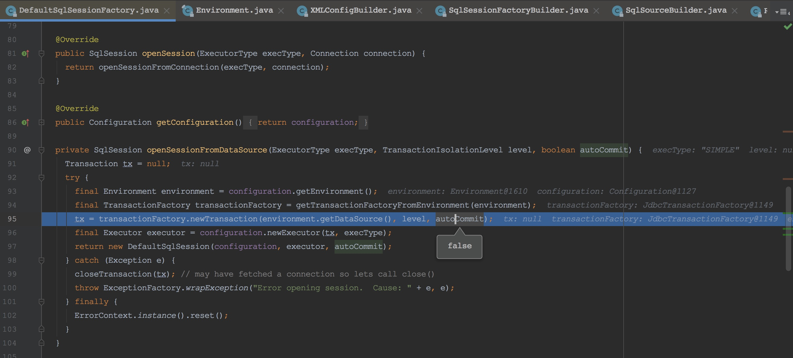


整合spring的几个组件

`org.mybatis.spring.SqlSessionFactoryBean` 注入sqlSessionFactory

`org.mybatis.spring.mapper.MapperScannerConfigurer`扫描指定包

1. 将包下class文件加入到beanDefinition中，bean类型指定为MapperFactoryBean
2. SqlSessionFactoryBean构建sqlSessionFactory时，扫描mapper xml文件，根据namespace在MapperRegistry中注入对应mapper接口的MapperProxyFactory
3. MapperFactoryBean->getObject中生成mapper的代理类MapperProxy（通过MapperFactoryBean中的interface，即mapper的namespace找到MapperProxyFactory，再生产出代理类）


以下大概知道了

现在差一个中间环节，mapper的beanDefinition怎么变成MapperProxy..以及MapperFactoryBean的作用

还有个SqlSessionTemplate：https://juejin.im/post/5cea1f386fb9a07ea803a70e

还有MapperProxyFactory -- 来创建MapperProxy

Java动态代理：https://juejin.im/post/5c1ca8df6fb9a049b347f55c


MapperFactoryBean

MapperProxy

MapperMethod -- 到这里之后，流程就转到sqlSession.selectOne之类的了


Mybatis缓存

https://juejin.im/post/5e81fb126fb9a03c546c22bb

MyBatis 系统中默认定义了两级缓存：**一级缓存**和**二级缓存** 

- 默认情况下，只有一级缓存开启。（SqlSession级别的缓存，也称为本地缓存） 
- 二级缓存需要手动开启和配置，它是基于 namespace 级别的缓存，缓存只作用于 cache 标签所在的映射文件中的语句。


# 附录

###### Protocol的适配器类

`jad org.apache.dubbo.rpc.Protocol$Adaptive`

```java
ClassLoader:
+-sun.misc.Launcher$AppClassLoader@18b4aac2
  +-sun.misc.Launcher$ExtClassLoader@737996a0

Location:
/github/learn/dubbo2/dubbo/dubbo-common/target/classes/

/*
 * Decompiled with CFR.
 *
 * Could not load the following classes:
 *  org.apache.dubbo.common.URL
 *  org.apache.dubbo.common.extension.ExtensionLoader
 *  org.apache.dubbo.rpc.Exporter
 *  org.apache.dubbo.rpc.Invoker
 *  org.apache.dubbo.rpc.Protocol
 *  org.apache.dubbo.rpc.RpcException
 */
package org.apache.dubbo.rpc;

import java.util.List;
import org.apache.dubbo.common.URL;
import org.apache.dubbo.common.extension.ExtensionLoader;
import org.apache.dubbo.rpc.Exporter;
import org.apache.dubbo.rpc.Invoker;
import org.apache.dubbo.rpc.Protocol;
import org.apache.dubbo.rpc.RpcException;

public class Protocol$Adaptive
implements Protocol {
    public void destroy() {
        throw new UnsupportedOperationException("The method public abstract void org.apache.dubbo.rpc.Protocol.destroy() of interface org.apache.dubbo.rpc.Protocol is not adaptive method!");
    }

    public int getDefaultPort() {
        throw new UnsupportedOperationException("The method public abstract int org.apache.dubbo.rpc.Protocol.getDefaultPort() of interface org.apache.dubbo.rpc.Protocol is not adaptive method!");
    }

    public List getServers() {
        throw new UnsupportedOperationException("The method public default java.util.List org.apache.dubbo.rpc.Protocol.getServers() of interface org.apache.dubbo.rpc.Protocol is not adaptive method!");
    }

    // 自适配方法1
    public Invoker refer(Class class_, URL uRL) throws RpcException {
        String string;
        if (uRL == null) {
            throw new IllegalArgumentException("url == null");
        }
        URL uRL2 = uRL;
        String string2 = string = uRL2.getProtocol() == null ? "dubbo" : uRL2.getProtocol();
        if (string == null) {
            throw new IllegalStateException(new StringBuffer().append("Failed to get extension (org.apache.dubbo.rpc.Protocol) name from url (").append(uRL2.toString()).append(") use keys([protocol])").toString());
        }
        Protocol protocol = (Protocol)ExtensionLoader.getExtensionLoader(Protocol.class).getExtension(string);
        return protocol.refer(class_, uRL);
    }

  // 自适配方法2
    public Exporter export(Invoker invoker) throws RpcException {
        String string;
        if (invoker == null) {
            throw new IllegalArgumentException("org.apache.dubbo.rpc.Invoker argument == null");
        }
        if (invoker.getUrl() == null) {
            throw new IllegalArgumentException("org.apache.dubbo.rpc.Invoker argument getUrl() == null");
        }
        URL uRL = invoker.getUrl();
        String string2 = string = uRL.getProtocol() == null ? "dubbo" : uRL.getProtocol();
        if (string == null) {
            throw new IllegalStateException(new StringBuffer().append("Failed to get extension (org.apache.dubbo.rpc.Protocol) name from url (").append(uRL.toString()).append(") use keys([protocol])").toString());
        }
        Protocol protocol = (Protocol)ExtensionLoader.getExtensionLoader(Protocol.class).getExtension(string);
        return protocol.export(invoker);
    }
}
```


###### 服务方Service的代理封装

`jad org.apache.dubbo.common.bytecode.Wrapper1`

```java
ClassLoader:
+-sun.misc.Launcher$AppClassLoader@18b4aac2
  +-sun.misc.Launcher$ExtClassLoader@737996a0

Location:
/github/learn/dubbo2/dubbo/dubbo-common/target/classes/

/*
 * Decompiled with CFR.
 *
 * Could not load the following classes:
 *  org.apache.dubbo.common.bytecode.ClassGenerator$DC
 *  org.apache.dubbo.common.bytecode.NoSuchMethodException
 *  org.apache.dubbo.common.bytecode.NoSuchPropertyException
 *  org.apache.dubbo.common.bytecode.Wrapper
 *  org.apache.dubbo.demo.PoJo
 *  org.apache.dubbo.demo.provider.HelloServiceImpl
 */
package org.apache.dubbo.common.bytecode;

import java.lang.reflect.InvocationTargetException;
import java.util.Map;
import org.apache.dubbo.common.bytecode.ClassGenerator;
import org.apache.dubbo.common.bytecode.NoSuchMethodException;
import org.apache.dubbo.common.bytecode.NoSuchPropertyException;
import org.apache.dubbo.common.bytecode.Wrapper;
import org.apache.dubbo.demo.PoJo;
import org.apache.dubbo.demo.provider.HelloServiceImpl;

public class Wrapper1
extends Wrapper
implements ClassGenerator.DC {
    public static String[] pns;
    public static Map pts;
    public static String[] mns;
    public static String[] dmns;
    public static Class[] mts0;
    public static Class[] mts1;

    public String[] getPropertyNames() {
        return pns;
    }

    public boolean hasProperty(String string) {
        return pts.containsKey(string);
    }

    public Class getPropertyType(String string) {
        return (Class)pts.get(string);
    }

    public String[] getMethodNames() {
        return mns;
    }

    public String[] getDeclaredMethodNames() {
        return dmns;
    }

    public void setPropertyValue(Object object, String string, Object object2) {
        try {
            HelloServiceImpl helloServiceImpl = (HelloServiceImpl)object;
        }
        catch (Throwable throwable) {
            throw new IllegalArgumentException(throwable);
        }
        throw new NoSuchPropertyException(new StringBuffer().append("Not found property \"").append(string).append("\" field or setter method in class org.apache.dubbo.demo.provider.HelloServiceImpl.").toString());
    }

    public Object getPropertyValue(Object object, String string) {
        try {
            HelloServiceImpl helloServiceImpl = (HelloServiceImpl)object;
        }
        catch (Throwable throwable) {
            throw new IllegalArgumentException(throwable);
        }
        throw new NoSuchPropertyException(new StringBuffer().append("Not found property \"").append(string).append("\" field or getter method in class org.apache.dubbo.demo.provider.HelloServiceImpl.").toString());
    }

  // 核心在这里
    public Object invokeMethod(Object object, String string, Class[] arrclass, Object[] arrobject) throws InvocationTargetException {
        HelloServiceImpl helloServiceImpl;
        try {
            helloServiceImpl = (HelloServiceImpl)object;
        }
        catch (Throwable throwable) {
            throw new IllegalArgumentException(throwable);
        }
        try {
            if ("testGeneric".equals(string) && arrclass.length == 1) {
                return helloServiceImpl.testGeneric((PoJo)arrobject[0]);
            }
            if ("sayHello".equals(string) && arrclass.length == 1) {
                return helloServiceImpl.sayHello((String)arrobject[0]);
            }
        }
        catch (Throwable throwable) {
            throw new InvocationTargetException(throwable);
        }
        throw new NoSuchMethodException(new StringBuffer().append("Not found method \"").append(string).append("\" in class org.apache.dubbo.demo.provider.HelloServiceImpl.").toString());
    }
}
```


###### ExtensionLoader和getAdaptiveExtension

1. ExtensionLoader缓存了每种组件的名称-实例映射

2. 组件适配器xx$Adaptive从相应的ExtensionLoader中取需要的实例