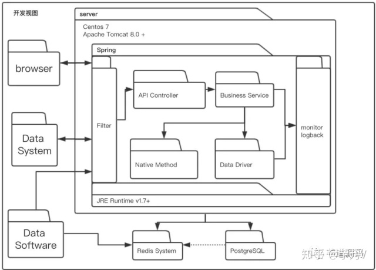
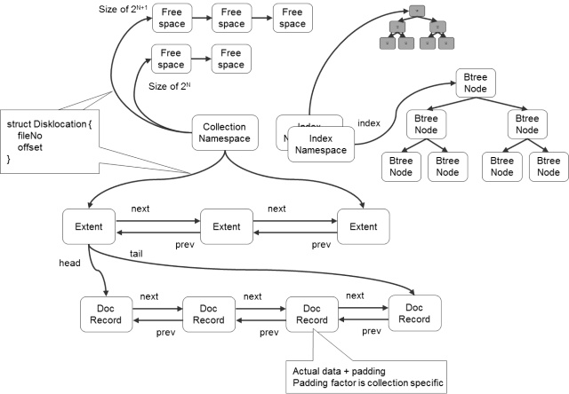
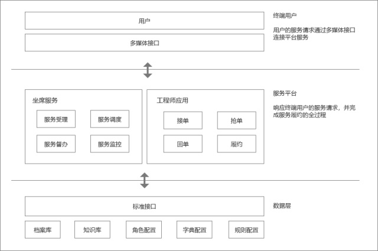

【以下都是原文摘录。著作权归原作者所有。更多内容请看原文。】

系统架构第三篇之架构(上) - gaofla的文章 - 知乎 https://zhuanlan.zhihu.com/p/50290236

架构一般分为：**业务架构、技术架构、应用架构、部署架构**，不同的架构关注面不一样。

业务架构：业务提供的能力，业务能做什么；

技术架构：技术领域解决问题，如存储、计算等；

应用架构：应用之间的关系；

部署架构：应用实际是怎样部署的，不同机房等。

那么问题来了，架子是怎么出来的呢？还是回到前面两篇文章中，系统架构前面有系统二字，那么具有系统的特性，**系统是分层**，所以架子的导出按照之前提到的三把斧：**分解**、**抽象**、**层次特性**。

软件架构之分离关注点 - gaofla的文章 - 知乎 https://zhuanlan.zhihu.com/p/54625074

“关注点=职责”---这句是我加的

分离关注点是我们经常听到的一个词汇，一说到分离关注点一般情况下有两种场景立即浮现在我们的眼前：**一是分层**；**二是面向接口编程**。这两个都只是分离关注点的具体实现，但并不是分离关注点的本质思想。分离关注点本身包含三层含义：**一是如何分离**； **二是关注点是什么**；**三是关注点如何实现的**。

二、关注点是什么

从分层出发，往上抽象，就是4个字：**单一职责**。

我们在学习面向对象时，首先会讲到封装，讲封装最低层次就是讲封装私密性(数据保护)；中层次就是对象功能的封装；高层次就是封装的关注点有哪些。面向对象的三大特性继承和多态都是为了封装服务的。

三、如何分离关注点

小到一个函数，大到一个类，再或者是一个包，甚至更大的是一个层，都可以看作是一个关注点，关注点常见划分的手段有两种：**功能(职责)**和**业务语义**。平时说的边界也是在分离各自己的关注点，划分边界也是体现了单一职责。

业务语义在领域建模中经常使用到，根据业务语义进行拆分，不同的对象放在不同的域内，如有订单域、商品域、交易域、结算域等等，它们的业务含义是不一样的。

系统架构设计（通用型），推荐给苦于写文档的同学们，干货分享！ - 摆渡人的文章 - 知乎 https://zhuanlan.zhihu.com/p/36989243

阿里巴巴的技术专家，是如何画好架构图的？ - 芋道源码的文章 - 知乎 https://zhuanlan.zhihu.com/p/64881017

4+1视图，分别为场景视图、逻辑视图、物理视图、处理流程视图和开发视图

场景视图用于描述系统的参与者与功能用例间的关系，反映系统的最终需求和交互设计，通常由用例图表示。

逻辑视图用于描述系统软件功能拆解后的组件关系，组件约束和边界，反映系统整体组成与系 统如何构建的过程,通常由UML的组件图和类图来表示。

物理视图用于描述系统软件到物理硬件的映射关系，反映出系统的组件是如何部署到一组可 计算机器节点上，用于指导软件系统的部署实施过程。

处理流程视图用于描述系统软件组件之间的通信时序，数据的输入输出，反映系统的功能流程 与数据流程,通常由时序图和流程图表示。

开发视图用于描述系统的模块划分和组成，以及细化到内部包的组成设计，服务于开发人员，反映系统开发实施过程。

知乎的技术架构是什么样的？ - 姚钢强的回答 - 知乎 https://www.zhihu.com/question/314356555/answer/625772570

简述下知乎在线部分的技术架构，先看下整体的架构图，整体比较清晰不再赘述。

## 偏流程的图

求一张MongoDB的系统架构图？ - Michael wang的回答 - 知乎 https://www.zhihu.com/question/29052377/answer/43378275

作者：Michael wang
链接：https://www.zhihu.com/question/29052377/answer/43378275
来源：知乎
著作权归作者所有。商业转载请联系作者获得授权，非商业转载请注明出处。

在我的笔记中找了找，发现了几副，比较老了，对付看吧。

sharding相关的图

Replication相关的

!

在最新的3.0中增加了很多新东西，值得继续跟进。

## 业务架构图的例子，仅供参考

零售系统架构图 - summer86的文章 - 知乎 https://zhuanlan.zhihu.com/p/80270660

产品架构图到底是怎么“画”出来的？ - 杜松的文章 - 知乎 https://zhuanlan.zhihu.com/p/67038314

