70. ioc原理、aop原理和应用

    1. ioc原理 控制反转（依赖注入）
       1. 本质是，spring维护了一个实例的容器，在需要使用某个实例的地方，自动注入这个实例
       2. 主要运用了反射机制，通过反射来创建约定的实例，并维护在容器中
       
    2. aop原理 面向切面编程
      
       [AOP原理](https://juejin.im/post/5bf4fc84f265da611b57f906)
       
       1. 原理是动态代理。代理模式的定义：给某一个对象提供一个代理，并由代理对象控制对原对象的引用。实现方式：
       
          1. 首先有接口A，类a实现接口A
       
          2. 接着创建一个bInvocationHandler类，实现InvocationHandler接口，持有一个被代理对象的实例target，invoke方法中触发method
       
             ```java
                 /**
                  * proxy: 代表动态代理对象，编译时候生成的
                  * method：代表正在执行的方法
                  * args：代表调用目标方法时传入的实参
                  */
                 public Object invoke(Object proxy, Method method, Object[] args) throws Throwable {
                     System.out.println("代理执行" +method.getName() + "方法");
                     Object result = method.invoke(target, args);
                     return result;
                 }
             ```
       
          3. 创建代理对象
       
             ```
             A a = (A) Proxy.newProxyInstance(A.class.getClassLoader(), new Class<?>[]{A.class}, handler)
             ```
       
             
       
       2. 比如日志、监控等公共行为可以通过AOP来实现，避免大量重复代码
       
       3. 元素
       
          1. 切面：拦截器类，定义切点以及通知
          2. 切点：具体拦截的某个业务点
          3. 通知：切面当中的方法，声明通知方法在目标业务层的执行位置，通知类型如下：
             1. 前置通知：@Before 在目标业务方法执行之前执行
             2. 后置通知：@After 在目标业务方法执行之后执行
             3. 返回通知：@AfterReturning 在目标业务方法返回结果之后执行
             4. 异常通知：@AfterThrowing 在目标业务方法抛出异常之后
             5. 环绕通知：@Around 功能强大，可代替以上四种通知，还可以控制目标业务方法是否执行以及何时执行
       
       4. aspectj切面扫描的细节再看下

65. ~~大数据相关，MapReduce~~ 不考虑

66. Docker的原理【待看】

    [Docker核心技术与实现原理](http://www.dockone.io/article/2941)

    [Docker底层原理介绍](https://www.jianshu.com/p/e1f7b8d5184c)

67. Http协议

    1. 基础概念

       1. URI：uniform resource identifier 统一资源标识符

          1. URL：uniform resource locator 统一资源定位符
          2. URN：uniform resource name 统一资源名称
          3. URI包括URL和URN

       2. 请求报文的格式

          1. request line 请求行：请求方法，URL，协议

          2. request headers 请求头：各种header

          3. 请求行和请求头合称为**请求消息头**

          4. 空行分隔开请求头和请求消息体

          5. request message body **请求消息体**：key-value形式或者raw格式等等

             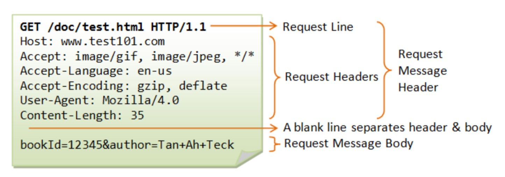

       3. 响应报文的格式

          1. status line 状态行：协议，状态码

          2. response headers 响应头

          3. 状态行和响应头合称为响应消息头

          4. 空行分隔开消息头和消息体

          5. response message body 响应消息体

             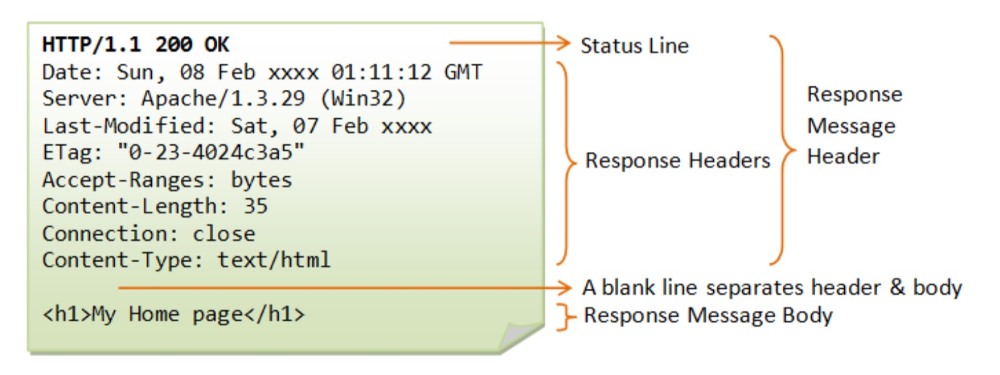

    2. HTTP方法

       1. get 主要用来获取资源
       2. head 获取报文首部，主要用于确认 URL 的有效性以及资源更新的日期时间等。
       3. post 主要用来传输数据
       4. put 上传文件，不带验证机制存在安全问题，一般不使用
       5. patch 对资源进行部分修改 -- 也不常用
       6. delete 删除文件，与put功能相反，同样不带验证机制
       7. options 查询支持的方法，会返回`Allow: GET, POST, HEAD, OPTIONS`这样的内容
       8. connect 要求在与代理服务器通信时建立隧道。使用 SSL(Secure Sockets Layer，安全套接层)和 TLS(Transport Layer Security，传输层安全)协议把通信内容 加密后经网络隧道传输。
       9. trace 追踪路径，一般也不用...

    3. HTTP状态码

       简要记一下

       1. 1XX 信息性状态码，接收的请求正在处理
       2. 2XX 请求正常处理完毕
       3. 3XX 重定向
       4. 4XX 客户端错误
       5. 5XX 服务端错误

    4. 再关注下前面的http和HTTPS的比较

       

68. cookie session介绍一下

    1. cookie

       1. 是服务器发送到用户浏览器并保持在本地的一小块数据，会在浏览器向同一服务器再次发起请求时被带上。
       2. 用途：
          1. 会话状态管理（比如用户登录状态、购物车等）
          2. 个性化设置（比如用户自定义设置、主题等）
          3. 浏览器行为分析
       3. 生成方式
          1. 服务器发送`Set-Cookie: yummy_cookie=choco`这样的header，客户端得到响应报文后把cookie存在浏览器
          2. 浏览器通过`document.cookie`属性可创建新的cookie
       4. HttpOnly 标记为 HttpOnly 的 Cookie 不能被 JavaScript 脚本调用。
       5. Secure 标记为 Secure 的 Cookie 只能通过被 HTTPS 协议加密过的请求发送给服务端。但即便设置了 Secure 标记，敏感信 息也不应该通过 Cookie 传输，因为 Cookie 有其固有的不安全性，Secure 标记也无法提供确实的安全保障。

    2. session

       1. 存储在服务端，可以存储在服务器上的文件、数据库或者内存中。也可以将 Session 存储在 Redis 这种内存型数据库中
       2. 使用 Session 维护用户登录状态的过程如下:
          1. 用户进行登录时，用户提交包含用户名和密码的表单，放入 HTTP 请求报文中; 
          2. 服务器验证该用户名和密码，如果正确则把用户信息存储到 Redis 中，它在 Redis 中的 Key 称为 Session ID; 
          3. 服务器返回的响应报文的 Set-Cookie 首部字段包含了这个 Session ID，客户端收到响应报文之后将该 Cookie 值存入浏览器中;
          4. 客户端之后对同一个服务器进行请求时会包含该 Cookie 值，服务器收到之后提取出 Session ID，从 Redis 中取 出用户信息，继续之前的业务操作。

    3. cookie和session的选择

       1. cookie只能存储ASCII码字符串，session可以存储任何类型的数据

       2. cookie存储在浏览器中，安全性较低

       3. 对于大型网址，如果所有用户信息都存储在session中，开销比较大 -- 【感觉不是个问题...】

          

69. session表结构怎么设计，储存在哪里？

    1. 我们项目里没有直接使用session，用的是商城统一单点登录
    2. 
    3. 如果我设计
       1. 首先一个用户请求过来，如果没有带session id，先重定向到登录页
       2. 收到登录请求，身份验证通过后，生成一个session，key为唯一ID，即session id，value为需要存储的信息，比如用户名、生成时间等，将session id作为cookie响应发回浏览器
       3. 众多的session是key-value结构，session本身也是key-value结构
       4. 存储在Redis

70. 你们的session cookie在项目里运用到哪里？

    1. session是SSO用的，cookie也主要是SSO用的
    2. 偶尔用的cookie是虚拟登录这样的场景
       1. 比如超级账号：员工的erp账号以只读的形式登录到用户账号，主要用于排查问题
       2. 比如账号管家：系统中，账号体系中的主账号可以登录到子账号上，一般也只读
       3. 再如虚拟登录，业务范畴上，两个账号建立授权关系，B账号可以虚拟登录到A账号上，代为操作系统
       4. 实现：被登录人一般是sso中的session对应的用户，属于资源所属者；操作者是erp账号、主账号、虚拟登录账号等，会有登录类型区分，这些信息会先加密，再存入cookie中（还会有不同的拦截器，进行身份和权限验证）

77. 单点登录的实现

    1. CAS

       TGT：Ticket Granted Ticket（俗称大令牌，或者说票根，他可以签发ST）。【类似session】

       TGC：Ticket Granted Cookie（cookie中的value），存在Cookie中，根据他可以找到TGT。【类似session id】

       ST：Service Ticket （小令牌），是TGT生成的，默认是用一次就生效了。也就是上面的ticket值。

       ps: 未登录状态下，访问app1时，展示登录页，浏览器会写入cas服务器的TGC；第二次访问app2，（因为app2本身校验当前请求未登录）重定向到cas服务器时，会带上TGC，cas服务器根据TGC判断用户已登录，签发新的ST再重定向到app2，这时候app2用ST校验通过，记录下自己的session cookie，提供请求内容。

       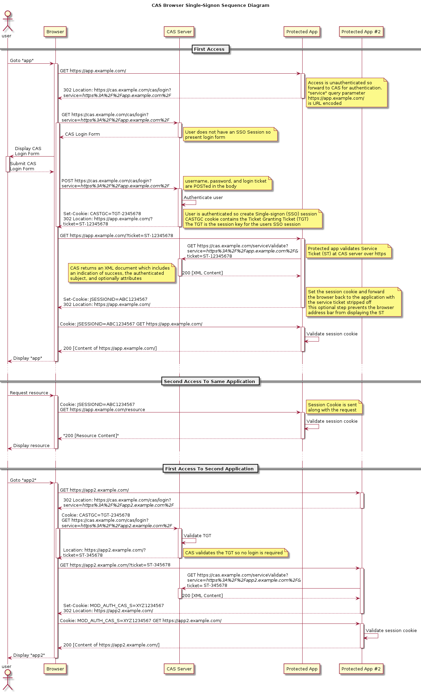

    2. ~~OAuth~~ 【不看了不看了！】

       https://juejin.im/post/5cc81d5451882524f72cd32c

       https://juejin.im/post/5b3b3b61f265da0f955ca780

       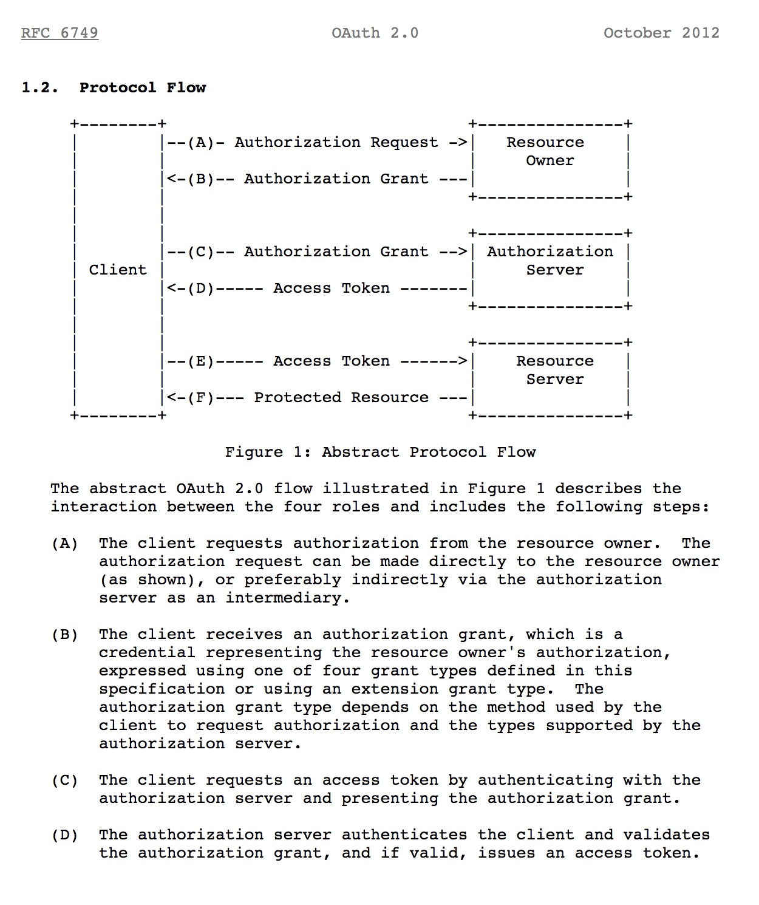

       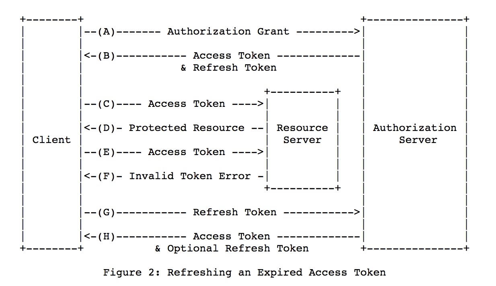
       
       

78. 算法题：[删除链表中重复的节点]在一个排序的链表中,存在重复的节点,请删除该链表中重复的节点,重复的节点不保留,返回链表头指针.例如,链表1-2-3-3-4-4-5处理后为1-2-5

    

79. TCP/UDP的区别介绍一下

    1. UDP：用户数据报协议 UDP(User Datagram Protocol)是无连接的，尽最大可能交付，没有拥塞控制，面向报文 (对于应用程序传下来的报文不合并也不拆分，只是添加 UDP 首部)，支持一对一、一对多、多对一和多对多 的交互通信。

    2. TCP：传输控制协议 TCP(Transmission Control Protocol)是面向连接的，提供可靠交付，有流量控制，拥塞控 制，提供全双工通信，面向字节流(把应用层传下来的报文看成字节流，把字节流组织成大小不等的数据 块)，每一条 TCP 连接只能是点对点的(一对一)。

    3. UDP首部格式

       首部字段只有 8 个字节，包括源端口、目的端口、长度、检验和。12 字节的伪首部是为了计算检验和临时添加的。

       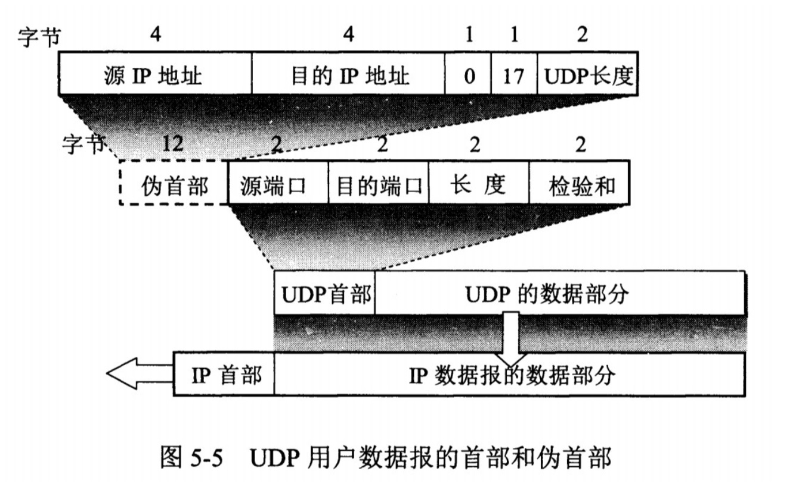

    4. TCP首部格式

       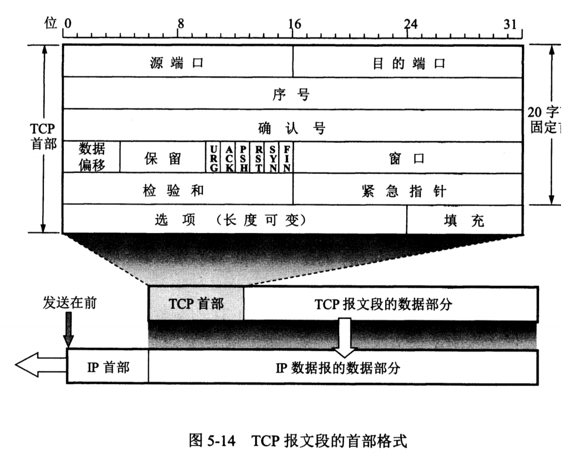

       1. 序号 :用于对字节流进行编号，例如序号为 301，表示第一个字节的编号为 301，如果携带的数据长度为 100 字节，那么下一个报文段的序号应为 401。

       2. 确认号 :期望收到的下一个报文段的序号。例如 B 正确收到 A 发送来的一个报文段，序号为 501，携带的数据 长度为 200 字节，因此 B 期望下一个报文段的序号为 701，B 发送给 A 的确认报文段中确认号就为 701。

       3.  数据偏移 :指的是数据部分距离报文段起始处的偏移量，实际上指的是首部的长度。

       4. 确认 ACK :当 ACK=1 时确认号字段有效，否则无效。TCP 规定，在连接建立后所有传送的报文段都必须把 ACK 置 1。

       5. 同步 SYN :在连接建立时用来同步序号。当 SYN=1，ACK=0 时表示这是一个连接请求报文段。若对方同意建 立连接，则响应报文中 SYN=1，ACK=1。

       6. 终止 FIN :用来释放一个连接，当 FIN=1 时，表示此报文段的发送方的数据已发送完毕，并要求释放连接。 

       7. 窗口 :窗口值作为接收方让发送方设置其发送窗口的依据。之所以要有这个限制，是因为接收方的数据缓存空 间是有限的。

          

80. TCP如何保证传输的有效性。

    使用超时重传来实现可靠传输：如果一个已经发送的报文段在超时时间内没有收到确认，那么就重传这个报文段。

    

81. TCP滑动窗口

    1. 暂时存放字节流。发送方和接收方各有一个窗口，接收方通过TCP报文段中的窗口字段告诉发送方自己的窗口大小，发送方根据这个值和其他信息设置自己的窗口大小。

    2. 发送窗口内的字节都允许被发送，接收窗口内的字节都允许被接收。如果发送窗口左部的字节已经发送并且收到了确认，那么就将发送窗口向右滑动一定距离，直到左部第一个字节不是已发送并且已确认的状态;接收窗口的滑动类似，接收窗口左部字节已经发送确认并交付主机，就向右滑动接收窗口。

    3. 接收窗口只会对窗口内最后一个按序到达的字节进行确认，例如接收窗口已经收到的字节为 {31, 34, 35}，其中 {31} 按序到达，而 {34, 35} 就不是，因此只对字节 31 进行确认。发送方得到一个字节的确认之后，就知道这个字节之前 的所有字节都已经被接收。

       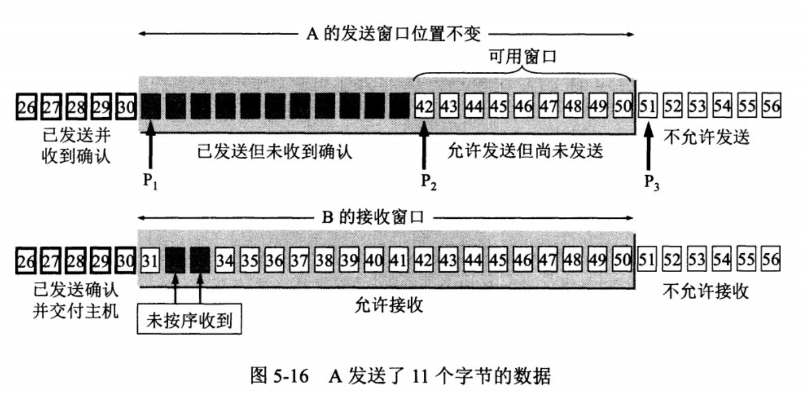

    

82. TCP的拥塞控制

    1. 与**流量控制**的区别：

       1. 流量控制是上一题里窗口，接收方发送窗口值来控制发送方的窗口大小，从而影响发送方的发送速率。将窗口值设置为0，则发送方不能发送数据。
        2. 控制发送方的发送速率，保证接收方来得及接收。

    2. **拥塞控制**

       1. 是为了降低整个网络的拥塞程度

       2. 主要通过四个算法进行拥塞控制：慢开始、拥塞避免、快重传、快恢复。

       3. 发送方需要维护一个叫做拥塞窗口(cwnd)的状态变量（只是一个状态变量，不是发送方窗口。再区别一下，拥塞窗口讨论的是报文段数量，发送窗口讨论的是字节数量）

       4. **慢开始与拥塞避免**

          1. 发送的最初是慢开始，cwnd=1，发送方只能发送一个报文段；接收到确认后，将cwnd加倍，之后能发送的报文段数量是2、4、8..

          2. ssthresh是慢开始门限（初始值自己定），当cwnd >= ssthresh 时，进入拥塞避免，每个轮 次只将 cwnd 加 1。

          3. 如果出现超时，则另ssthresh = cwnd / 2，并重新执行慢开始。

          4. 见图1、2、3

             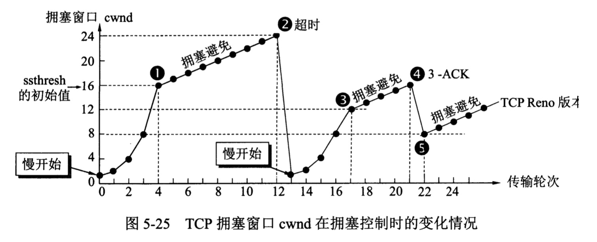

       5. 快重传与快恢复

          1. 【在接收方，要求每次接收到报文段都应该对最后一个已收到的有序报文段进行确认。例如已经接收到 M1 和 M2，此时收到 M4，应当发送对 M2 的确认。】

          2. 在发送方，如果收到三个重复确认，那么可以知道下一个报文段丢失，此时执行快重传，立即重传下一个报文段。【例如收到三个 M2，则 M3 丢失，立即重传 M3。】

          3. 同时执行快恢复，令 ssthresh = cwnd / 2 ，cwnd = ssthresh，并直接进入拥塞避免。

          4. 见上图4、5

             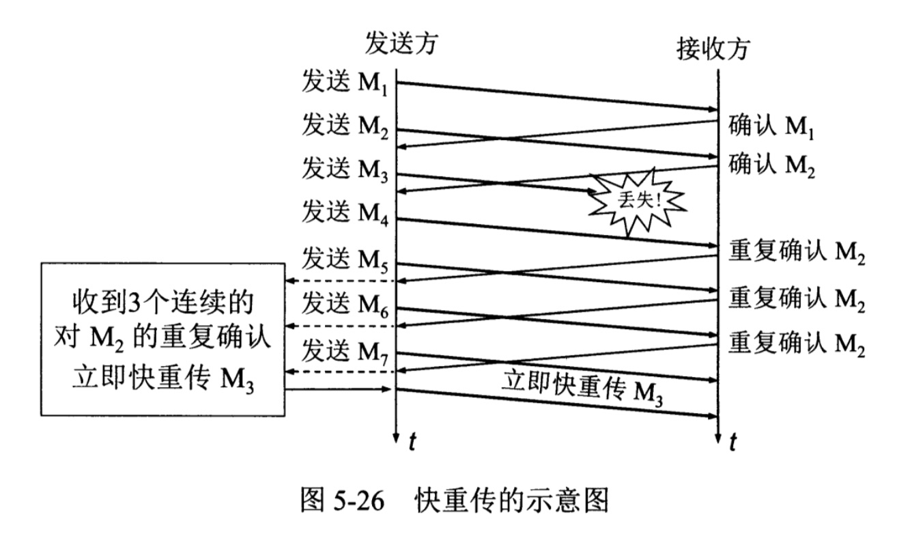

             

83. TCP建立连接的三次握手

    假设A为客户端，B为服务端

    1. 首先B处于监听（listen）状态，等待客户的连接请求
    2. A向B发送**连接（SYN，同步）请求报文**，SYN=1，ACK=0，seq=x（选择一个初始的序号x）
    3. B收到连接请求报文，如果同意建立连接，则向A发送**连接确认报文**，SYN=1，ACK=1，ack=x+1（确认号为x+1），seq=y（同时也选择一个初始的序号y）
    4. A收到B的连接确认报文后，还要向B发出确认，seq=x+1（序号为x+1），ack=y+1（确认号为y+1）

    为什么要三次握手？

    三次握手是为了防止失效的连接请求到达服务器，让服务器错误打开连接。

    客户端发送的连接请求如果在网络中滞留，那么隔很长时间才能收到服务器发回的连接确认，在这段时间内，客户端等待一个超时重传时间后，就会重新发送连接请求。同时滞留的连接请求最后还是会到达服务器，如果只是两次握手，那么服务器会打开两个连接。如果有第三次握手，客户端会忽略服务器之后发送的对滞留连接请求的连接确认，不进行第三次握手，因此就不会再次打开连接。

    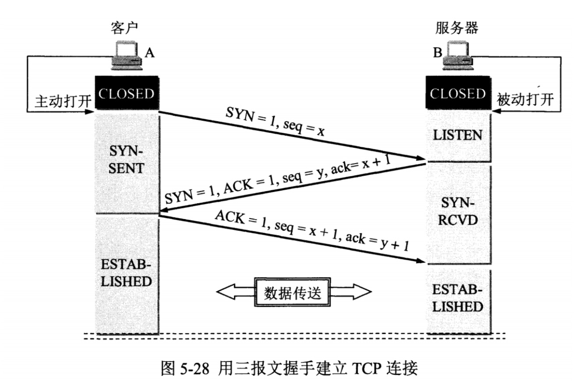

84. TCP四次挥手断开连接

    ack都为1.

    1. A 发送连接释放报文，FIN=1。

    2. B 收到之后发出确认，此时 TCP 属于半关闭状态，B 能向 A 发送数据但是 A 不能向 B 发送数据。 

    3. 当 B 不再需要连接时，发送连接释放报文，FIN=1。

    4. A 收到后发出确认，进入 TIME-WAIT 状态，等待 2 MSL(最大报文存活时间)后释放连接。

    5. B 收到 A 的确认后释放连接。

    **四次挥手的原因**

    客户端发送FIN连接释放报文后，服务器收到这个报文就进入**CLOSE_WAIT**状态，这个状态是为了让服务器端发送未传送完毕的数据，发完后服务器就会发送FIN连接释放报文。  

     **TIME_WAIT**

    客户端收到服务端的FIN报文后进入此状态，并不是直接进入CLOSED状态，还需要等待一个时间计时器设置的时间2MSL。有两个理由：

    1. 确保最后一个确认报文能够到达。如果 B 没收到 A 发送来的确认报文，那么就会重新发送连接释放请求报文， A 等待一段时间就是为了处理这种情况的发生。
    2. 等待一段时间是为了让本次连接持续时间内所产生的所有报文都从网络中消失，使得下一个新的连接不会出现旧的连接请求报文。

    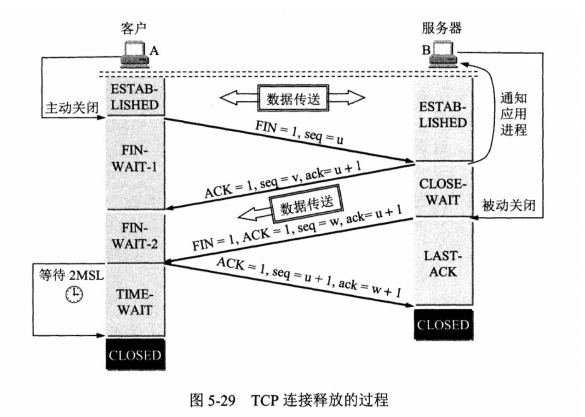

    

85. Java的锁机制

    [Java锁机制](https://juejin.im/post/5e0c5eba6fb9a047ef326a0b)  [AQS机制](https://juejin.im/post/5e16effef265da3e491a3f5e)

    1. 背景知识

       1. 指令流水线：现代处理器的体系结构中，采用流水线的方式对指令进行处理。每个指令的工作可分为5个阶段：取指令、指令译码、执行指令、访存取数和结果写回。
       2. CPU多级缓存：计算机系统中，存在CPU高速缓存，用于减少处理器访问内存所需平均时间。当处理器发出内存访问请求时，会先查看缓存中是否有请求数据，若命中则直接返回该数据；若不存在，则先从内存中将数据载入缓存，再将其返回处理器。

    2. 问题引入

       1. 原子性：即一个操作或者多个操作 要么全部执行**并且执行的过程不会被任何因素打断**，要么就都不执行。（比如i++，如果对实例变量i的操作不做额外的控制，那么多个线程同时调用，就会出现覆盖现象，丢失部分更新。） -- 因为指令流水线
       2. **可见性**：是指当多个线程访问同一个变量时，一个线程修改了这个变量的值，其他线程能够立即看得到修改的值（存在可见性问题的根本原因是由于缓存的存在）-- 因为存在缓存
       3. **顺序性**：即程序执行的顺序按照代码的先后顺序执行 -- 因为存在指令重排

    3. JMM内存模型

       主要目标是定义程序中各个变量的访问规则，即在虚拟机中将变量存储到内存和从内存中取出变量这样的底层细节。这里的变量指共享变量（存在竞争问题的变量），如实例字段、静态字段、数组对象元素等。不包括线程私有的局部变量、方法参数等。

       1. 内存划分：分为主内存和工作内存，【每个线程都有自己的工作内存，它们共享主内存。】【线程对共享变量的所有读写操作都在自己的工作内存中进行，不能直接读写主内存中的变量。】【不同线程间也无法直接访问对方工作内存中的变量，线程间变量值的传递必须通过主内存完成。】
          - 主内存（Main Memory）存储所有共享变量的值。

          - 工作内存（Working Memory）存储该线程使用到的共享变量在主内存的的值的副本拷贝。

       2. 内存间交互规则【一个变量如何从主内存拷贝到工作内存，如何从工作内存同步到主内存中】

          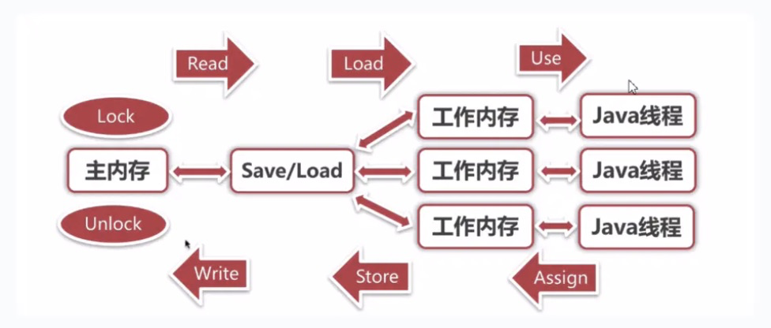

          **8种原子操作**

          - lock: 将一个变量标识为被一个线程独占状态
          - unclock: 将一个变量从独占状态释放出来，释放后的变量才可以被其他线程锁定
          - read: 将一个变量的值从主内存传输到工作内存中，以便随后的load操作
          - load: 把read操作从主内存中得到的变量值放入工作内存的变量的副本中
          - use: 把工作内存中的一个变量的值传给执行引擎，每当虚拟机遇到一个使用到变量的指令时都会使用该指令
          - assign: 把一个从执行引擎接收到的值赋给工作内存中的变量，每当虚拟机遇到一个给变量赋值的指令时，都要使用该操作
          - store: 把工作内存中的一个变量的值传递给主内存，以便随后的write操作
          - write: 把store操作从工作内存中得到的变量的值写到主内存中的变量

          **原子操作的使用规则**

          - read、load、use必须成对顺序出现，但不要求连续出现。assign、store、write同之；

          - 变量诞生和初始化：变量只能从主内存“诞生”，且须先初始化后才能使用，即在use/store前须先load/assign；

          - lock一个变量后会清空工作内存中该变量的值，使用前须先初始化；unlock前须将变量同步回主内存；

          - 一个变量同一时刻只能被一线程lock，lock几次就须unlock几次；未被lock的变量不允许被执行unlock，一个线程不能去unlock其他线程lock的变量。

          对于double和long，虽然内存模型允许对非volatile修饰的64位数据的读写操作分为两次32位操作来进行，但商用虚拟机几乎把64位数据的读写实现为了原子操作，可以忽略这个问题。

       3. 先行发生原则

          【Java内存模型具备一些先天的“有序性”，即不需要通过任何同步手段（volatile、synchronized等）就能够得到保证的有序性，这个通常也称为happens-before原则。】

          如果两个操作的执行次序不符合先行原则且无法从happens-before原则推导出来，那么它们就不能保证它们的有序性，虚拟机可以随意地对它们进行重排序。

          1. 程序次序规则（Program Order Rule）：一个线程内，逻辑上书写在前面的操作先行发生于书写在后面的操作。
          2. 监视器锁规则（Monitor Lock Rule）：一个unLock操作先行发生于后面对同一个锁的lock操作。“后面”指时间上的先后顺序。
          3. **volatile变量规则**（Volatile Variable Rule）：对一个volatile变量的写操作先行发生于后面对这个变量的读操作。“后面”指时间上的先后顺序。
          4. 传递规则（Transitivity）：如果操作A先行发生于操作B，而操作B又先行发生于操作C，则可以得出操作A先行发生于操作C。
          5. 线程启动规则（Thread Start Rule）：Thread对象的start()方法先行发生于此线程的每个一个动作。
          6. 线程中断规则（Thread Interruption Rule）：对线程interrupt()方法的调用先行发生于被中断线程的代码检测到中断事件的发生（通过Thread.interrupted()检测）。
          7. 线程终止规则（Thread Termination Rule）：线程中所有的操作都先行发生于线程的终止检测，我们可以通过Thread.join()方法结束、Thread.isAlive()的返回值手段检测到线程已经终止执行。
          8. 对象终结规则（Finaizer Rule）：一个对象的初始化完成（构造函数执行结束）先行发生于他的finalize()方法的开始。

    4. 问题解决

       1. 原子性

          1. 由JMM保证的原子性变量操作
          2. 基本数据类型的读写（工作内存）是原子的
          3. JMM的lock和unlock指令可以实现更大范围的原子性保证，虚拟机提供synchronized关键字和Lock锁来保证原子性。

       2. 可见性

          1. **volatile关键字**修饰的变量，被线程修改后会立即同步回主内存，其他线程要读取这个变量会从主内存刷新值到工作内存。（因为缓存一致性协议会让其他工作内存中的该变量拷贝无效，必须得从主内存再读取）即read、load、use三者连续顺序执行，assign、store、write连续顺序执行。
       
       2. **synchronized/Lock** ~~由lock和unlock的使用规则保证【这里有疑问啊，synchronized有lock和unlock，但是Lock没有吧...Lock怎么保证可见性？还是说Lock保证不了可见性。可见性只能由volatile保证？--参见ConcurrentHashMap，有synchronized，还配合volatile使用---ConcurrentHashMap有些是不加锁的操作，比如get，所以还是用volatile保证可见性。synchronized 锁的是某个node节点，对这个node节点的】~~
       
          1. synchronized有语义规定，说是通过内存屏障实现的
       
                线程解锁前，必须把共享变量的最新值刷新到主内存中
                线程加锁前，将清空工作内存中共享变量的值，从而使用共享变量时需要从主内存中重新读取最新的值
       
             2. Lock用了cas，有`lock cmpxchg`，lock前缀指令保证了可见性，同时有内存屏障的作用
       
             **同时，这俩还能保证临界区操作的所有变量的可见性**因为内存屏障
       
             > LOCK前缀的指令具有如下效果：
             >
             > - 把写缓冲区中所有的数据刷新到内存中
             >
             > 注意，是所有的数据，可不仅仅是对state的修改
       
             > [ReentrantLock对可见性的支持](https://www.zhihu.com/question/41016480/answer/130906913)
             >
             > All threads will see the most recent write to a volatile field, along with any writes which preceded that volatile read/write. Reentrantlock的lock和unlock方法实际上会cas一个state的变量，state是volatile的，因此夹在两次state之间的操作都能保证可见性。这应该算是happen before的传递性...
       
       3. 顺序性
       
          1. volatile 禁止指令重排序
          2. synchronized/Lock “一个变量在同一个时刻只允许一条线程对其执行lock操作” -- 感觉这个也没用，不然双重检查的单例怎么还用volatile关键字来防止重排序 -- 最多保证原子性，被加锁内容按照顺序被多个线程执行
       
    5. 锁机制

       1. volatile：
       
          保证可见性和顺序性【实现方式：lock前缀指令+依赖MESI缓存一致性协议】
       
          1. volatile修饰的变量，在进行写操作的时候会多一行汇编代码，lock指令，做两件事：
             1. 将当前处理器缓存行的数据写回系统内存
             2. 引起其他处理器里缓存了该内存地址的数据无效。【实现缓存一致性协议，处理器通过嗅探在总线上传播的数据来检查自己缓存的值是不是过期了（处理器发现自己缓存行对应的内存地址被修改，就会将自己的缓存设置成无效状态）】
       
       2. final：有两个重排序规则 -- 不甚了解
          1. **写final域的重排序规则**：在构造函数内对一个final域的写入，与随后把这个被构造对象的引用赋值给一个引用变量，这两个操作之间不能重排序。
          2. 读final域的重排序规则：初次读一个包含final域的对象的引用，与随后初次读这个final域，这两个操作之间不能重排序。
       
       3. synchronized关键字
          1. 使用哪个对象的监视器：
             - 修饰对象方法时，使用当前对象的监视器
             - 修饰静态方法时，使用类类型（Class 的对象）监视器
             - 修饰代码块时，使用括号中的对象的监视器
               - 必须为 Object 类或其子类的对象
             
          2. 无锁 -> 偏向锁 -> 轻量级锁 -> 重量级锁
            
             简单理解，只有一个线程CAS时，如果CAS成功，表示没有锁竞争，保持偏向锁状态，如果CAS失败，说明有竞争，（先撤销偏向锁，将对象头设置成无锁状态，并设置为不可偏向）升级为轻量级锁。
             
             几种锁的适用场景
             
             1. 偏向锁：锁不仅不存在线程竞争，而且总是由同一个线程多次获得，这时候偏向锁的代价最低。适用只有一个线程访问同步块的场景。（如果有别的线程来获取锁，发现）
             2. 轻量级锁：同步块执行时间非常快的，执行完就替换回mark word，别的线程要加锁也很快，CAS。（如果同步块执行很久，竞争线程自旋cas非常久，就很耗cpu，所以会升级到重量级锁，竞争线程阻塞挂起）
             3. 重量级锁：同步块执行时间比较长的，原因如2
          
             
             
             锁升级机制
             
             1. 偏向锁：线程检查锁对象的状态是否是可偏向的，是的话，检查mark word中的线程ID是不是自己，是的话进入代码块，不是的话，将线程ID cas进mark word。cas失败的话，说明之前是别的线程（假设A）取到的了，等待全局安全点，JVM暂停线程A，检查线程A的状态：如果A不在活动中，将锁对象的mark word中的线程ID置空，再cas成自己的线程ID；如果A在活动中（未退出代码块），升级为轻量级锁：JVM在线程A中分配锁记录，拷贝锁对象mark word，并将锁对象mark word指向这个锁记录；在线程B中分配锁记录，拷贝锁对象mark word，并持续自旋cas（如果自旋n次还失败，就要再次升级成重量级锁了..）...
             
             2. 轻量级锁：如果不止一个线程尝试获取锁，就会升级到轻量级锁。**通过自适应自旋CAS的方式获取锁。**如果获取失败，说明存在竞争，膨胀为重量级锁，线程阻塞。默认自旋10次。**将对象头中的Mark Word复制到栈帧（一块空间，称为锁记录）中，然后用CAS将对象头中的Mark Word替换为指向栈帧中锁记录的指针。**
             
             3. 重量级锁：通过系统的线程互斥锁来实现的，未获取到锁的线程会阻塞挂起
             
                
             
             大佬的图，来源见水印
             
             右下角的轻量级锁释放的补充说明：
             
             在某个线程A正持有轻量级锁的时候（还在代码块内运行，时间比较长），某个线程B自旋cas竞争锁（肯定是cas失败了）失败了，这时候就会升级成重量级锁了，mark word指向了互斥量的指针，这和线程A中锁记录的值不同，线程A后续释放锁就失败了（意识到已经升级成重量级锁，唤醒其他挂起的线程）
             
             
          
       4. AQS

86. 【内存屏障和"lock"前缀指令】理解

    volatile通过编译器，既会增加"lock"前缀指令，也会加上内存屏障（mfence等）

    内存屏障是抽象概念，各个硬件、处理器实现不同

    lock前缀指令和mfence等是具体实现

    mesi协议保证缓存和主存间的一致性

    > 有了msei协议，为什么汇编层面还需要lock(volatile)来实现可见性？ - Rob Zhang的回答 - 知乎 https://www.zhihu.com/question/334662600/answer/747038084
    >
    > 内存屏障能保证从storebuffer到缓存再到主存的一致性，在多线程运行中可以作为mesi的补充（因为mesi管不到那么多），但内存屏障
    >
    > **lock前缀主要是为了提供原子操作，虽然它也包含了内存屏障功能**（强制将寄存器、缓存（、storebuffer/invalid queue或类似的东西）等强制同步到主存）

    

    > 关于内存屏障的几个问题？ - cao的回答 - 知乎 https://www.zhihu.com/question/47990356/answer/108650501
    >
    > x86在Windows下的内存屏障是用lock前缀指令来达到效果的

    

    **简单理解：**

    **内存屏障保证了寄存器和缓存之间的一致性**

    **lock前缀保证操作原子性**

    **二者都能保证可见性**

    

    x86架构的内存屏障

    1. sfence: Store Barrier = StoreStore Barriers 写屏障

       所有sfence之前的store指令都在sfence之前被执行，并刷出到CPU的L1 Cache中；

       所有在sfence之后的store指令都在sfence之后执行，禁止重排序到sfence之前。

       所以，所有Store Barrier之前发生的内存更新都是可见的。

    2. lfence: Load Barrier = LoadLoad Barriers 读屏障

       所有在lfence之后的load指令，都在lfence之后执行，并且一直等到load buffer被该CPU读完才能执行之后的load指令（即要刷新失效的缓存）。配合sfence，使所有sfence之前发生的内存更新，对lfence之后的load操作都可见。

    3. mfence: Full Barrier = StoreLoad Barriers 全屏障

       综合了sfence和lfence的作用，强制所有在mfence之前的store/load指令都在mfence之前被执行，之后的store/load指令都在之后执行，禁止跨越mfence重排序。并且都刷新到缓存&重新载入无效缓存。

       

87. 3种重排序类型

    1是编译器重排序，2和3是处理器重排序。会导致多线程程序出现内存可见性问题。

    1. 编译器优化的重排序。编译器在不改变单线程程序语义的前提下，可以重新安排语句的执行顺序。

    2. 指令级并行的重排序。现代处理器采用了指令级并行技术（Instruction-LevelParallelism，ILP）来将多条指令重叠执行。如果不存在数据依赖性，处理器可以改变语句对应机器指令的执行顺序。

    3. 内存系统的重排序。由于处理器使用缓存和读/写缓冲区，这使得加载和存储操作看上去可能是在乱序执行。

       

88. 死锁

    死锁定义：多个进程循环等待它方占有的资源而无限期地僵持下去的局面。

    产生死锁的必要条件：

    1. 互斥（mutualexclusion），一个资源每次只能被一个进程使用
    2. 不可抢占（nopreemption），进程已获得的资源，在未使用完之前，不能强行剥夺
    3. 占有并等待（hold andwait），一个进程因请求资源而阻塞时，对已获得的资源保持不放
    4. 环形等待（circularwait），若干进程之间形成一种首尾相接的循环等待资源关系。

    对待死锁的策略主要有：

    1. 死锁预防：破坏导致死锁必要条件中的任意一个就可以预防死锁。例如，要求用户申请资源时一次性申请所需要的全部资源，这就破坏了保持和等待条件；将资源分层，得到上一层资源后，才能够申请下一层资源，它破坏了环路等待条件。预防通常会降低系统的效率。

    2. 死锁避免：避免是指进程在每次申请资源时判断这些操作是否安全，例如，使用银行家算法。死锁避免算法的执行会增加系统的开销。

    3. 死锁检测：死锁预防和避免都是事前措施，而死锁的检测则是判断系统是否处于死锁状态，如果是，则执行死锁解除策略。

    4. 死锁解除：这是与死锁检测结合使用的，它使用的方式就是剥夺。即将某进程所拥有的资源强行收回，分配给其他的进程。

       

89. 避免死锁的几个常见方法

    1. 避免一个线程同时获取多个锁

    2. 避免一个线程在锁内同时占用多个资源，尽量保证每个锁只占用一个资源。

    3. 尝试使用定时锁，使用`lock.tryLock(timeout)`来代替使用内部锁机制。

    4. 对于数据库锁，加锁和解锁必须在一个数据库连接里，否则会出现解锁失败的情况。

       

90. ~~三次握手和四次挥手,time_wait是什么状态~~【见83、84】

91. ~~B树 B+树区别说一下~~

    B树非叶子节点也存储数据

92. ~~数据库平时用到过什么 咱们先问MySQL MySQL索引原理知道吗，问了两种索引的区别~~

93. ~~索引的分类和优缺点~~

94. ~~innodb和myisam的区别~~

95. ~~乐观锁悲观锁区别说一下~~

96. ~~数据库四种隔离状态 分别有什么问题~~

    

97. redis的数据结构

    [Redis基础](https://juejin.im/post/5db66ed9e51d452a2f15d833)

    Redis 键值（Key-Value）存储数据库

    1. string 字符类型
    2. map 散列类型
    3. list 列表类型
    4. set 集合类型
    5. sortedset 有序集合类型

98. sortset底层，原理，怎么保证有序

    TreeSet具体实现是TreeMap，底层是红黑树

    containsKey、get、put、remove 时间复杂度log(n)

    

    红黑树

    通过对任何一条（根到叶子的）路径上的各个节点的着色方式的限制，确保没有一条路径会比其他路径长出2倍，因而近乎是平衡的

    性质：

    1. 每个节点是红色的，或是黑色的
    2. 根节点是黑色的
    3. 每个叶子节点（Nil）是黑色的
    4. 如果一个节点是红色的，则它的两个子节点是黑色的
    5. 对每个节点，从该节点到其子孙节点的所有路径上包含相同个数的黑色节点。（红节点不能有红孩子）（从该节点出发的所有下降路径，有相同的黑节点个数）

    

    黑高度：从一个节点到达一个叶子节点的任意一条路径上黑色节点的个数

    红黑树的黑高度定义为根节点的黑高度

      

99. 冯诺依曼计算机的结构

    运算器（算术逻辑单元，处理寄存器）

    控制器（指令寄存器，程序计数器）

    存储器（存储数据和指令）

    输入设备

    输出设备

    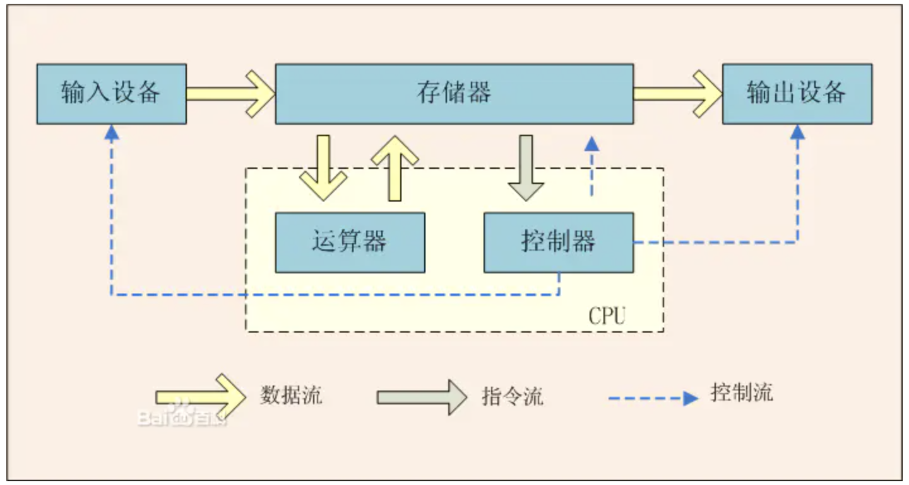

    

100. 操作系统的虚拟内存 100-104

   不懂 https://juejin.im/entry/592257b62f301e006b183b95

101. 进程的调度

102. 进程间的通讯方式

103. 线程间的同步方式

104. 进程和线程的区别

105. 常见的排序算法

     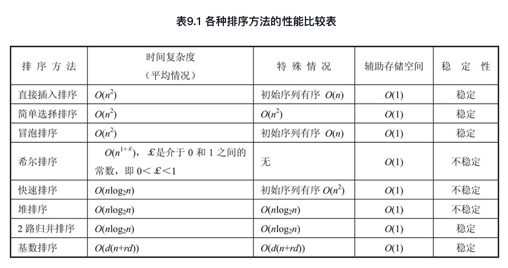

     1. 冒泡排序-复杂度O(n^2)-交换排序

        对所有相邻记录的关键码值进行比较，如果是逆序（L.r[1].key > L.r[2].key），则将其交换，最终达到有序化。

        对无序区从前向后依次将相邻记录的关键码进行比较，若逆序，则将其交换，从而使得关键码值小的记录向上“飘浮”（左移），关键码值大的记录向下“坠落”（右移）。

        每经过一趟冒泡排序，都使无序区中关键码值最大的记录进入有序区，对于由n个记录组成的记录序列，最多经过n-1趟冒泡排序，就可将这n个记录重新按关键码顺序排列。可看出，若“在一趟排序过程中没有进行过交换记录的操作”，则可结束整个排序过程。

        ```java
        
            /**
             * 冒泡排序--更像坠落排序
             *
             * @param nums
             */
            @Override
            public void sort(T[] nums) {
                int len = nums.length;
                boolean isSorted = false;
                // i区分无序区和有序区
                for (int i = len - 1; i >= 0 && !isSorted; i--) {
                    isSorted = true;
                    // j将大元素右移
                    for (int j = 0; j < i; i++) {
                        if (less(nums[j + 1], nums[j])) {
                            isSorted = false;
                            swap(nums, j, j + 1);
                        }
                    }
                }
            }
        ```

        

     2. 选择排序-复杂度O(n^2)-选择排序

        每一趟从待排序的记录中选出关键码最小的记录，顺序放在已排好序的子序列后面，直到全部记录排序完毕。

        ```java
            /**
             * 选择排序
             *
             * @param nums
             */
            @Override
            public void sort(T[] nums) {
                for (int i = 0; i < nums.length; i++) {
                    // index指向每轮最小的数
                    int index = i;
                    for (int j = i + 1; j < nums.length; j++) {
                        if (less(nums[j], nums[index])) {
                            index = j;
                        }
                    }
                    swap(nums, i, index);
                }
            }
        ```

        

     3. 插入排序-复杂度O(n^2) -插入排序

        基本思想是，将待排序的记录，按其关键码的大小插入到已经排好序的有序子表中，直到全部记录插入完成为止。

        ```java
            /**
             * 插入排序
             *
             * @param nums
             */
            @Override
            public void sort(T[] nums) {
                for (int i = 1; i < nums.length; i++) {
                    for (int j = i; j > 0 && less(nums[j], nums[j - 1]); j--) {
                        swap(nums, j, j - 1);
                    }
                }
            }
        ```

        

     4. 归并排序-复杂度O(nlogn)-归并排序

        ```java
        
            /**
             * 归并排序
             *
             * @param nums
             */
            public void sort(T[] nums, Class<T> clazz) {
                T[] copy = (T[]) Array.newInstance(clazz, nums.length);
                System.arraycopy(nums, 0, copy, 0, nums.length);
                sort(nums, copy, 0, nums.length);
            }
        
            private void sort(T[] nums, T[] copy, int begin, int end) {
                if (begin + 1 == end) {
                    return;
                }
                int half = (end - begin) / 2;
                sort(nums, copy, begin, begin + half);
                sort(nums, copy, begin + half, end);
                merge(copy, nums, begin, begin + half, end);
            }
        
            private void merge(T[] nums, T[] copy, int begin, int mid, int end) {
                int i = begin, j = mid, k = begin;
                while (i < mid && j < end) {
                    if (nums[i].compareTo(nums[j]) < 0) {
                        copy[k] = nums[i++];
                    } else {
                        copy[k] = nums[j++];
                    }
                    k++;
                }
                while (i < mid) {
                    copy[k++] = nums[i++];
                }
                while (j < end) {
                    copy[k++] = nums[j++];
                }
            }
        ```

        

     6. 快速排序-复杂度O(nlogn)-交换排序

        ```java
        
            /**
             * 快速排序
             *
             * @param nums
             */
            @Override
            public void sort(T[] nums) {
                sort(nums, 0, nums.length - 1);
            }
        
            private void sort(T[] nums, int begin, int end) {
                int left = begin + 1, right = end;
                while (left < right) {
                    while (left <= end && less(nums[left], nums[begin])) {
                        left++;
                    }
                    while (right >= begin && less(nums[begin], nums[right])) {
                        right--;
                    }
                    if (left < right) {
                        swap(nums, left, right);
                    }
                }
                if (right <= end && right >= begin) {
                    swap(nums, begin, right);
                    sort(nums, begin, right - 1);
                    sort(nums, right + 1, end);
                }
            }
        ```

        

     7. 堆排序-复杂度O(nlogn)-堆排序

        **位置 k 的节点的父节点位置 为 k/2，而它的两个子节点的位置分别为 2k 和 2k+1。**

        

        ```java
        
            /**
             * 堆排序 排成最大堆
             * 数组第 0 个位置不能有元素
             *
             * @param nums
             */
            @Override
            public void sort(T[] nums) {
                int cnt = nums.length - 1;
                for (int k = cnt / 2; k >= 1; k--) {
                    sink(nums, k, cnt);
                }
                while (cnt > 1) {
                    swap(nums, 1, cnt);
                    cnt--;
                    sink(nums, 1, cnt);
                }
            }
        
            /**
             * 下沉
             *
             * @param nums
             * @param k
             */
            private void sink(T[] nums, int k, int len) {
                while (k * 2 <= len) {
                    int child = k * 2;
                  // 判断child + 1未越界
                    if (child + 1 < len && less(nums[child], nums[child + 1])) {
                        child++;
                    }
                    // 如果子节点比k小，退出循环
                    if (less(nums[child], nums[k])) {
                        break;
                    }
                    swap(nums, k, child);
                    k = child;
                }
            }
        ```

        

     

106. spring 事务实现

     Spring事务的底层依赖MySQL的事务，代码层面上利用AOP实现。

     常用的是`@Transactional`注解，会被解析生成一个代理服务，**TransactionInterceptor**对它进行拦截处理，进行事务开启、 commit或者rollback的操作。

     另外，spring还定义了事务传播行为，有7种类型，项目中常见的是PROPAGATION_REQUIRED。如果没有事务就新建事务，如果存在事务，就加入这个事务。

     执行事务的时候使用**TransactionInterceptor**进行拦截，然后处理

     

     [事务传播行为](https://segmentfault.com/a/1190000013341344)

     | 事务传播行为类型             | 说明                                                         |
     | ---------------------------- | ------------------------------------------------------------ |
     | **PROPAGATION_REQUIRED**     | 如果当前没有事务，就新建一个事务，如果已经存在一个事务中，加入到这个事务中。这是最常见的选择。（如果父方法有事务，加入父方法的事务；父方法没有事务，则自己新建一个事务） |
     | PROPAGATION_SUPPORTS         | 支持当前事务，如果当前没有事务，就以非事务方式执行。（如果父方法有事务，加入父方法的事务；父方法没有事务，则以非事务执行） |
     | PROPAGATION_MANDATORY        | 使用当前的事务，如果当前没有事务，就抛出异常。（依赖父方法事务） |
     | **PROPAGATION_REQUIRES_NEW** | 新建事务，如果当前存在事务，把当前事务挂起。（如果父方法有事务，把父方法事务挂起，自己新建事务；父方法没有事务，则自己新建一个事务） |
     | PROPAGATION_NOT_SUPPORTED    | 以非事务方式执行操作，如果当前存在事务，就把当前事务挂起。（如果父方法有事务，把父方法事务挂起，以非事务执行自己的操作；父方法没有事务，则以非事务执行）（总是以非事务执行，不报错） |
     | PROPAGATION_NEVER            | 以非事务方式执行，如果当前存在事务，则抛出异常。（总是以非事务执行，如果父方法存在事务，抛异常） |
     | **PROPAGATION_NESTED**       | 如果当前存在事务，则在嵌套事务内执行。如果当前没有事务，则执行与PROPAGATION_REQUIRED类似的操作。 |

     REQUIRED、REQUIRES_NEW、NESTED的对比

     REQUIRED共用一个事务。

     REQUIRES_NEW 有独立的子事务，子事务异常**不会**导致父事务回滚，父事务异常也**不会**导致子事务回滚，相互独立。

     NESTED 子事务嵌套在父事务中，父事务回滚会引起子事务回滚；父事务正常、子事务异常，子事务可以单独回滚。

     

     [源码详解](https://juejin.im/post/59e87b166fb9a045030f32ed)

     1. txNamespaceHandle注册的`InfrastructureAdvisorAutoProxyCreator`是一个BeanPostProcessor，主要是为了创建动态代理（wrapIfNecessary）
     

     这几个类是可以自动创建代理的

       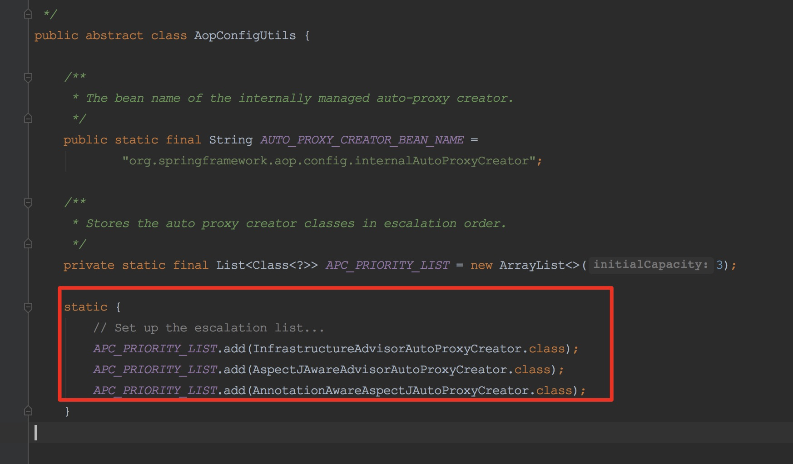

       

     2. 在创建代理的时候，获取切面

        txNamespaceHandler注册了一个Advisor（BeanFactoryTransactionAttributeSourceAdvisor），再在这个advisor中判断是否当前bean符合这个切面（主要实现就是看有没有@Transactional注解）

     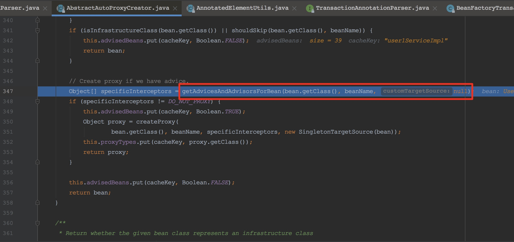

     

     3. `TransactionInterceptor`是advice，增强，执行切面工作

     

     摘录：https://my.oschina.net/fifadxj/blog/785621

     spring-jdb的事务流程：

     ```java
     DefaultTransactionDefinition def = new DefaultTransactionDefinition();
     PlatformTransactionManager txManager = new DataSourceTransactionManager(dataSource);
     
     TransactionStatus status = txManager.getTransaction(def);
     try {
         //get jdbc connection...
         //execute sql...
     
         txManager.commit(status);
     }
     catch (Exception e) {
         txManager.rollback(status);
         throw e;
     }
     ```

     PlatformTransactionManager的getTransaction(), rollback(), commit()是spring处理事务的核心api，分别对应事务的开始，提交和回滚。

     - TransactionSynchronizationManager负责从ThreadLocal中存取jdbc connection
     - 创建事务的时候会通过dataSource.getConnection()获取一个新的jdbc connection，然后绑定到ThreadLocal
     - 在业务代码中执行sql时，通过DataSourceUtils.getConnection()从ThreadLocal中获取当前事务的jdbc connection, 然后在该jdbc connection上执行sql
     - commit和rollback事务时，从ThreadLocal中获取当前事务的jdbc connection，然后对该jdbc connection进行commit和rollback

     

     mybatis-spring的事务流程：

     配置

     ```xml
     <bean id="transactionManager" class="org.springframework.jdbc.datasource.DataSourceTransactionManager">
       <property name="dataSource" ref="dataSource" />
     </bean>
     
     <bean id="sqlSessionFactory" class="org.mybatis.spring.SqlSessionFactoryBean">
       <property name="dataSource" ref="dataSource" />
       <property name="transactionFactory">
         <bean class="org.apache.ibatis.spring.transaction.SpringManagedTransactionFactory" />
       </property> 
     </bean>
     
     <bean id="sqlSession" class="org.mybatis.spring.SqlSessionTemplate">
       <constructor-arg index="0" ref="sqlSessionFactory" />
     </bean>
     ```

     - mybatis-spring依赖DataSourceTransactionManager来处理事务，并没有创建自己的PlatformTransactionManager实现。
     - mybatis通过SqlSessionFactoryBuilder创建SqlSessionFactory，而mybatis-spring通过SqlSessionFactoryBean创建SqlSessionFactory。
     - 配置使用SpringManagedTransactionFactory来创建MyBatis的Transaction实现SpringManagedTransaction
     - 配置使用SqlSessionTemplate代替通过SqlSessionFactory.openSession()获取SqlSession

     调用过程

     

     可以看到mybatis-spring处理事务的主要流程和spring jdbc处理事务并没有什么区别，都是通过DataSourceTransactionManager的getTransaction(), rollback(), commit()完成事务的生命周期管理，而且jdbc connection的创建也是通过DataSourceTransactionManager.getTransaction()完成，mybatis并没有参与其中，mybatis只是在执行sql时通过DataSourceUtils.getConnection()获得当前thread的jdbc connection，然后在其上执行sql。

     sqlSessionTemplate是DefaultSqlSession的一个代理类，它通过SqlSessionUtils.getSqlSession()试图从ThreadLocal获取当前事务所使用的SqlSession。如果是第一次获取时会调用SqlSessionFactory.openSession()创建一个SqlSession并绑定到ThreadLocal，同时还会通过TransactionSynchronizationManager注册一个SqlSessionSynchronization。

     SqlSessionSynchronization是一个事务生命周期的callback接口，mybatis-spring通过SqlSessionSynchronization在事务提交和回滚前分别调用DefaultSqlSession.commit()和DefaultSqlSession.rollback()

     这里的DefaultSqlSession只会进行一些自身缓存的清理工作，并不会真正提交事务给数据库，原因是这里的DefaultSqlSession使用的Transaction实现为SpringManagedTransaction，SpringManagedTransaction在提交事务前会检查当前事务是否应该由spring控制，如果是，则不会自己提交事务，而将提交事务的任务交给spring，所以DefaultSqlSession并不会自己处理事务。

     DefaultSqlSession执行sql时，会通过SpringManagedTransaction调用DataSourceUtils.getConnection()从ThreadLocal中获取jdbc connection并在其上执行sql。

     **mybatis-spring做的最主要的事情是：**

     1. **在SqlSession执行sql时通过用SpringManagedTransaction代替mybatis的JdbcTransaction，让SqlSession从spring的ThreadLocal中获取jdbc connection。**

     2. **通过注册事务生命周期callback接口SqlSessionSynchronization，让SqlSession有机会在spring管理的事务提交或回滚时清理自己的内部缓存。**

        

107. spring的循环依赖如何解决？为什么要三级缓存？

     https://juejin.im/post/5c98a7b4f265da60ee12e9b2

     https://juejin.im/post/5e927e27f265da47c8012ed9

     spring对循环依赖的处理有三种情况：

     1. 构造器的循环依赖：这种依赖spring是处理不了的，直 接抛出BeanCurrentlylnCreationException异常。
     2. 单例模式下的setter循环依赖：通过“三级缓存”处理循环依赖。 
     3. 非单例循环依赖：无法处理。

     

     如何解决的？

     只能解决单例的属性循环依赖的情况。本质上是通过将创建好的、或正在创建中的bean缓存起来。比如A和B循环依赖，创建A时先将A的实例放入缓存，自动注入属性B时，发现缓存中没有B，那么来创建B的实例，将B实例化放入缓存，注入属性A，发现A在缓存中，取出来赋值给A。bean B创建完成返回，赋值给A的属性B。这时候A和B的bean就都创建好了。

     

     为什么要三级？看起来一级就可以实现呀？

     [为什么要三级缓存](https://juejin.im/post/5ec88da26fb9a047e25d5691#h-2)：循环依赖的关键点：**提前暴露绑定A原始引用的工厂类到工厂缓存。等需要时触发后续操作处理A的早期引用，将处理结果放入二级缓存**

     只有一级singeltonObjects肯定是不行的，需要一个放半成品的地方

     实际上二级就够了，可以解决循环依赖的问题

     考虑到代理的情况，就需要objectFactories这个三级缓存了，因为代理的创建是在第三步，这时候动态代理还没产生，注入了也不是最终的实例。放入三级缓存时，重写了getObject方法，会调用BeanPostProcessor的getEarlyBeanReference，这时候取到的就会是动态代理后的。

     

108. jvm参数调优详细过程，到为什么这么设置，好处，一些gc场景，如何去分析gc日志

     jvm调优的基本原则：

     1. 大多数Java应用不需要进行JVM优化
     2. 大多数导致GC频繁、内存使用率高的问题的原因是代码层面的问题（代码层面）
     3. 上线前应考虑将JVM参数设置最优
     4. 减少创建对象的数量（代码层面）
     5. 较少使用全局变量和大对象（代码层面）
     6. 优先架构调优和代码调优，JVM优化是不得已的手段，或者说是发现问题
     7. 分析gc情况优化代码比优化JVM参数更好（代码层面）

     

     https://juejin.im/post/5dea4cb46fb9a01626644c36

     新生代配置原则：

     1.追求响应时间优先  这种需求下，新生代尽可能设置大一些，并通过实际情况调整新生代大小，直至接近系统的最小响应时间。因为新生代比较大，发生垃圾回收的频率会比较低，响应时间快速。

     2.追求吞吐量优先  吞吐量优先的应用，在新生代中的大部分对象都会被回收，所以，新生代尽可能设置大。此时不追求响应时间，垃圾回收可以并行进行。

     3.避免设置过小新生代   设置过小，YGC会很频繁，同时，很可能导致对象直接进入老年代中，老年代空间不足发生FullGC。

     老年代配置原则：

     1.追求响应时间优先   这种情况下，可以使用CMS收集器，以获取最短回收停顿时间，但是其内存分配需要注意，如果设置小了会造成回收频繁并且碎片变多；如果设置大了，回收的时间会很长。所以，最优的方案是根据GClog分析垃圾回收信息，调整内存大小。

     2.追求吞吐量优先   吞吐量优先通常需要分配一个大新生代、小老年代，将短期存活的对象在新生代回收掉。

     

109. 优先级队列的底层原理？

     堆，默认是小顶堆

     入队

     ```java
         public boolean offer(E e) {
             if (e == null)
                 throw new NullPointerException();
             modCount++;
             int i = size;
             if (i >= queue.length)
                 grow(i + 1);
             siftUp(i, e);
             size = i + 1;
             return true;
         }
         private static <T> void siftUpComparable(int k, T x, Object[] es) {
             Comparable<? super T> key = (Comparable<? super T>) x;
             while (k > 0) {
               // 如果父节点比自己大
                 int parent = (k - 1) >>> 1;
                 Object e = es[parent];
                 if (key.compareTo((T) e) >= 0)
                     break;
                 es[k] = e;
                 k = parent;
             }
             es[k] = key;
         }
     ```

     出队

     ```java
         public E poll() {
             final Object[] es;
             final E result;
     
             if ((result = (E) ((es = queue)[0])) != null) {
                 modCount++;
                 final int n;
                 final E x = (E) es[(n = --size)];
                 es[n] = null;
                 if (n > 0) {
                     final Comparator<? super E> cmp;
                     if ((cmp = comparator) == null)
                         siftDownComparable(0, x, es, n);
                     else
                         siftDownUsingComparator(0, x, es, n, cmp);
                 }
             }
             return result;
         }
         private static <T> void siftDownComparable(int k, T x, Object[] es, int n) {
             // assert n > 0;
             Comparable<? super T> key = (Comparable<? super T>)x;
             int half = n >>> 1;           // loop while a non-leaf
             while (k < half) {
               // 从孩子中选一个小的
                 int child = (k << 1) + 1; // assume left child is least
                 Object c = es[child];
                 int right = child + 1;
                 if (right < n &&
                     ((Comparable<? super T>) c).compareTo((T) es[right]) > 0)
                     c = es[child = right];
                 if (key.compareTo((T) c) <= 0)
                     break;
                 es[k] = c;
                 k = child;
             }
             es[k] = key;
         }
     ```

     

110. redis如何实现分布式锁，zk如何实现分布式锁，两者的区别。如果service还没执行完，分布式锁在redis中已经过期了，怎么解决这种问题

     redis实现分布式锁：setNX，创建成功表明获得了锁（要注意设置超时、谁加锁谁解锁、解锁的原子性）

     zk实现分布式锁：在路径下创建临时顺序节点，序号最小的节点表示获得了锁，其他竞争者监听自己的前一个节点

     

     redisson给的答案是锁获取成功后，注册一个定时任务，每隔一定时间(this.internalLockLeaseTime / 3L, 10s)就去续约

     加一个监听器，如果key快要超时了，就进行续约（重置成30s）

     

111. synchronized底层实现，加在方法上和加在同步代码块中编译后的区别、类锁、对象锁

     编译时候加入监视器锁

     

     ```java
     public class SyncTest {
         public void syncBlock() {
             synchronized (this) {
                 System.out.println("hello block");
             }
         }
     
         public synchronized void syncMethod() {
             System.out.println("hello method");
         }
     }
     ```

     

     加在方法上：方法上有synchronized关键字，flags里有ACC_SYNCHRONIZED

     https://blog.csdn.net/hosaos/java/article/details/100990954

     ACC_SYNCHRONIZED是获取监视器锁的一种隐式实现(没有显示的调用monitorenter，monitorexit指令)

     如果字节码方法区中的ACC_SYNCHRONIZED标志被设置，那么线程在执行方法前会先去获取对象的monitor对象，如果获取成功则执行方法代码，执行完毕后释放monitor对象

     ```shell
     public synchronized void syncMethod();
         descriptor: ()V
         flags: ACC_PUBLIC, ACC_SYNCHRONIZED
         Code:
           stack=2, locals=1, args_size=1
              0: getstatic     #2                  // Field java/lang/System.out:Ljava/io/PrintStream;
              3: ldc           #5                  // String hello method
              5: invokevirtual #4                  // Method java/io/PrintStream.println:(Ljava/lang/String;)V
              8: return
           LineNumberTable:
             line 15: 0
             line 16: 8
           LocalVariableTable:
             Start  Length  Slot  Name   Signature
                 0       9     0  this   Lwyq/learning/quickstart/juc/SyncTest;
     ```

     加在同步块上：monitorenter / monitorexit 关键字 

     ```shell
     public void syncBlock();
         descriptor: ()V
         flags: ACC_PUBLIC
         Code:
           stack=2, locals=3, args_size=1
              0: aload_0
              1: dup
              2: astore_1
              3: monitorenter
              4: getstatic     #2                  // Field java/lang/System.out:Ljava/io/PrintStream;
              7: ldc           #3                  // String hello block
              9: invokevirtual #4                  // Method java/io/PrintStream.println:(Ljava/lang/String;)V
             12: aload_1
             13: monitorexit
             14: goto          22
             17: astore_2
             18: aload_1
             19: monitorexit
             20: aload_2
             21: athrow
             22: return
           Exception table:
              from    to  target type
                  4    14    17   any
                 17    20    17   any
           LineNumberTable:
             line 9: 0
             line 10: 4
             line 11: 12
             line 12: 22
           LocalVariableTable:
             Start  Length  Slot  Name   Signature
                 0      23     0  this   Lwyq/learning/quickstart/juc/SyncTest;
           StackMapTable: number_of_entries = 2
             frame_type = 255 /* full_frame */
               offset_delta = 17
               locals = [ class wyq/learning/quickstart/juc/SyncTest, class java/lang/Object ]
               stack = [ class java/lang/Throwable ]
             frame_type = 250 /* chop */
               offset_delta = 4
     ```

     

112. volatile在编译上的体现

     ```java
     public class VolatileTest {
         private volatile int i;
     
         public void plus() {
             i = 2;
         }
     }
     ```

     字节码

     网上查到的是变量上flags有ACC_VOLATILE标识，自己编译出来没看到...

     ```shell
       public void plus();
         descriptor: ()V
         flags: ACC_PUBLIC
         Code:
           stack=2, locals=1, args_size=1
              0: aload_0
              1: iconst_2
              2: putfield      #2                  // Field i:I
              5: return
           LineNumberTable:
             line 11: 0
             line 12: 5
           LocalVariableTable:
             Start  Length  Slot  Name   Signature
                 0       6     0  this   Lwyq/learning/quickstart/juc/VolatileTest;
     ```

     看文章说还是lock前缀指令

     http://gee.cs.oswego.edu/dl/jmm/cookbook.html  -- x86架构下，实现是lock前缀指令，支持"SSE2"扩展 (Pentium4 and later)的版本支持mfence指令（比lock前缀更推荐），cas的cmpxchg的实现需要lock前缀

     

     https://www.cnblogs.com/xrq730/p/7048693.html

     1. 锁总线，其它CPU对内存的读写请求都会被阻塞，直到锁释放，不过实际后来的处理器都采用锁缓存替代锁总线，因为锁总线的开销比较大，锁总线期间其他CPU没法访问内存
     2. lock后的写操作会回写已修改的数据，同时让其它CPU相关缓存行失效，从而重新从主存中加载最新的数据
     3. 不是内存屏障却能完成类似内存屏障的功能，阻止屏障两边的指令重排序

     整理一下最终的实现：

     1. lock前缀指令会引起处理器缓存回写到内存
     2. 一个处理器的缓存回写到内存会导致其他处理器的缓存无效，这是MESI实现的（缓存一致性协议）
     3. 另外，lock前缀指令能完成内存屏障的功能，阻止屏障前后的指令重排序

     

     这篇文章https://juejin.im/post/5ea938426fb9a043856f2f6a提到，x86下使用`lock`来实现`StoreLoad`，并且只有 `StoreLoad` 有效果。x86 上怎么使用 Barrier 的说明可以在 openjdk 的代码中看到，在这里[src/hotspot/cpu/x86/assembler_x86.hpp](https://github.com/openjdk/jdk/blob/9a69bb807beb6693c68a7b11bee435c0bab7ceac/src/hotspot/cpu/x86/assembler_x86.hpp)。

     

        

113. mvcc，怎么实现rr rc

     

     ​      

     ​      

114. mysql间隙锁有没有了解，死锁有没有了解，写一段会造成死锁的sql语句，死锁发生了如何解决，mysql有没有提供什么机制去解决死锁

     gap lock

     

115. 如何保证RocketMQ 消息的顺序性，如何解决重复消费问题

     针对kafka来说

     如何保证消息的顺序性：

     一个分区内的消息是顺序的

     一个主题的不同分区之间，消息不能保证有序

     -- 对同一类消息指定相同的key，相同的key会哈希到同一个分区，这样可以保证这部分消息的有序性

     

     https://www.cnblogs.com/756623607-zhang/p/10506909.html

     如何解决重复消费：

     1. kafka自带的消费机制

        consumer消费后，会定期将消费过的offset偏移量提交给broker。如果consumer重启，会继续上次的offset开始消费。

     2. 业务上保证幂等性

        如果进程挂了或机器宕机，没来得及提交offset，需要业务上进行幂等。

        比如建立一张消息表。

        1. 生产者，发送消息前判断库中是否有记录（有记录说明已发送），没有记录，先入库，状态为待消费，然后发送消息并把主键id带上。

        2. 消费者，接收消息，通过主键ID查询记录表，判断消息状态是否已消费。若没消费过，则处理消息，处理完后，更新消息记录的状态为已消费。

        

116. explain 可以看到哪些信息，什么信息说明什么，explain的结果列讲一下

     https://dev.mysql.com/doc/refman/8.0/en/explain-output.html

     | Column                                                       | JSON Name       | Meaning                                                      |
     | ------------------------------------------------------------ | --------------- | ------------------------------------------------------------ |
     | [`id`](https://dev.mysql.com/doc/refman/8.0/en/explain-output.html#explain_id) | `select_id`     | The `SELECT` identifier     select标识                       |
     | [`select_type`](https://dev.mysql.com/doc/refman/8.0/en/explain-output.html#explain_select_type) | None            | The `SELECT` type    select类型                              |
     | [`table`](https://dev.mysql.com/doc/refman/8.0/en/explain-output.html#explain_table) | `table_name`    | The table for the output row    表名                         |
     | [`partitions`](https://dev.mysql.com/doc/refman/8.0/en/explain-output.html#explain_partitions) | `partitions`    | The matching partitions 使用的分区                           |
     | [`type`](https://dev.mysql.com/doc/refman/8.0/en/explain-output.html#explain_type) | `access_type`   | The join type  join类型                                      |
     | [`possible_keys`](https://dev.mysql.com/doc/refman/8.0/en/explain-output.html#explain_possible_keys) | `possible_keys` | The possible indexes to choose  可能使用的索引               |
     | [`key`](https://dev.mysql.com/doc/refman/8.0/en/explain-output.html#explain_key) | `key`           | The index actually chosen   实际使用的索引                   |
     | [`key_len`](https://dev.mysql.com/doc/refman/8.0/en/explain-output.html#explain_key_len) | `key_length`    | The length of the chosen key  实际使用的索引的长度           |
     | [`ref`](https://dev.mysql.com/doc/refman/8.0/en/explain-output.html#explain_ref) | `ref`           | The columns compared to the index   与索引进行对比的列       |
     | [`rows`](https://dev.mysql.com/doc/refman/8.0/en/explain-output.html#explain_rows) | `rows`          | Estimate of rows to be examined  预估要检查的行数            |
     | [`filtered`](https://dev.mysql.com/doc/refman/8.0/en/explain-output.html#explain_filtered) | `filtered`      | Percentage of rows filtered by table condition   符合条件的数据的百分比 |
     | [`Extra`](https://dev.mysql.com/doc/refman/8.0/en/explain-output.html#explain_extra) | None            | Additional information  额外的信息                           |

     1. select_type

        常见的有SIMPLE（简单查询，无union、subqueries）、PRIMARY（子查询的外层）、SUBQUERY、UNION等

     2. type

        1. system：表中只有一行数据，const的特殊情况

        2. const：至多有一行matching，可以理解为主键或唯一索引的=  （单表，对tbl_name来说，1是const）

           ```sql
           SELECT * FROM tbl_name WHERE primary_key=1;
           
           SELECT * FROM tbl_name
             WHERE primary_key_part1=1 AND primary_key_part2=2;
           ```

        3. eq_ref：主键或唯一索引的=   （多表关联，other_table的结果不定，所以对ref_table来说，选择不是const）

           ```sql
           SELECT * FROM ref_table,other_table
             WHERE ref_table.key_column=other_table.column;
           
           SELECT * FROM ref_table,other_table
             WHERE ref_table.key_column_part1=other_table.column
             AND ref_table.key_column_part2=1;
           ```

        4. ref：（非主键与非唯一索引的）其他索引的=和<=>（等和不等）

           ```sql
           SELECT * FROM ref_table WHERE key_column=expr;
           
           SELECT * FROM ref_table,other_table
             WHERE ref_table.key_column=other_table.column;
           
           SELECT * FROM ref_table,other_table
             WHERE ref_table.key_column_part1=other_table.column
             AND ref_table.key_column_part2=1;
           ```

        5. fulltext

           用到了全文索引

        6. ref_or_null

           类似ref，会额外检索包含null的行

        7. index_merge

           用到了多个索引，索引合并优化

        8. unique_subquery

           替换下面的in子查询，子查询返回不重复的集合

           ```sql
           value IN (SELECT primary_key FROM single_table WHERE some_expr)
           ```

        9. index_subquery

           区别于unique_subquery，用于非唯一索引，可以返回重复值

           ```sql
           value IN (SELECT key_column FROM single_table WHERE some_expr)
           ```

        10. range

            索引范围查找，包括主键、唯一索引、其他索引——即，所有key

             [`=`](https://dev.mysql.com/doc/refman/8.0/en/comparison-operators.html#operator_equal), [`<>`](https://dev.mysql.com/doc/refman/8.0/en/comparison-operators.html#operator_not-equal), [`>`](https://dev.mysql.com/doc/refman/8.0/en/comparison-operators.html#operator_greater-than), [`>=`](https://dev.mysql.com/doc/refman/8.0/en/comparison-operators.html#operator_greater-than-or-equal), [`<`](https://dev.mysql.com/doc/refman/8.0/en/comparison-operators.html#operator_less-than), [`<=`](https://dev.mysql.com/doc/refman/8.0/en/comparison-operators.html#operator_less-than-or-equal), [`IS NULL`](https://dev.mysql.com/doc/refman/8.0/en/comparison-operators.html#operator_is-null), [`<=>`](https://dev.mysql.com/doc/refman/8.0/en/comparison-operators.html#operator_equal-to), [`BETWEEN`](https://dev.mysql.com/doc/refman/8.0/en/comparison-operators.html#operator_between), [`LIKE`](https://dev.mysql.com/doc/refman/8.0/en/string-comparison-functions.html#operator_like), or [`IN()`](https://dev.mysql.com/doc/refman/8.0/en/comparison-operators.html#operator_in) 

            ```sql
            SELECT * FROM tbl_name
              WHERE key_column = 10;
            
            SELECT * FROM tbl_name
              WHERE key_column BETWEEN 10 and 20;
            
            SELECT * FROM tbl_name
              WHERE key_column IN (10,20,30);
            
            SELECT * FROM tbl_name
              WHERE key_part1 = 10 AND key_part2 IN (10,20,30);
            ```

        11. index

            类似all，但是只扫描索引，有两种情况

            1. 覆盖索引，select中的列都在索引中，extra中显示using index
            2. 利用索引的顺序进行全表扫描（比如有order by），extra中不宣誓using index

        12. all

            全表扫描

     3. rows和filtered

        1. rows：MySQL认为需要检查的行数
        2. filtered：rows中会被过滤出来的——即符合条件的——的数据的百分比
        3. rows*filtered=查询出的结果数

     4. extra 常见的有

        1. using index 列信息只从索引出，不用再从实际行取。使用了覆盖索引

        2. using where 没有可用的索引，通过where条件过滤

        3. using filesort 需要额外排序

        4. ....还有好多

           

117. aqs，countDownLatch如何实现

     

     ​      

118. java如何实现序列化的，Serialization底层如何实现的

     简单说来，是将类信息和数据信息递归写成字节信息

     

119. 线上服务器cpu飙高，如何处理这个问题

     1. 定位进程：top 查看cpu占用情况
     2. 定位线程：如果是Java应用，top -Hp pid
     3. 定位代码`
        1. `printf %x tid` 打印出线程ID对应的16进制数 0xtid
        2. `jstack pid |grep -A 200 0xtid`

        

120. 内核态 和 用户态、cas 和 sout 哪个用到了内核态和用户态的切换

     sout用到了切换

     

121. 哪些典型的应用用的是udp

     dns: Domain Name System，域名系统 域名解析

     TFTP: Trivial File Transfer Protocol,简单文件传输协议

     1.包总量较少的通信（DNS、SNMP等）

     2.视频、音频等多媒体通信（即时通信）

     3.限定于 LAN 等特定网络中的应用通信

     4.广播通信（广播、多播）

     

122. 计算密集型/IO密集型 任务 分别如何设置线程池的核心线程数和最大线程数，为什么这么设置

     https://blog.csdn.net/weixin_40151613/java/article/details/81835974

     计算密集型：

     CPU使用率比较高，（也就是一些复杂运算，逻辑处理）

     **线程数设置为CPU核数**

     

     IO密集型：

     cpu使用率较低，程序中会存在大量I/O操作占据时间，导致线程空余出来

     **一般设置线程数为CPU核数的2倍**

     最佳线程数目 = （（线程等待时间+线程CPU时间）/线程CPU时间 ）* CPU数目

     线程等待时间越长，需要越多的线程

     

     补充

     1. 高并发、任务执行时间短的业务：线程池线程数可以设置为CPU核数+1，减少线程上下文的切换

     2. 并发不高、任务执行时间长的业务：
        1. 假如是业务时间长集中在IO操作上，也就是IO密集型的任务，因为IO操作并不占用CPU，所以不要让所有的CPU闲下来，可以适当加大线程池中的线程数目，让CPU处理更多的业务
        2. 假如是业务时间长集中在计算操作上，也就是计算密集型任务，和（1）一样，线程池中的线程数设置得少一些，减少线程上下文的切换

     3. 并发高、业务执行时间长，解决这种类型任务的关键不在于线程池而在于整体架构的设计
        1. 数据能否做缓存
        2. 增加服务器
        3. 业务执行时间长的问题，也可能需要分析一下，看看能不能使用中间件（任务时间过长的可以考虑拆分逻辑放入队列等操作）对任务进行拆分和解耦。

     

123. ~~synchronized底层实现【见JMM】~~

     https://juejin.im/post/5bfe6ddee51d45491b0163eb

124. Mark Word 对象头【见JMM】

125. redis实现 带注解3.0源码

     《Redis设计与实现》

     https://github.com/huangz1990/redis-3.0-annotated

126. Java中的NIO，BIO，AIO分别是什么#

     - BIO:同步并阻塞，服务器实现模式为一个连接一个线程，即客户端有连接请求时服务器端就需要启动一个线程进行处理，如果这个连接不做任何事情会造成不必要的线程开销，当然可以通过线程池机制改善。BIO方式适用于连接数目比较小且固定的架构，这种方式对服务器资源要求比较高，并发局限于应用中，JDK1.4以前的唯一选择，但程序直观简单易理解。
     - NIO:同步非阻塞，服务器实现模式为一个请求一个线程，即客户端发送的连接请求都会注册到多路复用器上，多路复用器轮询到连接有I/O请求时才启动一个线程进行处理。NIO方式适用于连接数目多且连接比较短（轻操作）的架构，比如聊天服务器，并发局限于应用中，编程比较复杂，JDK1.4开始支持。
     - AIO:异步非阻塞，服务器实现模式为一个有效请求一个线程，客户端的I/O请求都是由OS先完成了再通知服务器应用去启动线程进行处理.AIO方式使用于连接数目多且连接比较长（重操作）的架构，比如相册服务器，充分调用OS参与并发操作，编程比较复杂，JDK7开始支持。

127. java中的反射

     field的赋值底层实现

     以UnsafeBooleanFieldAccessorImpl为例，也是利用unsafe 偏移

     ps: Unsafe工具类 static final Unsafe unsafe = Unsafe.getUnsafe();

     ```java
     // set    
         public void set(Object obj, Object value)
             throws IllegalArgumentException, IllegalAccessException
         {
             ensureObj(obj);
             if (isFinal) {
                 throwFinalFieldIllegalAccessException(value);
             }
             if (value == null) {
                 throwSetIllegalArgumentException(value);
             }
             if (value instanceof Boolean) {
               // 这里
                 unsafe.putBoolean(obj, fieldOffset, ((Boolean) value).booleanValue());
                 return;
             }
             throwSetIllegalArgumentException(value);
         }
     
     // get
         public Object get(Object obj) throws IllegalArgumentException {
             return Boolean.valueOf(getBoolean(obj));
         }
     
         public boolean getBoolean(Object obj) throws IllegalArgumentException {
             ensureObj(obj);
           // 这里
             return unsafe.getBoolean(obj, fieldOffset);
         }
     ```

128. 测试一下git commit -am 'xx'

129. MyBatis，Mybatis与Spring

     MyBatis 消除了大部分 JDBC 的样板代码、手动设置参数以及检索结果。**通过简洁的设计最大限度地简化开发和提升性能。**

     解除SQL与程序代码的耦合，通过提供dao层，将业务逻辑和数据访问逻辑分离开。设计更清晰，更易维护。

     MyBatis整体架构

     

     MyBatis层级结构

     

     

     裸用`sqlSession`是上面的红框

     spring用mapper/dao接口代理，本质上是一个MapperProxy，从下面的红框开始执行

     

     spring事务是在哪个环节起作用？

     https://mybatis.org/spring/zh/transactions.html

     > 一个使用 MyBatis-Spring 的其中一个主要原因是它允许 MyBatis 参与到 Spring 的事务管理中。而不是给 MyBatis 创建一个新的专用事务管理器，MyBatis-Spring 借助了 Spring 中的 DataSourceTransactionManager 来实现事务管理。
     >
     > 一旦配置好了 Spring 的事务管理器，你就可以在 Spring 中按你平时的方式来配置事务。并且支持 @Transactional 注解和 AOP 风格的配置。在事务处理期间，一个单独的 `SqlSession` 对象将会被创建和使用。当事务完成时，这个 session 会以合适的方式提交或回滚。
     >
     > 事务配置好了以后，MyBatis-Spring 将会透明地管理事务。

     所以，最外层是事务，每个事务会起一个`SqlSession`。

     

     几篇文章：

     入门，裸用mybatis：https://juejin.im/post/5aa5c6fb5188255587232e5a#heading-0

     mybatis执行，包括整合spring后的流程：https://juejin.im/post/5e350d895188254dfd43def5#heading-9

     关于JDBC：https://juejin.im/post/5c75e6666fb9a049cd54dc88

     Mybatis和spring整合的使用：https://juejin.im/post/5cdfed6ef265da1b6720dcaf

     

     mybatis框架说明：

     

     整体执行流程说明：

     

     sqlSession执行流程说明：

     

     

     关键流程（以下整个可以看成裸用MyBatis的执行流程）

     config文件加载：解析xml文件配置项

     mapper文件加载：上一个流程中的一个环节，解析完后封装成MappedStatement，存入configuration

     SqlSource创建流程：上一流程的一个环节，SqlSource是MappedStatement的一部分，主要存放sql和占位的参数名称

     -- 解析环节结束

     SqlSession执行流程：`sqlSessionFactory.openSession`主要是建立了一个和数据库的连接connection

     获取BoundSql流程：`sqlSession.xx`方法执行时，需要获取BoundSql，BoundSql本质上是SqlSource和执行请求的入参的一个组合

     参数映射流程：根据顺序，或者根据名称（只是大略看了一眼）

     结果集映射流程：根据名称（只是大略看了一眼）

     

     mybatis的openSession默认开启事务，autocommit为false，隔离级别为null

     mybatis的JdbcTransaction

     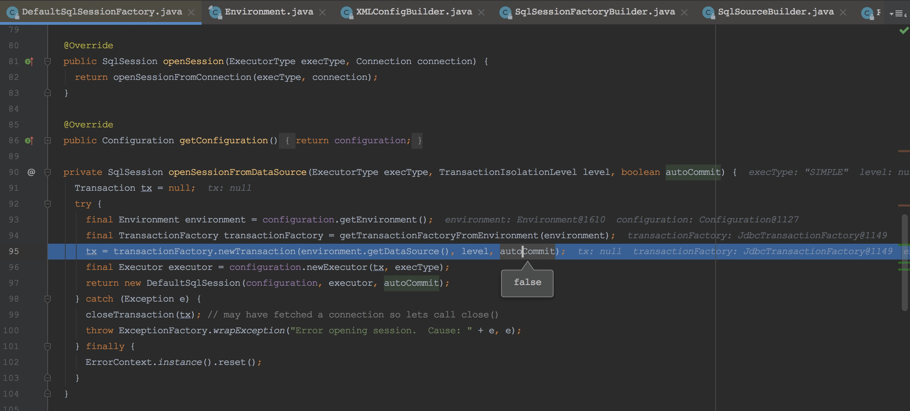

     

     整合spring的几个组件

     `org.mybatis.spring.SqlSessionFactoryBean` 注入sqlSessionFactory

     `org.mybatis.spring.mapper.MapperScannerConfigurer`扫描指定包

     1. 将包下class文件加入到beanDefinition中，bean类型指定为MapperFactoryBean
     2. SqlSessionFactoryBean构建sqlSessionFactory时，扫描mapper xml文件，根据namespace在MapperRegistry中注入对应mapper接口的MapperProxyFactory
     3. MapperFactoryBean->getObject中生成mapper的代理类MapperProxy（通过MapperFactoryBean中的interface，即mapper的namespace找到MapperProxyFactory，再生产出代理类）

     

     以下大概知道了

     现在差一个中间环节，mapper的beanDefinition怎么变成MapperProxy..以及MapperFactoryBean的作用

     还有个SqlSessionTemplate：https://juejin.im/post/5cea1f386fb9a07ea803a70e

     还有MapperProxyFactory -- 来创建MapperProxy

     Java动态代理：https://juejin.im/post/5c1ca8df6fb9a049b347f55c

     

     MapperFactoryBean

     MapperProxy

     MapperMethod -- 到这里之后，流程就转到sqlSession.selectOne之类的了

     

     Mybatis缓存

     https://juejin.im/post/5e81fb126fb9a03c546c22bb

     MyBatis 系统中默认定义了两级缓存：**一级缓存**和**二级缓存** 

     - 默认情况下，只有一级缓存开启。（SqlSession级别的缓存，也称为本地缓存） 
     - 二级缓存需要手动开启和配置，它是基于 namespace 级别的缓存，缓存只作用于 cache 标签所在的映射文件中的语句。

     

     

     130. DelayQueue

          https://www.cnblogs.com/jobs/archive/2007/04/27/730255.html

          DelayQueue = BlockingQueue + PriorityQueue + Delayed

     

     

     

## 扩展信息备查
1. http status备查

    1XX 信息
     100 Continue :表明到目前为止都很正常，客户端可以继续发送请求或者忽略这个响应。

    2XX 成功

    200 OK
     204 No Content :请求已经成功处理，但是返回的响应报文不包含实体的主体部分。一般在只需要从客户端 往服务器发送信息，而不需要返回数据时使用。
     206 Partial Content :表示客户端进行了范围请求，响应报文包含由 Content-Range 指定范围的实体内容。

    3XX 重定向

    301 Moved Permanently :永久性重定向
     302 Found :临时性重定向
     303 See Other :和 302 有着相同的功能，但是 303 明确要求客户端应该采用 GET 方法获取资源。
     注:虽然 HTTP 协议规定 301、302 状态下重定向时不允许把 POST 方法改成 GET 方法，但是大多数浏览器都 会在 301、302 和 303 状态下的重定向把 POST 方法改成 GET 方法。
     304 Not Modified :如果请求报文首部包含一些条件，例如:If-Match，If-Modified-Since，If-None- Match，If-Range，If-Unmodified-Since，如果不满足条件，则服务器会返回 304 状态码。
     307 Temporary Redirect :临时重定向，与 302 的含义类似，但是 307 要求浏览器不会把重定向请求的 POST 方法改成 GET 方法。

    4XX 客户端错误

    400 Bad Request :请求报文中存在语法错误。
     401 Unauthorized :该状态码表示发送的请求需要有认证信息(BASIC 认证、DIGEST 认证)。如果之前已进 行过一次请求，则表示用户认证失败。
     403 Forbidden :请求被拒绝。
     404 Not Found

    5XX 服务器错误
     500 Internal Server Error :服务器正在执行请求时发生错误。

    503 Service Unavailable :服务器暂时处于超负载或正在进行停机维护，现在无法处理请求。
    
2. synchronized锁消除和锁粗化

    https://juejin.im/post/5d96db806fb9a04e0f30f0eb

    #### 锁消除

    锁消除主要是 JIT 编译器的优化操作，首先对于热点代码 JIT 编译器会将其编译为机器码，后续执行的时候就不需要在对每一条 class 字节码解释为机器码然后再执行了从而提升效率，它会根据逃逸分析来对代码做一定程度的优化比如锁消除，栈上分配等等

    ```
    public void f() {
        Object obj = new Object();
        synchronized(obj) {
             System.out.println(obj);
        }
    }
    复制代码
    ```

    JIT 编译器发现 f() 中的对象只会被一个线程访问，那么就会取消同步

    ```
    public void f() {
        Object obj = new Object();
        System.out.println(obj);
    }
    复制代码
    ```

    #### 锁粗化

    如果在一段代码中连续的对同一个对象反复加锁解锁，其实是相对耗费资源的，这种情况下可以适当放宽加锁的范围，减少性能消耗。

    当 JIT 发现一系列连续的操作都对同一个对象反复加锁和解锁，甚至加锁操作出现在循环体中的时候，会将加锁同步的范围扩散到整个操作序列的外部。

    ```
    for (int i = 0; i < 10000; i++) {
        synchronized(this) {
            do();
        }
    }
    复制代码
    ```

    粗化后的代码

    ```
    synchronized(this) {
        for (int i = 0; i < 10000; i++) {
            do();
        }
    }
    ```


​    